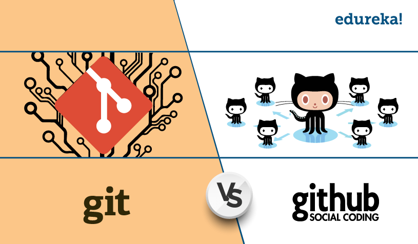

# Git: Revolução no Controle de Versão

## História do Git

O Git foi criado por Linus Torvalds em 2005, o famoso criador do kernel do Linux. Linus sentiu a necessidade de um novo sistema de controle de versão enquanto trabalhava no desenvolvimento do Linux. Na época, ele estava descontente com as ferramentas disponíveis, pois elas não atendiam às demandas do projeto Linux, que era grande e altamente colaborativo.

Motivado por essas frustrações, Linus decidiu criar sua própria ferramenta de controle de versão, e assim nasceu o Git. Ele projetou o Git com foco na velocidade, desempenho e na habilidade de lidar com grandes projetos de código aberto, como o Linux. O Git foi desenvolvido para ser distribuído, ou seja, permitir que cada desenvolvedor tenha uma cópia completa do repositório, proporcionando independência e flexibilidade.

### Vantagens do Git

O Git oferece diversas vantagens em relação a outros sistemas de controle de versão:

1. **Desempenho e velocidade**: O Git foi projetado para ser rápido, mesmo em projetos com grandes quantidades de código. Isso o torna eficiente tanto para pequenos projetos pessoais quanto para grandes projetos corporativos.

2. **Sistema distribuído**: Cada desenvolvedor tem uma cópia completa do repositório, o que permite que trabalhem offline e tenham independência em suas ramificações. As alterações podem ser sincronizadas posteriormente.

3. **Gerenciamento eficiente de ramificações**: O Git torna fácil e rápido criar, mesclar e gerenciar ramificações. Isso permite que desenvolvedores trabalhem em diferentes recursos ou versões paralelamente sem conflitos.

4. **Histórico completo e rastreável**: O Git registra todas as alterações e mantém um histórico detalhado do projeto. Isso facilita a identificação de quando e por quem uma alteração foi feita, auxiliando no rastreamento de bugs e na colaboração entre equipes.

### GitHub: Plataforma de Hospedagem de Repositórios Git

O GitHub é uma plataforma de hospedagem de código que utiliza o Git como sistema de controle de versão. Lançado em 2008, o GitHub se tornou uma das maiores comunidades de desenvolvimento de software, oferecendo recursos de colaboração e compartilhamento de código.

No GitHub, desenvolvedores podem criar repositórios públicos ou privados para hospedar seu código. Eles podem colaborar com outros desenvolvedores através de pull requests, fazer contribuições para projetos de código aberto e utilizar ferramentas de gerenciamento de problemas (issue tracking) e integração contínua.

 

## Diferença entre Git e GitHub

A principal diferença entre Git e GitHub está na funcionalidade que cada um oferece:

- O Git é um sistema de controle de versão distribuído que permite o rastreamento e a gestão de alterações em um projeto.

- O GitHub é uma plataforma de hospedagem que utiliza o Git como sistema de controle de versão. Ele fornece recursos adicionais, como colaboração, compartilhamento de código e gerenciamento de projetos.

Em resumo, o Git é o sistema de controle de versão, enquanto o GitHub é uma plataforma que utiliza o Git para hospedar e gerenciar repositórios de código-fonte.

### Conclusão

O Git revolucionou o controle de versão de software, proporcionando uma solução distribuída, eficiente e flexível. Com o Git, desenvolvedores podem trabalhar de forma colaborativa em projetos de qualquer tamanho, mantendo um histórico completo de alterações. O GitHub complementa o Git, oferecendo uma plataforma para compartilhar, colaborar e gerenciar projetos com a comunidade de desenvolvedores. Juntos, Git e GitHub tornaram-se ferramentas essenciais no desenvolvimento de software moderno.

 

 

[Voltar a introdução ao Git](/Arquivos/Conteudo/1%20-%20Principio%20de%20desenvolvimento%20de%20software/1.1%20Introducao%20ao%20git.md) 
[Voltar para inicio](/README.md)