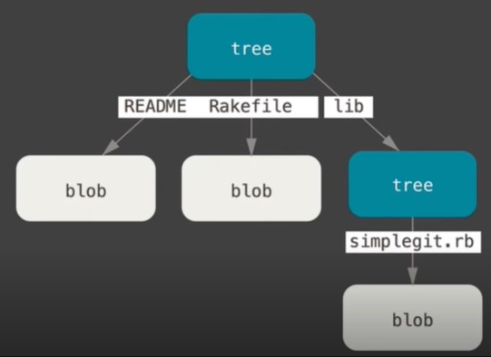
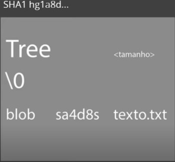
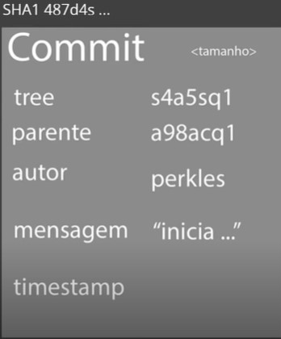
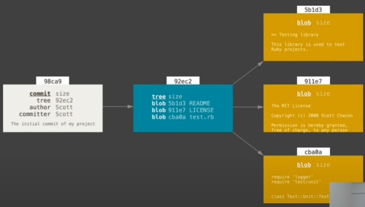

# Como o Git funciona

## Sha1 (Secure hash algorithm)

No contexto do GitHub, o SHA-1 é amplamente utilizado para identificar commits e versões específicas em um repositório Git. Cada commit gerado pelo Git possui um identificador único de 40 caracteres, que é o resultado do cálculo do SHA-1 sobre os dados do commit.

O SHA-1 no GitHub desempenha um papel crucial na integridade e na rastreabilidade dos commits. Cada commit possui um hash SHA-1 exclusivo que representa seu estado específico do projeto em determinado momento. Isso permite que os desenvolvedores identifiquem com precisão um commit específico e o referenciem em operações como ramificação, mesclagem e reverte.

Quando você visita um repositório no GitHub, pode ver os commits e suas mensagens de commit associadas. O hash SHA-1 é exibido junto a cada commit, permitindo que você identifique e se refira a um commit específico ao longo da história do projeto. Além disso, ao explorar um repositório no GitHub, você pode acessar diferentes versões do código-fonte por meio de branches, tags e commits, todos identificados por seus respectivos hashes SHA-1.

É importante ressaltar que o SHA-1 é usado principalmente para identificação e rastreabilidade, não para fins de segurança criptográfica. Como mencionado anteriormente, o SHA-1 foi considerado inseguro para aplicações criptográficas desde 2005 devido a vulnerabilidades descobertas. Portanto, embora o SHA-1 seja usado para identificar commits no GitHub, não deve ser utilizado para fins críticos de segurança.

### Resumindo:
- Se trata de um algoritmo de encriptação. Esse conjunto criptográfico foi criado pela NSA (agencia de segurança nacional americana).
- A encriptação gera um conjunto identificador de 40 dígitos.

### Encriptando arquivo com SHA1

```bash
# Vamos abrir o git bash na pasta onde esta o arquivo de texto e fazer:
openssl sha1 nome_do_arquivo_de_texto

#Obs
#Após a execução do comando o terminal irá retornar a chave criptografica do arquivo.
#Essa chave será modificada cada vez que o arquivo sofrer alguma modificação.
```
<br> 

## Objetos internos do Git

### Hierarquia completa:



### Blob


- **Blob** é um objeto que representa o conteúdo de um arquivo específico em um repositório. Ele armazena os dados binários ou de texto do arquivo, mas não contém informações sobre o nome do arquivo, a localização ou o histórico de alterações. O blob é identificado pelo seu hash SHA-1 único e é usado pelo Git para rastrear e gerenciar o conteúdo dos arquivos em um repositório.

### Trees



- **Trees** são objetos que representam a estrutura de diretórios de um repositório. Uma "tree" contém informações sobre os arquivos e diretórios presentes em um determinado ponto da história do projeto. Ela registra os nomes dos arquivos, os modos de permissão e os hashes SHA-1 dos blobs correspondentes aos conteúdos dos arquivos. As "trees" também podem referenciar outras "trees", formando uma estrutura hierárquica que reflete a organização dos diretórios no repositório. As "trees" são usadas pelo Git para manter o controle e a integridade dos diretórios e arquivos em um repositório.

### Commits



- **Commit** no Git é uma operação que registra uma nova versão dos arquivos em um repositório. Ele representa um marco na história do projeto, capturando as alterações feitas nos arquivos em um determinado momento. Um "commit" inclui informações como o autor, a data e a mensagem descritiva das alterações realizadas. Além disso, cada "commit" possui um hash SHA-1 único que o identifica de forma exclusiva. Os "commits" são usados para rastrear e gerenciar o histórico do projeto, permitindo que os desenvolvedores acompanhem as alterações ao longo do tempo, comparem versões anteriores e restaurem versões anteriores, se necessário. O Git facilita a criação de ramos (branches) e a mesclagem (merge) de "commits", permitindo o trabalho paralelo em diferentes recursos e a integração das alterações em uma versão principal do projeto.

<br> 

## Fluxo do git



- O __fluxo__ do Git envolve a criação de blobs que representam o conteúdo dos arquivos, que são organizados em árvores que registram a estrutura de diretórios. Os commits são então criados para registrar as alterações feitas nos arquivos e referenciam as árvores correspondentes. Dessa forma, os blobs armazenam os dados dos arquivos, as árvores organizam os blobs em diretórios e os commits registram as alterações nos arquivos, formando um histórico completo e rastreável do projeto.

<br>

<br>

[Voltar a introdução ao Git](/Arquivos/Conteudo/1%20-%20Principio%20de%20desenvolvimento%20de%20software/1.1%20Introducao%20ao%20git.md)<br>
[Voltar para inicio](/README.md)