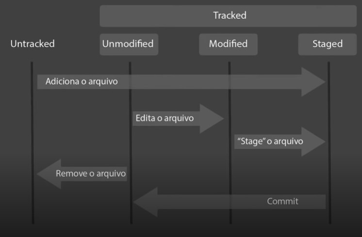

# Entendendo alguns pontos importantes

## Ciclo de vida de arquivos no Git



**1. Untracked** (não rastreado):
- Arquivo ainda não está sendo monitorado pelo Git.
- O Git não registra alterações ou mantém o histórico do arquivo.
  
**2. Staged** (preparado):
- Arquivo foi adicionado ao índice do Git para ser incluído no próximo commit.
- O Git está ciente das alterações feitas no arquivo e pronto para registrá-las.

**3. Unmodified** (não modificado):
- Arquivo está no estado atual, sem alterações em relação ao último commit.
- O Git não detectou modificações no arquivo desde o último commit.

**4. Modified** (modificado):
- Arquivo foi alterado desde o último commit.
- O Git registrou as alterações feitas no arquivo, mas elas ainda não foram incluídas em um novo commit.

Esses estágios refletem o estado dos arquivos em relação ao controle de versão do Git, permitindo que você monitore e gerencie as alterações nos seus arquivos ao longo do tempo.

<br>

## Representação


### Para monitorar a situação que estão nossos arquivos vamos usar o comando:
```bash
# Comando importante para saber o que faremos a seguir com o arquivo.
git status
```
<br>

## Desfazendo alterações (git restore)
O comando "git restore" é usado no Git para desfazer alterações em arquivos específicos, restaurando-os para um estado anterior. Ele permite reverter modificações feitas em arquivos modificados ou desfazer adições de arquivos ao índice (staging area).

### Os principais comandos relacionados ao "git restore" são:
```bash
# Restaurar um arquivo modificado para o estado anterior
git restore <arquivo>

# Remover um arquivo do índice (staging area)
git restore --staged <arquivo>

# Restaurar um arquivo para um estado específico, referenciado pelo hash SHA-1 do commit
git restore --source=<commit> <arquivo>

# Descartar todas as alterações feitas em um arquivo modificado
git restore --worktree <arquivo>
```

<br>

## Resetando as modificações feitas por commits (git reset)
O comando "git reset" é utilizado no Git para desfazer commits ou reposicionar o HEAD e o branch atual em um commit específico. Ele permite reverter o histórico de commits e refazer o estado do repositório para um ponto anterior.

### Importante!
- É importante mencionar que o "git reset" modifica o histórico do Git e pode afetar outros colaboradores do repositório. Portanto, tenha cuidado ao usar esse comando e evite utilizá-lo em commits já compartilhados com outros membros da equipe.

- O "git reset" é uma ferramenta poderosa para desfazer commits e reorganizar o estado do repositório, mas é recomendado usá-lo com cuidado para evitar perdas irreversíveis de código.

- Tenha cuidado ao usar o git reset --hard, pois ele descarta todas as alterações não confirmadas. Utilize esses comandos com cautela e certifique-se de entender seu impacto no histórico do Git.

### Existem diferentes opções e formas de utilizar o "git reset", que são:
```bash
# Desfazer o commit e manter as alterações no índice (staging area)
git reset --soft <commit>

# Desfazer o commit e limpar o índice, mantendo as alterações nos diretórios de trabalho
git reset --mixed <commit>

# Desfazer o commit e descartar todas as alterações nos arquivos
git reset --hard <commit>
```
<br>

## Resolução de conflito entre arquivos
A resolução de conflitos de arquivos ocorre quando o Git encontra diferenças entre as versões de um arquivo em diferentes ramos ou commits e não consegue mesclá-las automaticamente. Isso geralmente acontece quando duas ou mais alterações conflitantes foram feitas no mesmo local de um arquivo.

### Para resolver conflitos de arquivos no Git, você pode seguir os seguintes passos:

- Identificar o conflito: O Git informará quais arquivos têm conflitos e mostrará as seções conflitantes dentro desses arquivos.

- Abrir o arquivo conflitante: Abra o arquivo em um editor de texto e localize as seções conflitantes, que serão demarcadas pelo Git.

- Editar o arquivo: Edite o arquivo para resolver manualmente as diferenças e decidir qual versão do código deve ser mantida. Remova as marcações de conflito e deixe o arquivo com a versão desejada.

- Adicionar o arquivo modificado: Após editar o arquivo para resolver os conflitos, adicione-o novamente ao índice (staging area) usando o comando git add <arquivo>.

- Completar a mesclagem: Depois de adicionar todos os arquivos conflitantes, finalize a mesclagem executando o comando git commit. O Git criará um novo commit que contém a resolução do conflito.

É importante lembrar que a resolução de conflitos requer atenção e consideração cuidadosa para garantir que as alterações conflitantes sejam tratadas corretamente. É recomendado revisar cuidadosamente o código e testar as alterações após a resolução do conflito para garantir a integridade e funcionamento adequado do projeto.

Usando o comando `git status`, você verá uma seção chamada "Conflitos de mesclagem". Essa seção lista os arquivos com conflitos e indica que eles precisam ser resolvidos manualmente. 

<br>

<br>

[Voltar a introdução ao Git](/Arquivos/Conteudo/1%20-%20Principio%20de%20desenvolvimento%20de%20software/1.1%20Introducao%20ao%20git.md)<br>
[Voltar para inicio](/README.md)