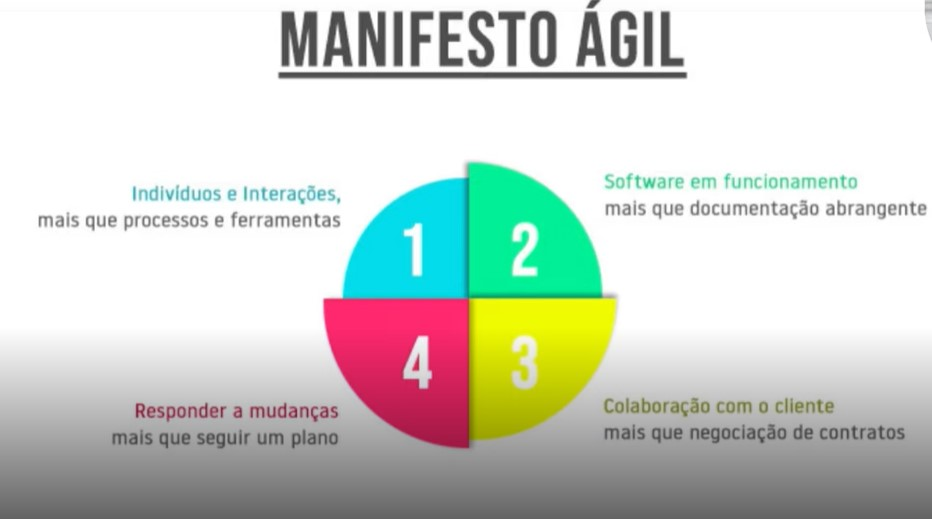
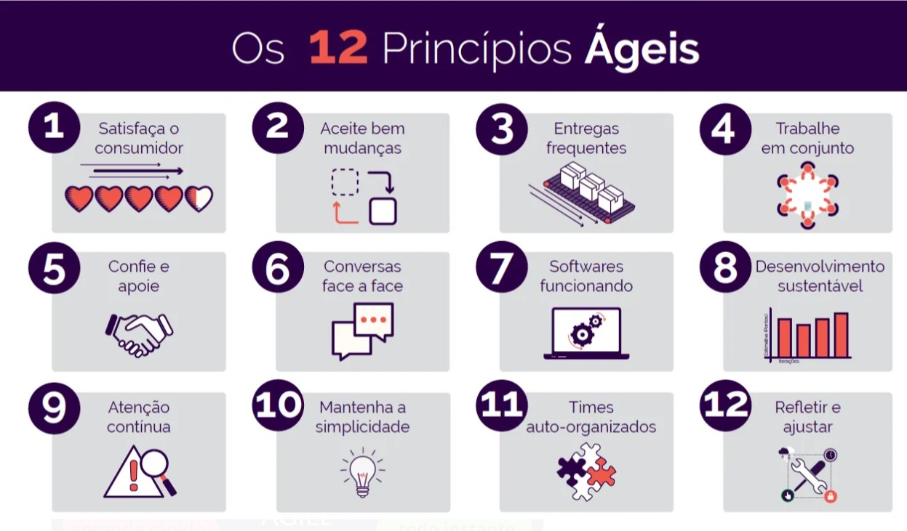
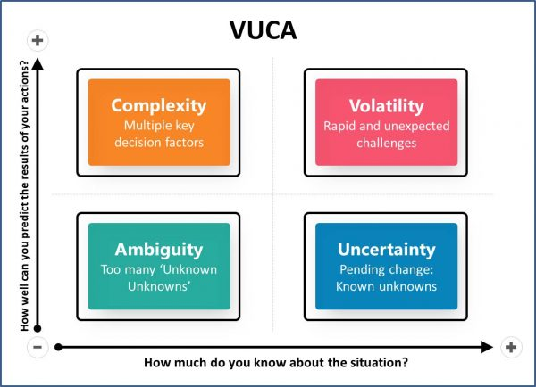

# Manifesto ágil

[Link do manifesto Ágil](https://agilemanifesto.org/iso/ptbr/manifesto.html)

## Agilidade x Velocidade

- Agilidade está mais ligado a eficiência e adaptação.
- Existe correção de rumos e comunicação assertiva.

  

## Falando sobre valores do manifesto Ágil

- O manifesto ágil foi criado em fevereiro de 2001, durante uma reunião de 17 desenvolvedores de software em Snowbird, Utah, nos Estados Unidos. Essa reunião levou à criação do Manifesto Ágil, que estabeleceu os valores e princípios para o desenvolvimento ágil de software.
- O Manifesto Ágil é um conjunto de valores e princípios que norteiam o desenvolvimento ágil de software. 
  
### Os valores do manifesto são:
1. Indivíduos e interações acima de processos e ferramentas: o foco deve estar nas pessoas e na comunicação entre elas, em vez de se prender a processos e ferramentas rígidas.
2. Software em funcionamento acima de documentação abrangente: o objetivo principal é criar um software funcional que atenda às necessidades do cliente, em vez de se concentrar em documentação extensa.
3. Colaboração do cliente acima de negociação de contratos: é fundamental ter uma colaboração ativa e constante com o cliente, em vez de se basear em contratos que muitas vezes são inflexíveis.
4. Responder a mudanças acima de seguir um plano: a flexibilidade é essencial em um ambiente de desenvolvimento ágil, portanto, é mais importante ser capaz de se adaptar a mudanças do que seguir um plano rigoroso.

 

## Os 12 princípios ágeis

1.&nbsp;&nbsp;Satisfação do cliente através da entrega contínua e adiantada de software de valor.

2.&nbsp;&nbsp;Mudanças nos requisitos são bem-vindas, mesmo que tardias no projeto.

3.&nbsp;&nbsp;Entregar software funcionando com frequência, na escala de semanas até meses, com preferência aos períodos mais curtos.

4.&nbsp;&nbsp;Pessoas de negócio e desenvolvedores devem trabalhar juntos diariamente durante todo o projeto.

5.&nbsp;&nbsp;Construir projetos em torno de indivíduos motivados. Dar a eles o ambiente e suporte necessário e confiar neles para fazer o trabalho.

6.&nbsp;&nbsp;O método mais eficiente e eficaz de transmitir informações para e entre uma equipe de desenvolvimento é através de uma conversa cara-a-cara.

7.&nbsp;&nbsp;Software funcionando é a medida primária de progresso.

8.&nbsp;&nbsp;Processos ágeis promovem um ambiente sustentável. Os patrocinadores, desenvolvedores e usuários devem ser capazes de manter um ritmo constante indefinidamente.

9.&nbsp;&nbsp;Contínua atenção à excelência técnica e bom design aumenta a agilidade.

10.&nbsp;Simplicidade – a arte de maximizar a quantidade de trabalho que não precisa ser feito – é essencial. KISS

11.&nbsp;As melhores arquiteturas, requisitos e designs emergem de equipes auto-organizáveis.

12.&nbsp;Em intervalos regulares, a equipe reflete sobre como se tornar mais eficaz e ajusta seu comportamento de acordo.

 

### Características de um time Ágil
- Alinhado com o cliente e stakeholders
- Auto-organizado e responsável
- Multidisciplinar
- Entrega valor continuamente
- Está sempre aprendendo
- Melhoria contínua
- Possui métricas e metas claras
- Unido

  

### Importância do ágil no mundo de tecnologia

