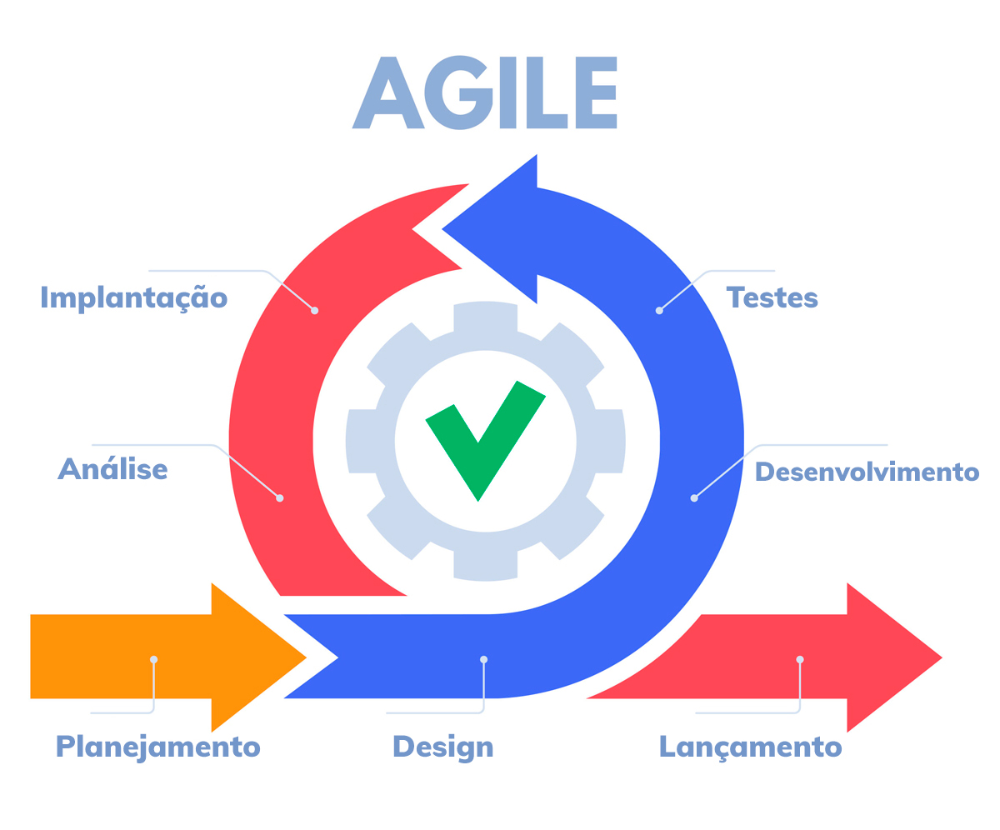

# Gerenciamento de projetos x Gestão Ágil

## Projeto vs Processo

 

## Modelo Ágil vs Modelo Tradicional

 

### Modelo tradicional (Waterfall)

- Cada etapa posterior depende que a anterior tenha sido realizada.
- Planejamento inicial feito por: escopo → custo → Cronograma.
- O valor só passa a ser gerado na etapa de implementação.

 

## Representação das etapas do modelo Ágil

- Modelo baseado em ciclos de entregas, chamados de sprints.
- O valor é entregue durante o andamento do projeto de forma contínua ao fim de cada ciclo (Valor iterativo e incremental).
- A cada entrega de valor é feito o Feedback da sprint.

 

#### Resumindo as vantagens do modelo de gestão Ágil ?
- Flexível e que se adapte às mudanças
- Colaborativa e que gere transparência
- Voltado ao aprendizado
- Entrega contínua de valor

 

 

[Voltar a trabalho com equipes ágeis](/Arquivos/Conteudo/1%20-%20Principio%20de%20desenvolvimento%20de%20software/1.2%20Trabalho%20com%20equipes%20ageis.md) 
[Voltar para inicio](/README.md)