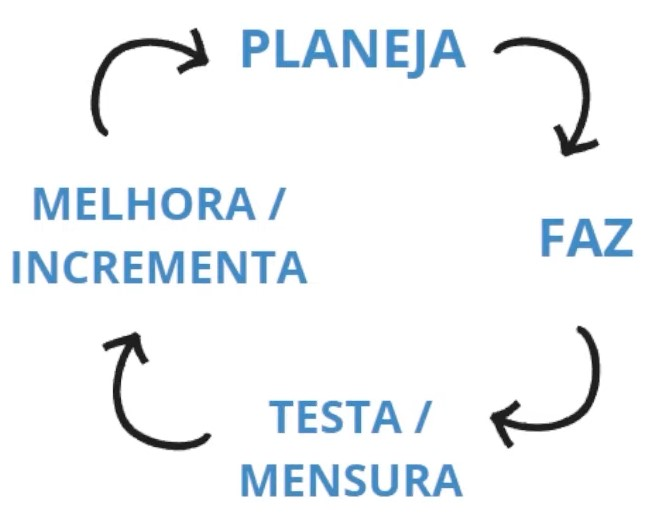

# XP 

## Definições:

- Extreme Programming (XP) é uma metodologia de desenvolvimento de software ágil que visa melhorar a qualidade do software e a satisfação do cliente por meio de um processo iterativo e incremental. O XP enfatiza a comunicação constante com o cliente, feedback frequente e melhoria contínua, em ciclos de desenvolvimentos curtos.
- O XP foi criado por Kent Beck e sua equipe no final da década de 1990, como uma resposta às metodologias de desenvolvimento de software da época que muitas vezes eram lentas e burocráticas. Beck acreditava que muitas vezes os desenvolvedores ficavam presos em processos e documentações excessivas, perdendo de vista o objetivo final de produzir um software funcional e de alta qualidade.
- A metodologia XP inclui práticas como programação em par, desenvolvimento orientado a testes, integração contínua e design simples. Essas práticas são combinadas com valores centrais, como comunicação, feedback, simplicidade e coragem.

### Representação de fluxo de XP

#### O que tem no XP ?

- Ciclos
- Cerimônias (reuniões)
- Testes
- Programação em pares
- Feedback
- Aproximação com o cliente
- Flexibilidade

 

 

[Voltar a trabalho com equipes ágeis](/Arquivos/Conteudo/1%20-%20Principio%20de%20desenvolvimento%20de%20software/1.2%20Trabalho%20com%20equipes%20ageis.md) 
[Voltar para inicio](/README.md)