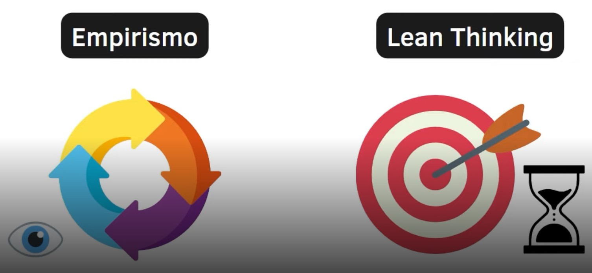
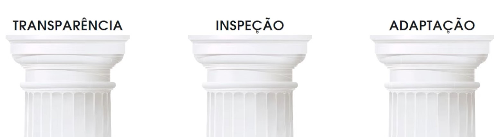
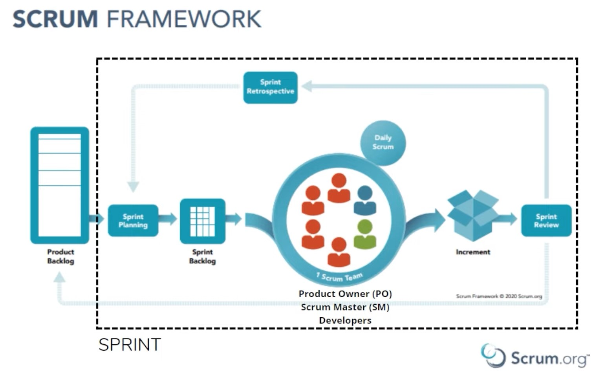

# Scrum 

[Link - Documentação Guia do Scrum](https://scrumguides.org/index.html)

## Sobre Scrum

- framework ágil para aumentar a produtividade, promovendo uma abordagem colaborativa e iterativa para o desenvolvimento de produtos. Foi criado em 1993 por Hirotaka Takeuchi e Ikujiro Nonaka.
- O Scrum é baseado na ideia de que os projetos de desenvolvimento de software são altamente complexos e difíceis de prever.
- O objetivo do Scrum é permitir que os desenvolvedores se adaptem rapidamente às mudanças e realizem trabalhos de alta qualidade.

### As bases do scrum

- **Papéis do Scrum:** Existem três papéis principais no Scrum: Product Owner, Scrum Master e Time de Desenvolvimento. Cada papel possui responsabilidades específicas dentro do framework.

- **Eventos do Scrum:** São os eventos que estruturam o trabalho no Scrum, como a Reunião de Planejamento da Sprint, a Daily Scrum, a Revisão da Sprint e a Retrospectiva da Sprint. Esses eventos fornecem oportunidades para inspeção e adaptação contínuas.

- **Artefatos do Scrum:** Os artefatos no Scrum incluem o Product Backlog, que lista todas as funcionalidades desejadas do produto, o Sprint Backlog, que contém as tarefas selecionadas para a Sprint atual, e o Incremento, que é a soma de todas as funcionalidades concluídas ao final de uma Sprint.

 

### Pilares do scrum (TIA)

- **Transparência**: Todos os membros da equipe têm acesso a todos os dados relevantes. Isso permite que todos compreendam plenamente o progresso do projeto e os resultados alcançados.

- **Inspeção**: Os resultados são regularmente verificados para garantir que o progresso está de acordo com o planejado e que a qualidade está sendo mantida.
  
- **Adaptação**: Não há nada de definitivo no Scrum, pois é permitido fazer mudanças ao longo do tempo para melhorar o desempenho. Isso permite que as equipes se adaptem rapidamente às mudanças no ambiente.

 

## Framework vs Metodologia

### Framework
- Aqui temos o porquê algo deve ser feito e o que deve ser feito. A parte de como fazer pode ser customizada a partir de um método a parte ou outra ferramenta externa. 

### Metodologia
- Temos o porquê das coisas, o que deve ser feito e como fazemos. Podemos analogamente dizer que se trata de um manual de instruções ou uma receita de bolo.

 

## Exemplo de fluxo de Scrum framework 
