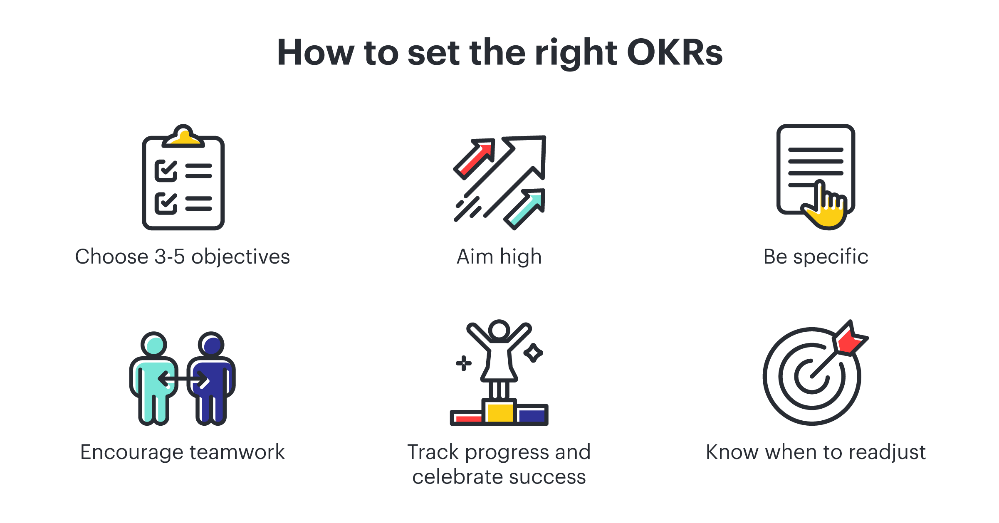

# OKR 

## Pontos importantes!

- OKR é uma sigla para Objectives and Key Results, ou Objetivos e Resultados-chave, em português. É uma metodologia utilizada para definir e acompanhar metas e objetivos em empresas e organizações, que tem como objetivo aumentar o foco e a efetividade na busca por resultados.
- A metodologia OKR foi criada por Andrew Grove, ex-CEO da Intel, na década de 1970, e posteriormente popularizada por John Doerr, investidor e ex-executivo do Google. O objetivo inicial era definir e monitorar metas em empresas de tecnologia, mas hoje em dia é utilizada em diversos setores e tipos de negócio.
- Os OKRs são definidos em ciclos, geralmente trimestrais, e consistem em um conjunto de objetivos de alto nível, que devem ser específicos, mensuráveis, atingíveis, relevantes e temporais (SMART), e um conjunto de resultados-chave que indicam o progresso na direção dos objetivos. Os resultados-chave devem ser definidos de forma quantitativa e objetiva, permitindo que o desempenho seja monitorado e comparado com as metas estabelecidas.
  
### Ilustrando pontos de OKR:

> **OBS:** Os resultados-chave, chamados de KRs, são as metas que determinam o atingimento do objetivo na metodologia OKR.
> - Baseada em indicadores-chave de desempenho (KPIs)
> - Quantitativas
> - Smart (Específicas, mensuráveis, atingíveis, relevantes e temporais).
>
>> Em média cada objetivo tem de 2 a 5 metas chave.