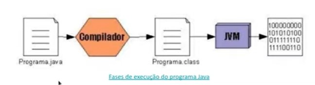
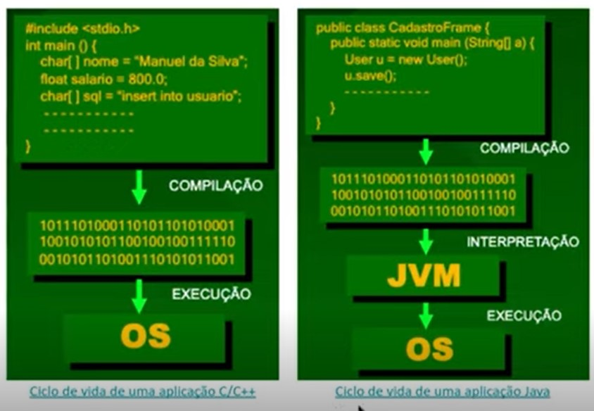
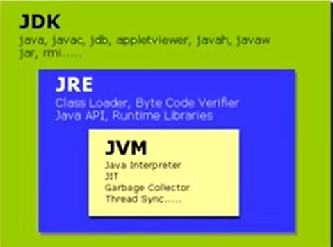

# História do java e alguns conceitos importantes

A história do Java começa com a criação do projeto Green, liderado por James Gosling na Sun Microsystems, com o objetivo de criar uma linguagem de programação que pudesse ser executada em diversos dispositivos, independentemente do sistema operacional.

O nome original da linguagem era Oak, em homenagem a uma árvore que ficava do lado de fora do escritório de Gosling. No entanto, em 1995, quando a Sun Microsystems estava procurando um nome para a linguagem, Oak já havia sido registrado por outra empresa, então o nome foi alterado para Java.

Java foi lançado oficialmente em maio de 1995. Desde então, a linguagem se tornou uma das mais populares do mundo, sendo usada em uma grande variedade de aplicativos e sistemas, desde desktops e servidores até dispositivos móveis e embarcados.

### Aplicações e Softwares
Alguns dos principais softwares que usam Java incluem o Minecraft, o IntelliJ IDEA, o Eclipse, o Apache Tomcat e o Android Studio. Java também é a base da plataforma Java Enterprise Edition (Java EE), que é usada para criar aplicativos corporativos complexos.

### Autores e Aquisição
Entre os autores do Java estão James Gosling, Mike Sheridan e Patrick Naughton, que lideraram o projeto Green na Sun Microsystems.

Em 2010, a Sun Microsystems foi adquirida pela Oracle Corporation, que se tornou a proprietária da linguagem Java. Atualmente, Java é uma das linguagens de programação mais populares e amplamente utilizadas do mundo.

### Características da Linguagem
Java é uma linguagem de programação que possui uma sintaxe semelhante à linguagem C. Isso se deve ao fato de James Gosling, um dos criadores do Java, já ter trabalhado com a linguagem C e desejar que a nova linguagem fosse fácil de aprender para programadores que já conheciam C.

Embora Java seja similar a C em muitos aspectos, como estruturas de controle de fluxo, tipos de dados e operadores, a linguagem possui algumas diferenças significativas. Por exemplo, Java é uma linguagem orientada a objetos, enquanto C é uma linguagem procedural. Isso significa que, em Java, tudo é um objeto e a programação é feita em torno de objetos e suas interações, enquanto em C, o foco está nas funções e procedimentos.

Outra diferença importante entre Java e C é que Java é uma linguagem compilada e interpretada, enquanto C é apenas compilada. Isso significa que o código Java é primeiro compilado para bytecode e, em seguida, interpretado pela máquina virtual Java (JVM). Já o código C é compilado diretamente para o código de máquina.

 

## Write Once, Run Anywhere (Escreva uma vez, execute em qualquer lugar)
Um dos princípios fundamentais do Java é o conceito de "Write Once, Run Anywhere" (Escreva uma vez, execute em qualquer lugar). Isso significa que, ao desenvolver um programa em Java, você pode escrever o código uma vez e ele poderá ser executado em qualquer plataforma que possua uma máquina virtual Java (JVM) instalada.

Isso é possível graças à abordagem de compilação e interpretação do Java. Primeiro, o código fonte Java é compilado em bytecode, uma forma intermediária de código que é independente de plataforma. Em seguida, o bytecode é interpretado pela JVM, que é responsável por executar o programa.

A JVM é um componente essencial do ambiente de execução Java e está disponível para várias plataformas, como Windows, macOS e Linux. Isso significa que, uma vez que um programa Java tenha sido compilado em bytecode, ele pode ser executado em qualquer sistema operacional que possua uma JVM compatível.

Esse conceito de "Write Once, Run Anywhere" trouxe uma grande vantagem para o desenvolvimento de software em Java. Ele permite que os desenvolvedores criem aplicativos independentes de plataforma, evitando a necessidade de reescrever o código para cada sistema operacional específico. Isso economiza tempo e esforço, além de facilitar a portabilidade dos programas Java.

Graças ao "Write Once, Run Anywhere", o Java se tornou uma linguagem de programação amplamente adotada em diversas áreas, desde aplicações de desktop e servidores até dispositivos móveis e embarcados. Ele oferece flexibilidade e eficiência no desenvolvimento de software, permitindo que os programas sejam executados em diferentes plataformas sem grandes modificações no código-fonte original.

### Plataforma java x linguagem java

- A linguagem Java é conhecida por ser portátil e independente de plataforma, o que significa que o mesmo código Java pode ser executado em diferentes sistemas operacionais e plataformas.
- A plataforma Java é um conjunto de programas e tecnologias que permitem que aplicativos Java sejam executados em diferentes dispositivos e sistemas operacionais. A plataforma Java consiste em três componentes principais: a Máquina Virtual Java (JVM), as bibliotecas Java padrão e o compilador Java.

### Esquema de execução do programa em Java

### Ciclo de uma aplicação em C vs Java

#### Principais edições do Java

- Java SE → Usado para desenvolvimento de aplicativos de desktop e aplicativos baseados em servidor
- Java EE → Usado principalmente para desenvolvimento de aplicativos corporativos (Web)
- Java ME → Usado para desenvolvimento de aplicativos em dispositivos móveis e embarcados.
- Java FX → Usado para desenvolver aplicativos de interface do usuário ricos e interativos para desktop, celular e web
- Java Card → projetado para executar aplicativos em dispositivos inteligentes com restrições de memória e recursos
- Java TV → uma plataforma projetada para permitir que desenvolvedores criem aplicativos para televisões digitais.

### Kits do java

- JVM → Máquina virtual que interpreta o código.
- JRE → Para rodar programas Java.
- JDK → Para desenvolvimento de apps em Java.
