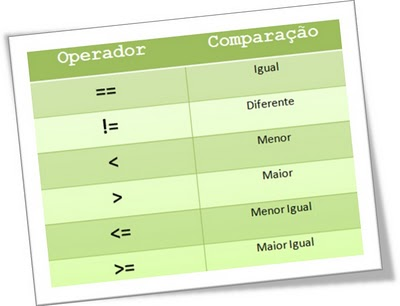

# Operadores

## Símbolos especiais tem um significado próprio para a linguagem e estão associados a determinadas operações.

Geralmente as primeiras palavras que ouvimos em um curso de programação são: um programa é um conjunto de instruções lógicas que, quando executadas, produzem algum resultado. Com isso em mente, ao começar a criar as primeiras linhas de código, logo você notará que é comum receber dados do usuário, prover alguma lógica para processá-los e então apresentar o resultado desse processamento.



<br>

## Classificação do operadores

### Atribuição:
- Representado pelo símbolo de igualdade =. O operador de atribuição é utilizado para definir o valor inicial ou sobrescrever o valor de uma variável. em Java definimos um tipo, nome e opcionalmente atribuímos um valor à variável através do operador de atribuição. Exemplos abaixo:
  ```java
    //classe Operadores.java
    String nome = "josué";
    String time = "Flamengo";
    int idade = 22;
    double peso = 99.9;
    char sexo = 'M';
    boolean doadorOrgao = true;
    Date dataNascimento = new Date();
    ```
### Aritméticos:
- O operador aritmético é utilizado para realizar operações matemáticas entre valores numéricos, podendo se tornar ou não uma expressão mais complexa. Os operadores aritméticos são: + (adição), - (subtração), * (multiplicação) e / (divisão).
    ```java
    //classe Operadores.java
    double soma = 10.5 + 15.7;
    int subtração = 113 - 25;
    int multiplicacao = 20 * 7;
    int divisao = 15 / 3;
    int modulo = 18 % 3;
    double resultado = (10 * 7) + (20/4);
    ```

    >💡**ATENÇÃO!** O operador de adição (+), quando utilizado em variáveis do tipo texto, realizará a “concatenação de textos”.

### Unários:
- Esses operadores são aplicados juntamente com um outro operador aritmético. Eles realizam alguns trabalhos básicos como incrementar, decrementar, inverter valores numéricos e booleanos.
    
    - **(+) Operador unário de valor positivo** – números são positivos sem esse operador explicitamente;
    
    - **(-) Operador unário de valor negativo** – nega um número ou expressão aritmética;
    
    - **(++) Operador unário de incremento de valor** – incrementa o valor em 1 unidade;
    
    - **(--) Operador unário de decremento de valor** – decrementa o valor em 1 unidade;
    
    - **(!) Operador unário lógico de negação** – nega o valor de uma expressão booleana;

    ```java
    //classe Operadores.java
    int numero = 5;
            
    //Imprimindo o numero negativo
    System.out.println(- numero);

    //incrementando numero em mais 1 numero, imprime 6
    numero ++;
    System.out.println(numero);

    //incrementando numero em mais 1 numero, imprime 7
    System.out.println(numero ++);// ops algo de errado não está certo

    System.out.println(numero);// agora sim, numero virou 7

    //ordem de precedencia conta aqui
    System.out.println(++ numero);

    boolean verdadeiro = true;

    System.out.println("Inverteu " + !verdadeiro);

    /* Muito cuidado com ordem de precedência dos operadores unários! */
    ```

### Ternário:
- O Operador de Condição Ternária é uma forma resumida para definir uma condição e escolher por um dentre dois valores. Você deve pensar numa condição ternária como se fosse uma condição IF normal, porém, de uma forma em que toda a sua estrutura estará escrita numa única linha.

- O operador ternário é representado pelos símbolos ?: utilizados na seguinte estrutura de sintaxe:
    > <Expressão Condicional>`` ?``<Caso condição seja true>``: ``<Caso condição seja false>

    ```java
    // classe Operadores.java
    int a, b;
    a = 5;
    b = 6;
    String resultado;

    /* EXEMPLO DE CONDICIONAL UTILIZANDO UMA ESTRUTURA IF/ELSE
    if(a==b)
    resultado = "verdadeiro";
    else
    resultado = "falso";
    */

    //MESMA CONDICIONAL, MAS DESSA VEZ, UTILIZANDO O OPERADOR CONDICIONAL TERNÁRIO
    String resultado = (a==b) ? "verdadeiro" : "false";

    System.out.println(valor);

    /*O operador ternário é aplicado para qualquer tipo de valor.*/
    ```

### Relacionais:
- Os operadores relacionais avaliam a relação entre duas variáveis ou expressões. Neste caso, mais precisamente, definem se o operando à esquerda é igual, diferente, menor, menor ou igual, maior ou maior ou igual ao da direita, retornando um valor booleano como resultado.

    `==` Quando desejamos verificar se uma variável é IGUAL A outra.

    `!=` Quando desejamos verificar se uma variável é DIFERENTE da outra.

    `>` Quando desejamos verificar se uma variável é MAIOR QUE a outra.

    `>=` Quando desejamos verificar se uma variável é MAIOR OU IGUAL a outra.

    `<` Quando desejamos verificar se uma variável é MENOR QUE outra.

    `<=` Quando desejamos verificar se uma variável é MENOR OU IGUAL a outra.

    ```java
    //classe Operadores.java
    int numero1 = 1;
    int numero2 = 2;

    if(numero1 > numero2)
        System.out.print("Numero 1 maior que numero 2");

    if(numero1 < numero2)
        System.out.print("Numero 1 menor que numero 2");

    if(numero1 >= numero2)
        System.out.print("Numero 1 maior ou igual que numero 2");

    if(numero1 <= numero2)
        System.out.print("Numero 1 menor ou igual que numero 2");

    if(numero1 != numero2)
        System.out.print("Numero 1 é diferente de numero 2");jav
    ```

### Lógicos
- Os operadores lógicos representam o recurso que nos permite criar expressões lógicas maiores a partir da junção de duas ou mais expressões.

    `&&` Operador Lógico "E"

    `||` Operador Lógico "OU"

    ```java
    // Operadores.java
    boolean condicao1=true;

    boolean condicao2=false;

    /* Aqui estamos utilizando o operador lógico E para fazer a união de duas 
    expressões. 
    É como se estivesse escrito:
    "Se Condicao1 e Condicao2 forem verdadeiras, executar código"
    */

    if(condicao1 && condicao2)
        System.out.print("Os dois valores precisam ser verdadeiros");;

    //Se condicao1 OU condicao2 for verdadeira, executar código.
    if(condicao1 || condicao2)
        System.out.print("Um dos valores precisa ser verdadeiro");
    ```

    #### Expressões lógicas avançadas

    - Nós acabamos de aprender que existem os operadores lógicos & (E) e ||(OU), mas por quê no exemplo acima, foram ilustradas as condições:

        `if (condicao1 && condicao2) e if(condicao1 || condicao2) ?`
    
    ##### A duplicidade nos operadores lógicos é um recurso conhecido como Operador Abreviado, isso quer que se a condição1 atender aos critérios não será necessário validar a condição2.

    ```java
    // ComparacaoAvancada.java
    int numero1 = 1;
    int numero2 = 1;

    if(numero1== 2 & numero2 ++ == 2 )
        System.out.println("As 2 condições são verdadeiras");

    System.out.println("O numero 1 agora é " + numero1);
    System.out.println("O numero 2 agora é " + numero2);

    // Vamos mudar a linha 5 do código acima para: if(numero1== 2 && numero2 ++ == 2 
    /* O mesmo acontece com o operador | e || considerando que operador 
    agora representa que, se uma das alternativas for verdadeira, 
    a outra nem precisa ser avaliada. */
    ```

<br>

<br>

[Voltar a Aprendendo a sintaxe Java](/Arquivos/Conteudo/2%20-%20Conhecendo%20a%20linguagem%20Java/2.2%20Aprendendo%20a%20sintaxe%20java.md)<br>
[Voltar ao inicio](/README.md)