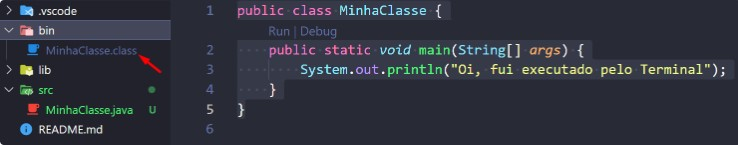
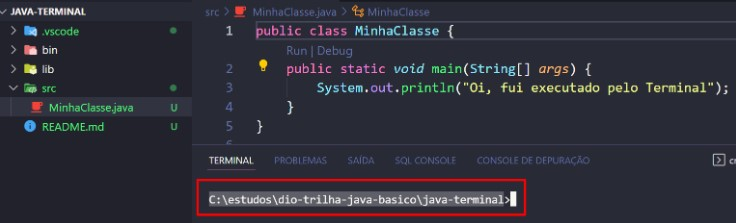
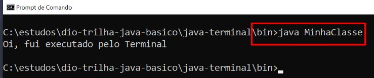

# Terminal

#### Links úteis:
[Running and debugging Java](https://code.visualstudio.com/docs/java/java-debugging)

## Sobre terminal:
Nem sempre executamos nosso programa Java pela IDE, já pensou nossos clientes tendo que instalar o Eclipse ou VsCode para rodar o sistema em sua empresa ?

- Com a JVM devidamente configurada, nós podemos criar um executável do nosso programa e disponibilizar o instalador para qualquer sistema operacional.
- No nosso caso iremos aprender como executar um programa Java via terminal como MS - DOS ou terminal do VsCode.

#### Vamos criar uma classe chamada MinhaClasse.javacom o código abaixo:
```java
public class MinhaClasse {
    public static void main(String[] args) {
        System.out.println("Oi, fui executado pelo Terminal");
    }
}
```

#### Observe que nosso projeto Java criado por um IDE, ele terá uma pasta chamada bin. É nesta pasta que ficarão os arquivos .class, o nosso bytecode:



#### Mesmo usando uma IDE, nós sempre precisaremos identificar aonde se encontram as classes do nosso projeto, no meu caso está em: C:\estudos\dio-trilha-java-basico\java-terminal.


<br>

Vamos ilustrar como executar uma classe, depois de compilada, sem precisar usar a IDE.

1. Abra o MS-DOS ou Power Shell

2. Localize o diretório do seu projeto: **`cd C:\estudos\dio-trilha-java-basico\java-terminal`**

3. Acesse a pasta **** *bin*: ** `cd bin`**

4. Agora digite o comando:**`java MinhaClasse` ** *(nome da sua classe sem a extensão .**class**)*

    

<br> 

