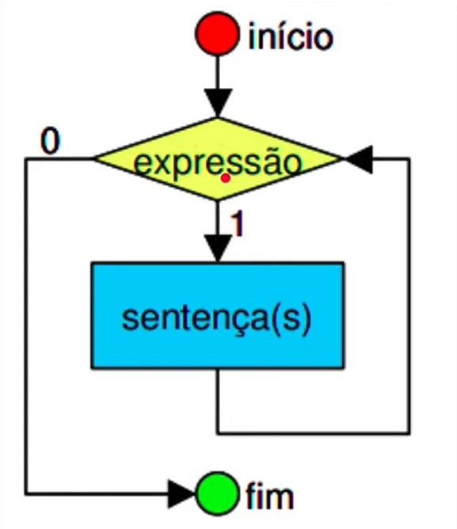
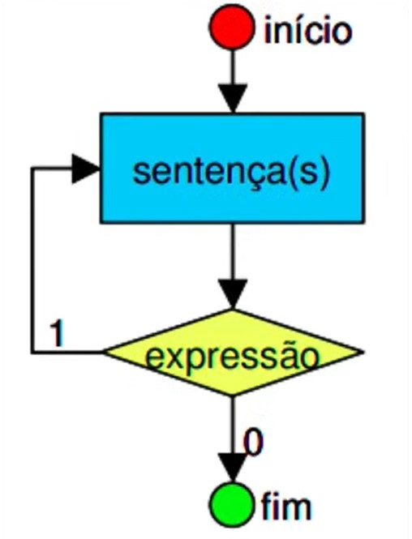
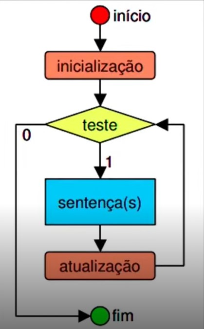
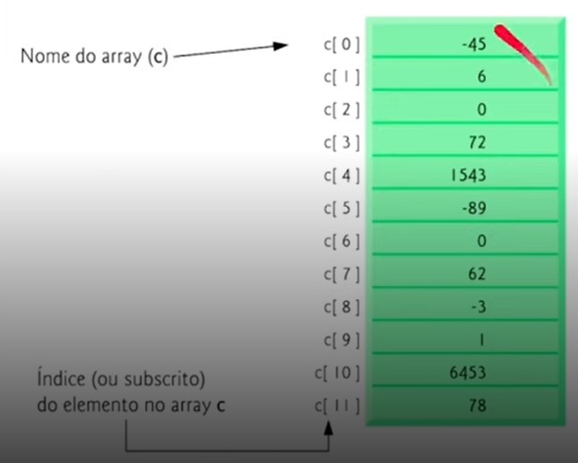
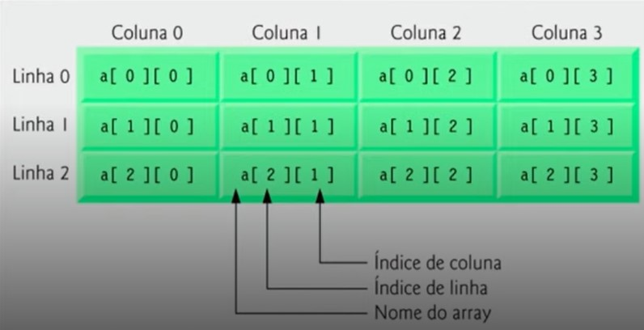

# Visão geral

## Estruturas de repetição

Estruturas de repetição em Java são utilizadas para executar um determinado bloco de código várias vezes, com base em uma condição ou em um número definido de vezes. A escolha de qual estrutura usar depende do contexto em que o código está sendo escrito e da lógica que se deseja implementar.

### Tipos de estruturas de repetição
- Repetição com teste no inicio (While)
    

<br>

- Repetição com teste no final (Do while)
    

<br>

- Repetição contada (For)
    

<br>

#### Comandos complementares
- O comando `break` é usado para terminar de forma abrupta uma repetição.
  
- O comando `continue` é usado para pular comandos abaixo dele e forçar o programa a testar a condição novamente ou não, dependendo da aplicação.

<br>

### Operadores de incremento e decremento

- **Pre-fixados:** Operador prefixado: Um operador prefixado é aquele que é aplicado antes do operando. No caso do operador de incremento ++, por exemplo, ele incrementa o valor do operando e retorna o valor incrementado.
    ```java
    System.out.println("Exemplo com operador de incremento prefixado:");

    for (int i = 0; i < 5; ++i) {
        System.out.println("Valor de i: " + i);
    }

    System.out.println("-----------------------");
    ```


- **Operador prefixado:** Um operador prefixado é aquele que é aplicado antes do operando. No caso do operador de incremento ++, por exemplo, ele incrementa o valor do operando e retorna o valor incrementado.
    ```java
    System.out.println("Exemplo com operador de incremento pós-fixado:");

    int j = 0;
    while (j < 5) {
        System.out.println("Valor de j: " + j);
        j++;
    }

    System.out.println("-----------------------");
    ```

<br>

### Operações aritméticas

Operador **`+=`** (adição e atribuição):

- O operador **`+=`** é utilizado para somar um valor a uma variável e atribuir o resultado à mesma variável.
- É equivalente a escrever **`variavel = variavel + valor`**.
    
    **Exemplo de uso:**
    
    ```java
    int numero = 10;
    numero += 5;
    System.out.println("Valor após adição: " + numero);  // Saída: Valor após adição: 15
    ```

<br>

Operador `-=` (subtração e atribuição):

- O operador -= é utilizado para subtrair um valor de uma variável e atribuir o resultado à mesma variável.

- É equivalente a escrever variavel = variavel valor.

    **Exemplo de uso:**
    ```java
    int numero = 10;
    numero -= 5;
    System.out.println("Valor após subtração: " + numero);  // Saída: Valor após subtração: 5
    ```

<br>

Operador **`*=`** (multiplicação e atribuição):

- O operador **`=`** é utilizado para multiplicar uma variável por um valor e atribuir o resultado à mesma variável.
- É equivalente a escrever **`variavel = variavel * valor`**.
    
    **Exemplo de uso:**
    
    ```java
    int numero = 5;
    numero *= 3;
    System.out.println("Valor após multiplicação: " + numero);  // Saída: Valor após multiplicação: 15
    ```

<br>

Operador **`/=`** (divisão e atribuição):

- O operador **`/=`** é utilizado para dividir uma variável por um valor e atribuir o resultado à mesma variável.
- É equivalente a escrever **`variavel = variavel / valor`**.
    
    **Exemplo de uso:**
    
    ```java
    int numero = 20;
    numero /= 4;
    System.out.println("Valor após divisão: " + numero);  // Saída: Valor após divisão: 5
    ```

<br>

## Arrays

Um array é uma estrutura de dados que armazena um conjunto de valores do mesmo tipo em uma única variável. Cada elemento do array é acessado por um índice numérico que começa em 0 e vai até o tamanho do array menos 1.

#### A declaração de um array em Java segue o seguinte formato:
```java
tipo[] nomeDoArray = new tipo[tamanhoDoArray];
```
<br>

### Podemos ter 2 tipos de arrays 
#### Array unidimensional 
- Temos apenas uma coluna (índice) dos elementos.

    ```java
    //Criando o array com 12 posições
    double[] c = new double[12];

    //Atribuindo valores as posições 
    c[0] = -45;
    c[1] = 6;
    c[2] = 0;
    c[3] = 72;
    c[4] = 1543;
    c[5] = -89;
    c[6] = 0;
    c[7] = 62;
    c[8] = -3;
    c[9] = 1;
    c[10] = 6453;
    c[11] = 78;
    ```
    

<br>

#### Array multidimensional (Matriz)    

- Temos um índice para coluna.
- Temos outro índice para linhas.
    ```java
    //Criando o array com 3 linhas e 4 colunas
    double[][] a = new double[3][4];

    ```
    

<br>

<br>

[Voltar a Estrutura de repetição e arrays em Java](/Arquivos/Conteudo/2%20-%20Conhecendo%20a%20linguagem%20Java/2.4%20Estruturas%20de%20repeticao%20e%20arrays%20em%20java.md)<br>
[Voltar ao inicio](/README.md)