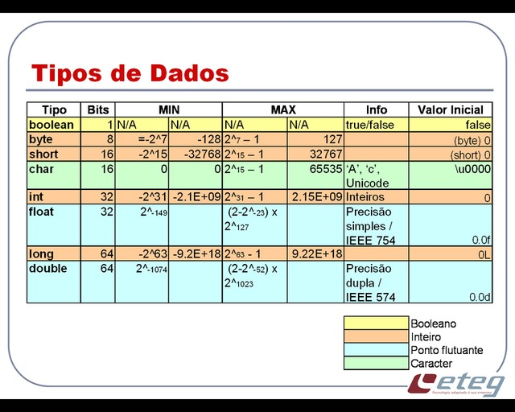
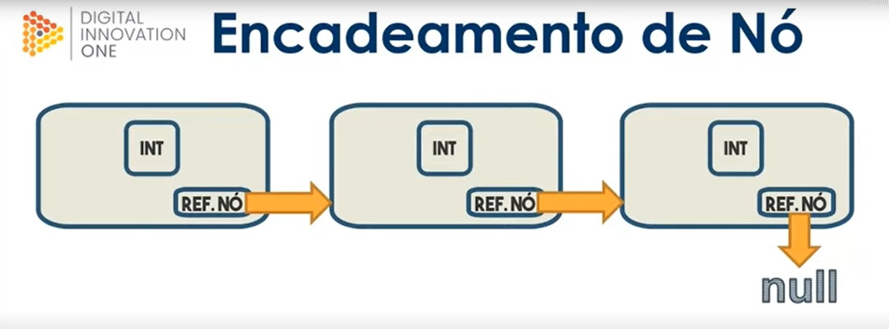

# Introdução e conceitos básicos

## Tabela de dados no java



### Atribuições e referência:
- As atribuições em Java são por cópia de valor sempre.
- Com o tipo primitivo, copiamos o valor em memória.
- Com objetos, copiamos o valor da referência em memória, sem duplicar o objeto.

#### Mostrando em código
<details>
<summary>Código</summary>


```java
/*Classe "Main"*/
package com.projeto.atribuicao_referencia;

public class Main {
    public static void main(String[] args) {
        //Criando 2 variáveis simples e usando "int_b" para receber valor de "int_a"
        int int_a = 1;
        int int_b = int_a;

        //Mostrando valores de "int_a" e "int_b" na tela
        System.out.println("Referência de tipo primitivo");
        System.out.println("Int_a = " + int_a);
        System.out.println("Int_b = " + int_b);

        //Modificando o valor de "int_a"
        int_a = 2;

        //Mostrando novamente os valores de "int_a" e "int_b" na tela
        /* Note que "int_b" não teve seu valor modificado */
        System.out.println("Int_a = " + int_a);
        System.out.println("Int_b = " + int_b);

        //Criando objetos a partir da classe "Meu_obj"
        Meu_obj obj_a = new Meu_obj(1);
        Meu_obj obj_b = obj_a;

        //Mostrando os valores na tela de "obj_a" e "obj_b"
        System.out.println("\nReferência de objetos");
        System.out.println("obj_a = " + obj_a);
        System.out.println("obj_b = " + obj_b);

        //Modificando o valor do "obj_a"
        obj_a.setNum(2);

        //Mostrando novamente os valores de "obj_a" e "obj_b"
        /* Note que "obj_b" também teve seu valor modificado pois referencia o "obj_a" */
        System.out.println("obj_a = " + obj_a);
        System.out.println("obj_b = " + obj_b);
    }
}
```

```java
/*Classe "Meu_obj"*/
package com.projeto.atribuicao_referencia;

public class Meu_obj {
    Integer num;

    public Meu_obj(Integer num) {
        this.num = num;
    }

    public void setNum(Integer num){
        this.num = num;
    }

    @Override
    public String toString() {
        return this.num.toString();
    }
}
```

</details>

<br>

## Conceito de nó e encadeamento de nó



- Em programação, um nó (ou "node", em inglês) é uma estrutura de dados básica que é usada para representar um objeto ou uma entidade em um conjunto de dados ou em uma estrutura de dados como uma lista encadeada, uma árvore ou um grafo.
- Em Java, um nó pode ser definido como uma classe ou estrutura que contém pelo menos um campo de dados para armazenar informações e um campo que representa o encadeamento para o próximo nó na estrutura. Por exemplo, em uma lista encadeada, um nó pode ter um campo de dados que armazena um valor e um campo de encadeamento que aponta para o próximo nó na lista.
- O encadeamento de nó, por sua vez, é a maneira pela qual os nós são conectados em uma estrutura de dados. Cada nó na estrutura contém um campo que representa o encadeamento para o próximo nó na estrutura. Isso permite que os dados sejam acessados sequencialmente, um nó de cada vez, e também permite que os nós sejam facilmente adicionados ou removidos da estrutura de dados. Em outras palavras, o encadeamento de nó é o mecanismo que torna as estruturas de dados baseadas em nós dinâmicas e flexíveis.
- Geralmente a última referência em uma estrutura de dados baseada em nós é definida como "null". Essa referência nula é usada para indicar o final da estrutura de dados. Exemplo: Em uma árvore, os nós folha são aqueles que não têm filhos e, portanto, seus ponteiros de encadeamento para filhos são definidos como nulos. Isso indica que não há mais descendentes naquele ramo da árvore.

#### Mostrando em código (Criando a classe “No”):

<details>
<summary>Código</summary>

```java
/*Class "main"*/
package com.projeto.No;

public class Main {
    public static void main(String[] args) {
        /*no_1 -> no_2 -> no_3 -> no_4 -> null*/

        //Criando objetos do tipo "NO"
        No no_1 = new No("Conteúdo no_1");
        No no_2 = new No("Conteúdo no_2");
        //Encadeando "no_1" com "no_2"
        no_1.setProximo_no(no_2);

        //Criando "no_3"
        No no_3 = new No("Conteúdo no_3");
        //Encadeando "no_2" com "no_3"
        no_2.setProximo_no(no_3);

        //Criando "no_4"
        No no_4 = new No("Conteúdo no_4");
        //Encadeando "no_3" com "no_4"
        no_3.setProximo_no(no_4);

        //Mostrando na tela
        //"no1"
        System.out.println(no_1);
        //"no2"
        System.out.println(no_1.getProximo_no());
        //"no3"
        System.out.println(no_1.getProximo_no().getProximo_no());
        //"no4"
        System.out.println(no_1.getProximo_no().getProximo_no().getProximo_no());
        //"null"
        System.out.println(no_1.getProximo_no().getProximo_no().getProximo_no().getProximo_no());
    }
}
```

```java
/*Class no*/
package com.projeto.No;

public class No {
    private String conteudo;
    private No proximo_no;

    //Construtor de "conteúdo"
    public No(String conteudo) {
        this.proximo_no = null;
        this.conteudo = conteudo;
    }

    //Getters e setters de "conteudo"
    public String getConteudo() {
        return conteudo;
    }
    public void setConteudo(String conteudo) {
        this.conteudo = conteudo;
    }

    //Getters e setters de "proximo_no"
    public No getProximo_no() {
        return proximo_no;
    }
    public void setProximo_no(No proximo_no) {
        this.proximo_no = proximo_no;
    }

    //ToString de "conteudo"
    @Override
    public String toString() {
        return "no{" +
                "conteudo='" + conteudo + '\'' +
                '}';
    }
}
```

</details>

<br>

## Generics 

[Documentação generics](https://docs.oracle.com/javase/tutorial/java/generics/why.html)

### Alguns pontos importantes:
- Generics é um recurso da linguagem de programação Java que permite criar classes, interfaces e métodos que podem ser parametrizados com tipos. Em outras palavras, ele permite que você escreva um código que pode ser reutilizado para diferentes tipos de objetos, sem precisar escrever o mesmo código várias vezes.
- Com generics, é possível criar classes ou interfaces que possam manipular diferentes tipos de dados de forma segura e eficiente. Por exemplo, em vez de criar uma classe diferente para cada tipo de coleção (ArrayList, LinkedList, HashSet, etc.), você pode criar uma única classe genérica que possa ser usada para todos os tipos de coleção.
- Os generics em Java são indicados pelo uso de caracteres angulares "<>" e são usados para definir o tipo de dado que será manipulado pela classe, interface ou método. Por exemplo, a classe `ArrayList<T>` é uma classe genérica que pode ser usada para criar listas de qualquer tipo de objeto, basta informar o tipo desejado dentro dos caracteres angulares, como `ArrayList<String>` ou `ArrayList<Integer>`.
- Os generics em Java ajudam a tornar o código mais legível, mais seguro em tempo de compilação e mais fácil de manter.

<br>

### Wildcards

Wildcards, em Java, são um recurso que permite trabalhar com tipos desconhecidos ou genéricos em tempo de compilação. Eles são representados pelo caractere coringa **`?`**.

Os wildcards podem ser usados em três formas diferentes:

- Wildcard não limitado: representado por **`<?>`**, é usado para indicar que o tipo é desconhecido e pode ser qualquer tipo.
- Wildcard limitado superior: representado por **`<? extends Tipo>`**, é usado para indicar que o tipo é desconhecido, mas deve ser uma subclasse de **`Tipo`** (ou o próprio **`Tipo`**).
- Wildcard limitado inferior: representado por **`<? super Tipo>`**, é usado para indicar que o tipo é desconhecido, mas deve ser uma superclasse de **`Tipo`** (ou o próprio **`Tipo`**).

Os wildcards podem ser usados como tipos de parâmetros em métodos genéricos, em classes genéricas e em listas genéricas, permitindo que o código seja escrito de forma mais flexível e genérica. Por exemplo, um método que receba uma lista de objetos de um tipo desconhecido pode usar o wildcard **`List<?>`** para aceitar uma lista de qualquer tipo. Já um método que receba uma lista de objetos que sejam uma subclasse de **`Animal`**, pode usar o wildcard limitado superior **`List<? extends Animal>`**.

##### Convenção:
- K → Para “key”
- V → Para “value”
- E → para “element”
- T → para “type”
- ? → Para genérico

### Mostrando em código (Refatorando a classe “No”):

<details>
<summary>Código</summary>

```java
/*Class "main (Refatorada)"*/
package com.projeto.no;

public class Main {
    public static void main(String[] args) {
        /*Aqui estou definindo o tipo de dado dos objetos "no".
				Neste caso, estõu definindo tudo como "String" */

        //Criando objetos do tipo "NO"
        No<String> no_1 = new No<>("Conteúdo no_1");
        No<String> no_2 = new No<>("Conteúdo no_2");
        //Encadeando "no_1" com "no_2"
        no_1.setProximo_no(no_2);

        //Criando "no_3"
        No<String> no_3 = new No<>("Conteúdo no_3");
        //Encadeando "no_2" com "no_3"
        no_2.setProximo_no(no_3);

        //Criando "no_4"
        No<String> no_4 = new No<>("Conteúdo no_4");
        //Encadeando "no_3" com "no_4"
        no_3.setProximo_no(no_4);

        //Mostrando na tela
        //"no1"
        System.out.println(no_1);
        //"no2"
        System.out.println(no_1.getProximo_no());
        //"no3"
        System.out.println(no_1.getProximo_no().getProximo_no());
        //"no4"
        System.out.println(no_1.getProximo_no().getProximo_no().getProximo_no());
        //"null"
        System.out.println(no_1.getProximo_no().getProximo_no().getProximo_no().getProximo_no());
    }
}
```

```java
/*Class no (Refatorada*/
package com.projeto.no;

public class No<T> {
    private T conteudo;
    private No<T> proximo_noRef;

    //Construtor de "conteúdo"
    public No(T conteudo) {
        this.proximo_noRef = null;
        this.conteudo = conteudo;
    }

    //Getters e setters de "conteudo"
    public T getConteudo() {
       return conteudo;
    }
    public void setConteudo(T conteudo) {
        this.conteudo = conteudo;
    }

    //Getters e setters de "proximo_no"
    public No<T> getProximo_no() {
        return proximo_noRef;
    }
    public void setProximo_no(No<T> proximo_noRef) {
        this.proximo_noRef = proximo_noRef;
    }

    //ToString de "conteudo"
    @Override
    public String toString() {
        return "no{" +
                "conteudo='" + conteudo + '\'' +
                '}';
    }
}
```

</details>


