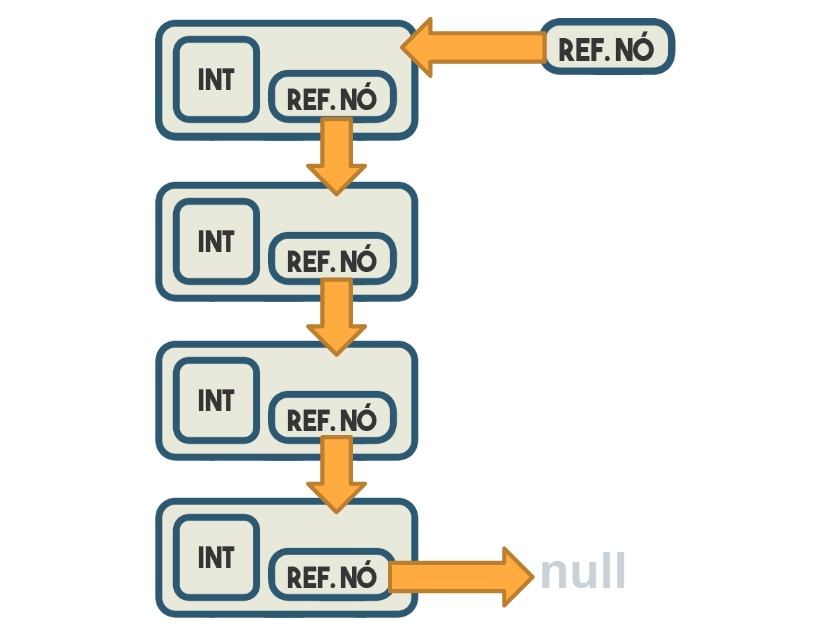
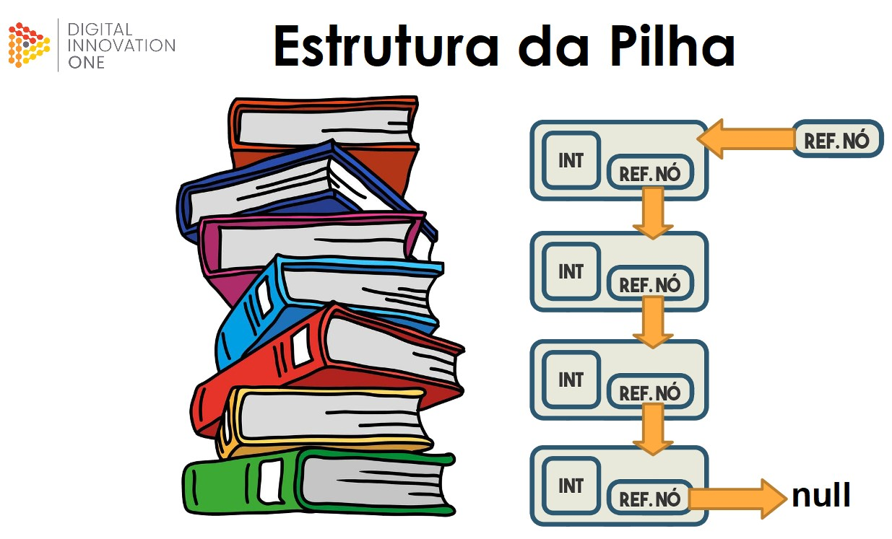

# Pilhas (LIFO: last in, first out)

Pilha (ou stack, em inglês) é uma estrutura de dados em que o último elemento inserido é o primeiro a ser removido. Ela é conhecida como LIFO (Last-In, First-Out), o que significa que o último elemento adicionado à pilha é o primeiro a ser removido. Em outras palavras, a pilha opera como uma estrutura que permite inserir e remover elementos, mas sempre seguindo a ordem inversa da inserção. A pilha é uma estrutura de dados muito utilizada em programação, especialmente em algoritmos que envolvem recursão, inversão de ordem e outras situações em que é necessário armazenar dados temporariamente seguindo a ordem inversa da inserção.

 

## Os principais métodos de uma pilha (ou stack) em Java incluem:

- `push(elemento)`: adiciona um elemento ao topo da pilha.
- `pop()`: remove e retorna o elemento que está no topo da pilha.
- `peek() ou top()`: retorna o elemento que está no topo da pilha sem removê-lo.
- `isEmpty()`: verifica se a pilha está vazia.
- `search(elemento)`: retorna a posição do elemento na pilha contando a partir do topo, ou -1 se o elemento não estiver presente na pilha.

