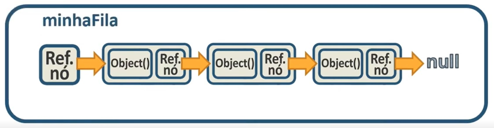
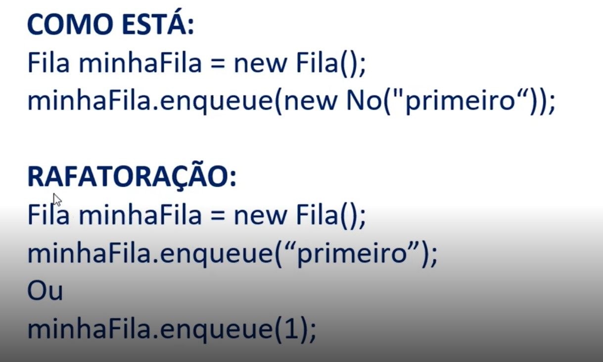
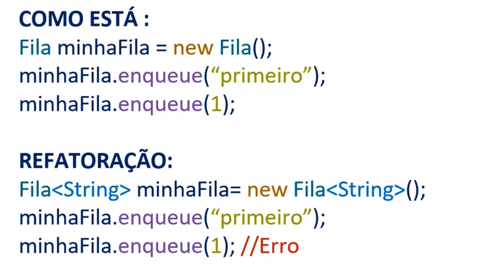

# Filas (FIFO: first in, first out)



Pilhas FIFO (First-In, First-Out) são uma estrutura de dados em que o primeiro elemento inserido é o primeiro a ser removido. Essa estrutura é também conhecida como fila, e é usada em diversas aplicações, tais como processamento de tarefas em um sistema operacional, atendimento de pedidos em um restaurante ou e-commerce, entre outros.

- Na pilha FIFO, a inserção de novos elementos é feita no final da estrutura (ou na "cauda"), e a remoção é feita no início (ou na "cabeça"). Isso significa que, ao remover um elemento, todos os elementos restantes são deslocados uma posição para a esquerda, para preencher o espaço vazio no início da estrutura.

<br>

- A estrutura FIFO é representada graficamente como uma fila, em que cada elemento é adicionado no final da fila e removido no início, seguindo a ordem de chegada dos elementos.

<br>

- A fila termina com a referência de nó, que aponta para o último objeto da fila, que por sua vez aponta para o penultimo, assim, sucessivamente, até que o primeiro objeto da fila aponta para null.
  
<br>

## Principais métodos de FIFO


- **`enqueue`**: adiciona um elemento ao final da fila
- **`dequeue`**: remove o elemento na frente da fila
- **`isEmpty`**: verifica se a fila está vazia
- **`isFull`**: verifica se a fila está cheia
- **`front ou first`**: retorna o elemento na frente da fila sem removê-lo
- **`rear`**: retorna o elemento no final da fila sem removê-lo.

<br>

### Mostrando em código:

<details>
<summary>Código</summary>

```java
//Class "main"
package com.projeto.fila_FIFO;

public class Main {
    public static void main(String[] args) {
        //Criando objeto a partir da classe "Fila"
        Fila minha_fila = new Fila();

        //Inserindo objetos dentro da "minha_fila"
        minha_fila.enqueue(new No("Primeiro"));
        minha_fila.enqueue(new No("Segundo"));
        minha_fila.enqueue(new No("Terceiro"));
        minha_fila.enqueue(new No("Quarto"));

        //Imprimindo "minha_fila"
        System.out.println("Fila: " + minha_fila);

        //Usando "dequeue" para remover e mostrar o primeiro objeto da "minha_fila"
        System.out.println("\nObjeto removido: " + minha_fila.dequeue());

        //Imprimindo novamente "minha_fila" para ver a nova ordem de elementos
        System.out.println("\nNova fila: " + minha_fila);

        //Adicionando outro elemento na "minha_fila"
        minha_fila.enqueue(new No("último"));

        //Imprimindo "minha_fila" novamente
        System.out.println("\nNova fila com 'último' adicionado: " + minha_fila);

        //Imprimindo o primeiro elemento de "minha fila"
        System.out.println("\nPrimeiro elemento da fila: " + minha_fila.first());
    }
}
```

```java
//Class "No"
package com.projeto.fila_FIFO;

public class No {
    //Criando variáveis "objeto" e "ref_no"
    private Object object;
    private No ref_no;

    //Contrutor de "No"
    public No(Object object) {
        this.ref_no = null;
        this.object = object;
    }
    //construtor padrão de "No" (Construtor vazio)
    public No() {}

    //Getters e settes de "No"
    public No getRef_no() {
        return ref_no;
    }
    public void setRef_no(No ref_no) {
        this.ref_no = ref_no;
    }
    //Getters e settes de "object"
    public Object getObject() {
        return object;
    }
    public void setObject(Object object) {
        this.object = object;
    }

    //Método "toString" para "object"
    @Override
    public String toString() {
        return "No{" +
                "object=" + object +
                '}';
    }
}
```

```java
//Classe "Fila
package com.projeto.fila_FIFO;

public class Fila {
    //Variável para "ref_entrada_fila
    private No ref_entrada_fila;

    //Construtor para "Fila"
    public Fila() {
        this.ref_entrada_fila = null;
    }

    //Método "isEmpty" (verifica se "Fila" esta vazia)
    public boolean isEmpty(){
        return ref_entrada_fila == null ? true : false;
    }
    //Método "enqueue" (adiciona novo objeto a "Fila")
    public void enqueue(No novo_no){
        novo_no.setRef_no(ref_entrada_fila);
        ref_entrada_fila = novo_no;
    }
    //Método "dequeue" (Remove o primeiro objeto da "Fila")
    public No dequeue(){
        if(!this.isEmpty()){
            No primeiro_no = ref_entrada_fila;
            No no_auxiliar = ref_entrada_fila;
            while(true){
                if (primeiro_no.getRef_no() != null){
                    no_auxiliar = primeiro_no;
                    primeiro_no = primeiro_no.getRef_no();
                }else{
                    no_auxiliar.setRef_no(null);
                    break;
                }
            }
            return primeiro_no;
        }else{
            return null;
        }
    }
    //Método "first" (Retorna o primeiro objeto da "Fila")
    public No first(){
        if(!this.isEmpty()){
            No primeiro_no = ref_entrada_fila;
            while(true){
                if (primeiro_no.getRef_no() != null){
                    primeiro_no = primeiro_no.getRef_no();
                }else{
                    break;
                }
            }
            return primeiro_no;
        }else{
            return null;
        }
    }

    //Método "toString" para "Fila"
    @Override
    public String toString() {
        String string_retorno = "";
        No no_auxiliar = ref_entrada_fila;

        if(ref_entrada_fila != null){
            while (true){
                string_retorno += "[No{objeto = " + no_auxiliar.getObject()+"}]-->";

                if(no_auxiliar.getRef_no() != null){
                    no_auxiliar = no_auxiliar.getRef_no();
                }else {
                    string_retorno +="null";
                    break;
                }
            }
        }else {
            string_retorno = null;
        }
        return string_retorno;
    }
}
```

</details>

<br>

### Refatorando o código para embutir o “Nó” na criação de objetos da fila:

<details>
<summary>Código</summary>



```java
//class "main" (Refadorada)
package com.projeto.fila_FIFO;

public class Main {
    public static void main(String[] args) {
        //Criando objeto a partir da classe "Fila"
        Fila minha_fila = new Fila();

        //Inserindo objetos dentro da "minha_fila"
        minha_fila.enqueue("Primeiro");
        minha_fila.enqueue("Segundo");
        minha_fila.enqueue("Terceiro");
        minha_fila.enqueue("Quarto");

        //Imprimindo "minha_fila"
        System.out.println("Fila: " + minha_fila);

        //Usando "dequeue" para remover e mostrar o primeiro objeto da "minha_fila"
        System.out.println("\nObjeto removido: " + minha_fila.dequeue());

        //Imprimindo novamente "minha_fila" para ver a nova ordem de elementos
        System.out.println("\nNova fila: " + minha_fila);

        //Adicionando outro elemento na "minha_fila"
        minha_fila.enqueue("último");

        //Imprimindo "minha_fila" novamente
        System.out.println("\nNova fila com 'último' adicionado: " + minha_fila);

        //Imprimindo o primeiro elemento de "minha fila"
        System.out.println("\nPrimeiro elemento da fila: " + minha_fila.first());
    }
}
```

```java
//class "No"
package com.projeto.fila_FIFO;

public class No {
    //Criando variáveis "objeto" e "ref_no"
    private Object object;
    private No ref_no;

    //Contrutor de "No"
    public No(Object object) {
        this.ref_no = null;
        this.object = object;
    }
    //construtor padrão de "No" (Construtor vazio)
    public No() {}

    //Getters e settes de "No"
    public No getRef_no() {
        return ref_no;
    }
    public void setRef_no(No ref_no) {
        this.ref_no = ref_no;
    }
    //Getters e settes de "object"
    public Object getObject() {
        return object;
    }
    public void setObject(Object object) {
        this.object = object;
    }

    //Método "toString" para "object"
    @Override
    public String toString() {
        return "No{" +
                "object=" + object +
                '}';
    }
}
```

```java
//class "Fila" (Refatorada)
package com.projeto.fila_FIFO;

public class Fila {
    //Variável para "ref_entrada_fila
    private No ref_entrada_fila;

    //Construtor para "Fila"
    public Fila() {
        this.ref_entrada_fila = null;
    }

    //Método "isEmpty" (verifica se "Fila" esta vazia)
    public boolean isEmpty(){
        return ref_entrada_fila == null ? true : false;
    }
    //Método "enqueue" (adiciona novo objeto a "Fila")
    public void enqueue(Object obj){
        No novo_no = new No(obj);
        novo_no.setRef_no(ref_entrada_fila);
        ref_entrada_fila = novo_no;
    }
    //Método "dequeue" (Remove o primeiro objeto da "Fila")
    public Object dequeue(){
        if(!this.isEmpty()){
            No primeiro_no = ref_entrada_fila;
            No no_auxiliar = ref_entrada_fila;
            while(true){
                if (primeiro_no.getRef_no() != null){
                    no_auxiliar = primeiro_no;
                    primeiro_no = primeiro_no.getRef_no();
                }else{
                    no_auxiliar.setRef_no(null);
                    break;
                }
            }
            return primeiro_no.getObject();
        }else{
            return null;
        }
    }
    //Método "first" (Retorna o primeiro objeto da "Fila")
    public Object first(){
        if(!this.isEmpty()){
            No primeiro_no = ref_entrada_fila;
            while(true){
                if (primeiro_no.getRef_no() != null){
                    primeiro_no = primeiro_no.getRef_no();
                }else{
                    break;
                }
            }
            return primeiro_no.getObject();
        }else{
            return null;
        }
    }
    //Método "toString" para "Fila"
    @Override
    public String toString() {
        String string_retorno = "";
        No no_auxiliar = ref_entrada_fila;

        if(ref_entrada_fila != null){
            while (true){
                string_retorno += "[No{objeto = " + no_auxiliar.getObject()+"}]-->";

                if(no_auxiliar.getRef_no() != null){
                    no_auxiliar = no_auxiliar.getRef_no();
                }else {
                    string_retorno +="null";
                    break;
                }
            }
        }else {
            string_retorno = null;
        }
        return string_retorno;
    }
}
```

</details>

<br>

### Refatorando o código novamente para inserir generics:

<details>
<summary>Código</summary>



```java
//class "main" (Refatorada)
package com.projeto.fila_FIFO;

public class Main {
    public static void main(String[] args) {
        //Criando objeto a partir da classe "Fila" com adição de tipo dentro dos diamonds
        Fila<Integer> minha_fila = new Fila<>();

        //Inserindo objetos dentro da "minha_fila"
        minha_fila.enqueue(1);
        minha_fila.enqueue(2);
        minha_fila.enqueue(3);
        minha_fila.enqueue(4);

        //Imprimindo "minha_fila"
        System.out.println("Fila: " + minha_fila);

        //Usando "dequeue" para remover e mostrar o primeiro objeto da "minha_fila"
        System.out.println("\nObjeto removido: " + minha_fila.dequeue());

        //Imprimindo novamente "minha_fila" para ver a nova ordem de elementos
        System.out.println("\nNova fila: " + minha_fila);

        //Adicionando outro elemento na "minha_fila"
        minha_fila.enqueue(5);

        //Imprimindo "minha_fila" novamente
        System.out.println("\nNova fila com 5° objeto adicionado adicionado: " + minha_fila);

        //Imprimindo o primeiro elemento de "minha fila"
        System.out.println("\nPrimeiro elemento da fila: " + minha_fila.first());
    }
}
```

```java
//class "Fila" (Refatorada)
package com.projeto.fila_FIFO;

//Inserindo wildcard na class "Fila"
public class Fila<T> {
    //Variável para "ref_entrada_fila
    private No<T> ref_no_entrada_fila;

    //Construtor para "Fila"
    public Fila() {
        this.ref_no_entrada_fila = null;
    }

    //Método "isEmpty" (verifica se "Fila" esta vazia)
    public boolean isEmpty(){
        return ref_no_entrada_fila == null ? true : false;
    }
    //Método "enqueue" (adiciona novo objeto a "Fila")
    public void enqueue(T object){
        No novo_no = new No(object);
        novo_no.setRef_no(ref_no_entrada_fila);
        ref_no_entrada_fila = novo_no;
    }
    //Método "dequeue" (Remove o primeiro objeto da "Fila")
    public T dequeue(){
        if(!this.isEmpty()){
            No primeiro_no = ref_no_entrada_fila;
            No no_auxiliar = ref_no_entrada_fila;
            while(true){
                if (primeiro_no.getRef_no() != null){
                    no_auxiliar = primeiro_no;
                    primeiro_no = primeiro_no.getRef_no();
                }else{
                    no_auxiliar.setRef_no(null);
                    break;
                }
            }
            return (T) primeiro_no.getObject();
        }else{
            return null;
        }
    }
    //Método "first" (Retorna o primeiro objeto da "Fila")
    public T first(){
        if(!this.isEmpty()){
            No primeiro_no = ref_no_entrada_fila;
            while(true){
                if (primeiro_no.getRef_no() != null){
                    primeiro_no = primeiro_no.getRef_no();
                }else{
                    break;
                }
            }
            return(T) primeiro_no.getObject();
        }else{
            return null;
        }
    }
    //Método "toString" para "Fila"
    @Override
    public String toString() {
        String string_retorno = "";
        No no_auxiliar = ref_no_entrada_fila;

        if(ref_no_entrada_fila != null){
            while (true){
                string_retorno += "[No{objeto = " + no_auxiliar.getObject()+"}]-->";

                if(no_auxiliar.getRef_no() != null){
                    no_auxiliar = no_auxiliar.getRef_no();
                }else {
                    string_retorno +="null";
                    break;
                }
            }
        }else {
            string_retorno = null;
        }
        return string_retorno;
    }
}
```

```java
//class "No" (Refatorada)
package com.projeto.fila_FIFO;

//Inserindo wildcard na classe "No"
public class No<T> {
    //Refatorando variáveis "objeto" e "ref_no" com generics
    private T object;
    private No<T> ref_no;

    //Contrutor de "No"
    public No(T object) {
        this.ref_no = null;
        this.object = object;
    }
    //construtor padrão de "No" (Construtor vazio)
    public No() {}

    //Getters e settes de "No"
    public No getRef_no() {
        return ref_no;
    }
    public void setRef_no(No ref_no) {
        this.ref_no = ref_no;
    }
    //Getters e settes de "object"
    public Object getObject() {
        return object;
    }
    public void setObject(T object) {
        this.object = object;
    }

    //Método "toString" para "object"
    @Override
    public String toString() {
        return "No{" +
                "object=" + object +
                '}';
    }
}
```

</details>
