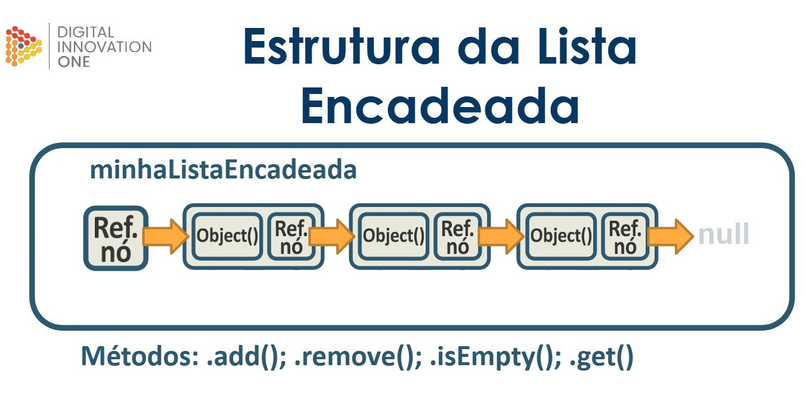

# Listas encadeadas



- Uma estrutura de lista encadeada (também conhecida como lista de encadeamento) é uma estrutura de dados que consiste em nós ligados em uma sequência. Cada nó contém algum tipo de dado, bem como uma referência ao próximo nó da lista. 

<br>

- Em Java, as listas encadeadas são muitas vezes usadas em lugar de vetores, pois elas permitem que você adicione ou remova elementos facilmente. Além disso, elas são mais eficientes para acessar elementos aleatórios na lista. Diferente de lista e fila, as listas encadeadas podem adicionar elementos de acordo com índice específico. 

<br>

### Mostrando em código:

<details>
<summary>Código</summary>

```java
//Class "main"
package com.projeto.lista_encadeada;

public class Main {
    public static void main(String[] args) {
        //Criando lista de elementos "minha_lista_encadeada"
        ListaEncadeada<String> minha_lista_encadeada = new ListaEncadeada<>();

        //Adicionando objetos dentro da "minha_lista_encadeada"
        minha_lista_encadeada.add("teste1");
        minha_lista_encadeada.add("teste2");
        minha_lista_encadeada.add("teste3");
        minha_lista_encadeada.add("teste4");

        //Mostrando elementos da lista na tela usando o método "get"
        System.out.println(minha_lista_encadeada.get(0));
        System.out.println(minha_lista_encadeada.get(1));
        System.out.println(minha_lista_encadeada.get(2));
        System.out.println(minha_lista_encadeada.get(3));

        //Mostrando toda a lista de elemento e referências de apontamento
        System.out.println(minha_lista_encadeada);

        //Removendo e mostrando nó de indice 3
        System.out.println(minha_lista_encadeada.remove(3));

        //Imprimindo a lista novamente com a remoção
        System.out.println(minha_lista_encadeada);
    }
}
```

```java
//Classe "No"
package com.projeto.lista_encadeada;

public class No<T> {
    private T conteudo; //Wildcard
    private No proximo_no; //Referência do no

    //Construtores
    public No() {
        this.proximo_no = null;
    }
    public No(T conteudo) {
        this.conteudo = conteudo;
        this.proximo_no = null;
    }
    public No(T conteudo, No proximo_no) {
        this.conteudo = conteudo;
        this.proximo_no = proximo_no;
    }

    //Getters e setters "conteúdo"
    public T getConteudo() {
        return conteudo;
    }
    public void setConteudo(T conteudo) {
        this.conteudo = conteudo;
    }
    //Getters e setters "No"
    public No getProximo_no() {
        return proximo_no;
    }
    public void setProximo_no(No proximo_no) {
        this.proximo_no = proximo_no;
    }

    //Método "toString" para "T"
    @Override
    public String toString() {
        return "No{" + "conteudo=" + conteudo + '}';
    }
    //Metodo "toString" personalizado
    public String toString_enc(){
       String str =  "No{" + "conteudo=" + conteudo + '}';
       if(proximo_no != null){
           str += (" -> " + proximo_no.toString());
       }else{
           str += (" -> null");
       }
       return str;
    }
}
```

```java
//Class "listaEncadeada"
package com.projeto.lista_encadeada;

public class ListaEncadeada<T> {
    No<T> referencia_entrada;

    //Construtor
    public ListaEncadeada() {
        this.referencia_entrada = null;
    }

    //Método "is_empty (Verifica se a lista esta vazia)
    public boolean is_empty(){
        return referencia_entrada == null ? true : false;
    }
    //Método size (Verifica o tamanho da lista)
    public int size(){
        int tamanho_lista = 0;
        No<T> referencia_aux = referencia_entrada;
        while (true){
            if(referencia_aux != null){
                tamanho_lista++;
                if(referencia_aux.getProximo_no() != null){
                    referencia_aux = referencia_aux.getProximo_no();
                }else{
                    break;
                }
            }else{
                break;
            }
        }
        return tamanho_lista;
    }
    //Método add (Adiciona novo elemento na lista)
    public void add(T conteudo){
        No<T> novo_no = new No<>(conteudo);
        if (this.is_empty()){
            referencia_entrada = novo_no;
            return;
        }
        No<T> no_auxiliar = referencia_entrada;
        for (int i = 0; i < (this.size() -1); i++){
            no_auxiliar = no_auxiliar.getProximo_no();
        }
        no_auxiliar.setProximo_no(novo_no);
    }
    //Método "valida_indice" (para validadar índices da lista)
    private void valida_indice(int indice){
        if(indice >= size()){
            int ultimo_indice = size() - 1;
            throw new IndexOutOfBoundsException("Erro! Não existe conteúdo no indice "
                    + indice +" dessa lista. A lista só vai até indice " + ultimo_indice+"." );
        }
    }
    //Método get_no (Retorna um Nó específico de acordo com o indice informado)
    private No<T> get_no(int indice){
        valida_indice(indice);
        No<T> no_auxiliar = referencia_entrada;
        No<T> no_retorno = null;
        for (int i = 0; i <= indice; i++){
            no_retorno = no_auxiliar;
            no_auxiliar = no_auxiliar.getProximo_no();
        }
        return no_retorno;
    }
    //Método "get" (Para retornar conteúdo do elemento da lista)
    public T get (int indice){
        return get_no(indice).getConteudo();
    }
    //Método "remove" (Para remover objeto da lista)
    public T remove(int indice){
       No<T> no_alvo =  this.get_no(indice);
       if(indice == 0){
           referencia_entrada = no_alvo.getProximo_no();
           return no_alvo.getConteudo();
       }
       No<T> no_anterior = get_no(indice -1);
       no_anterior.setProximo_no(no_alvo.getProximo_no());
       return no_alvo.getConteudo();
    }
    //Método "toString" para "lista encadeada"
    @Override
    public String toString() {
        String str_retorno = "";
        No<T> no_auxiliar = referencia_entrada;
        for(int i = 0; i < this.size(); i++){
            str_retorno += "[No{conteúdo = " + no_auxiliar.getConteudo()+"}]--->";
            no_auxiliar = no_auxiliar.getProximo_no();
        }
        str_retorno += "null";
        return str_retorno;
    }
}
```

</details>
