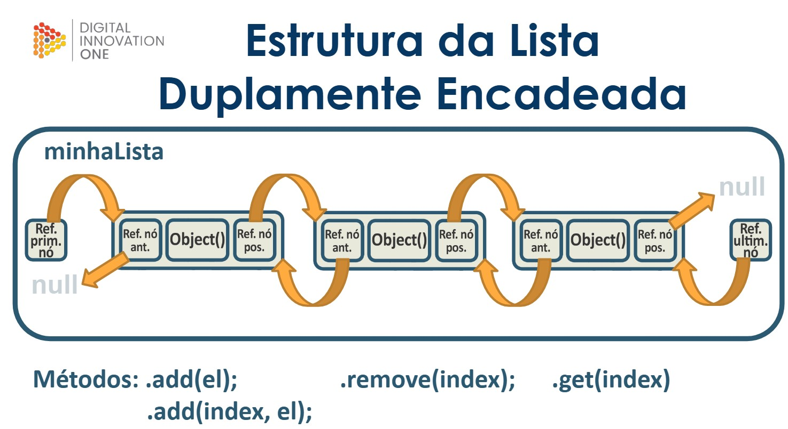

# Listas duplamente encadeadas



Uma lista duplamente encadeada em Java é uma estrutura de dados onde cada nó contém uma referência para os nós anterior e posterior na lista. Isso permite a inserção e remoção eficientes de nós tanto no início quanto no final da lista.

- A lista começa com um nó inicial (conhecido como cabeça) e termina com um nó final (conhecido como cauda). Os nós da lista são encadeados em ambas as direções, permitindo que a lista seja percorrida em ambas as direções.

- As listas duplamente encadeadas são úteis quando precisamos percorrer a lista em ambas as direções, ou quando precisamos inserir ou remover elementos em posições arbitrárias da lista de maneira eficiente. No entanto, elas ocupam mais espaço em memória do que as listas simplesmente encadeadas, pois cada nó contém duas referências adicionais.

<br>

### Mostrando em código:
<details>
<summary>Código</summary>

```java
//Class "Main"
package com.projeto.Lista_duplamente_encadeada;

public class Main {
    public static void main(String[] args) {
        //Criando uma lista duplamente encadeada do tipo "String"
        ListaDuplamenteEncadeada<String> minha_lista_enc = new ListaDuplamenteEncadeada<>();

        //Adicionando objetos a "minha_lista_enc"
        minha_lista_enc.add("c1");
        minha_lista_enc.add("c2");
        minha_lista_enc.add("c3");
        minha_lista_enc.add("c4");
        minha_lista_enc.add("c5");
        minha_lista_enc.add("c6");
        minha_lista_enc.add("c7");

        //Imprimindo a lista com todos os objetos e referências
        System.out.println(minha_lista_enc);

        //Removendo um elemento da lista
        minha_lista_enc.remove(3);

        //Adicionando novo elemento na lista
        minha_lista_enc.add(3, "99");

        //Verificando se o elemento novo entrou na lista
        System.out.println("Novo elemento: " + minha_lista_enc.get(3));

        //Imprimindo a lista novamente
        System.out.println(minha_lista_enc);
    }
}
```

```java
//Class "NoDuplo"
package com.projeto.Lista_duplamente_encadeada;

public class NoDuplo<T> {
    private T conteudo;
    private NoDuplo<T> no_proximo;
    private NoDuplo<T> no_previo;

    //Construtor
    public NoDuplo(T conteudo){
        this.conteudo = conteudo;
    }

    //Getters e setters para "conteudo"
    public T getConteudo() {
        return conteudo;
    }
    public void setConteudo(T conteudo) {
        this.conteudo = conteudo;
    }
    //Getters e setters para "no_proximo"
    public NoDuplo<T> getNo_proximo() {
        return no_proximo;
    }
    public void setNo_proximo(NoDuplo<T> no_proximo) {
        this.no_proximo = no_proximo;
    }
    //Getters e setters para "no_previo"
    public NoDuplo<T> getNo_previo() {
        return no_previo;
    }
    public void setNo_previo(NoDuplo<T> no_previo) {
        this.no_previo = no_previo;
    }

    //Método "toString" para "conteúdo"

    @Override
    public String toString() {
        return "No_duplo{" + "conteudo=" + conteudo + '}';
    }
}
```

```java
//Class "ListaDuplamenteEncadeada"
package com.projeto.Lista_duplamente_encadeada;

public class ListaDuplamenteEncadeada<T> {
    private NoDuplo<T> primeiro_no;
    private NoDuplo<T> ultimo_no;
    private int tamanho_lista;

    //Construtor
    public ListaDuplamenteEncadeada(){
        this.tamanho_lista = 0;
        this.primeiro_no = null;
        this.ultimo_no = null;
    }

    //Método size (Verifica o tamanho da lista)
    public int size(){
        return this.tamanho_lista;
    }
    //Método "getNo" (Localiza objeto específico da lista de acordo com um indice)
    private NoDuplo<T> getNo(int indice){
        NoDuplo<T> no_auxiliar = primeiro_no;
        for(int i = 0; ((i < indice) && (no_auxiliar != null)); i++){
            no_auxiliar = no_auxiliar.getNo_proximo();
        }
        return no_auxiliar;
    }
    //Método "get" (Retorna o conteúdo de um objeto específico de acordo com um indice)
    public T get (int indice){
        return this.getNo(indice).getConteudo();
    }
    //Método "add" (Adiciona novo objeto no fim da lista)
    public void add(T elemento){
        NoDuplo<T> novo_no = new NoDuplo<>(elemento);
        novo_no.setNo_proximo(null);
        novo_no.setNo_previo(ultimo_no);
        if(primeiro_no == null){
           primeiro_no = novo_no;
        }
        if(ultimo_no != null){
           ultimo_no.setNo_proximo(novo_no);
        }
        ultimo_no = novo_no;
        tamanho_lista++;
    }
    //Método "add" com índice (Adiciona elemento em um índice específico)
    public void add(int indice, T elemento){
        NoDuplo<T> no_auxiliar = getNo(indice);
        NoDuplo<T> novo_no = new NoDuplo<>(elemento);
        novo_no.setNo_proximo(no_auxiliar);
        if(novo_no.getNo_proximo() != null){
            novo_no.setNo_previo(no_auxiliar.getNo_previo());
            novo_no.getNo_proximo().setNo_previo(novo_no);
        }else{
            novo_no.setNo_proximo(ultimo_no);
            ultimo_no = novo_no;
        }
        if(indice == 0){
            primeiro_no = novo_no;
        }else {
            novo_no.getNo_previo().setNo_proximo(novo_no);
        }
        this.tamanho_lista++;
    }
    //Método "remove" (Remove objeto da lista)
    public void remove(int indice){
        if (indice == 0){
            primeiro_no = primeiro_no.getNo_proximo();
            if (primeiro_no != null){
                primeiro_no.setNo_previo(null);
            }
        }else {
            NoDuplo<T> no_auxiliar = getNo(indice);
            no_auxiliar.getNo_previo().setNo_proximo(no_auxiliar.getNo_proximo());
            if (no_auxiliar != ultimo_no){
                no_auxiliar.getNo_proximo().setNo_previo(no_auxiliar.getNo_previo());
            }else {
                ultimo_no = no_auxiliar;
            }
        }
        this.tamanho_lista --;
    }
    //Método "toString" para montar a cadeia de conteúdos dos elementos
    @Override
    public String toString() {
        String str_retorno = "";
        NoDuplo<T> no_auxiliar = primeiro_no;
        for(int i = 0; i < size(); i++){
            str_retorno += "[No{conteúdo = " + no_auxiliar.getConteudo() +"}]--->";
            no_auxiliar = no_auxiliar.getNo_proximo();
        }
        str_retorno += "null";
        return str_retorno;
    }
}
```

</details>

<br>

<br>

[Voltar a Estrutura de dados em Java](/Arquivos/Conteudo/2%20-%20Conhecendo%20a%20linguagem%20Java/2.5%20Estrutura%20de%20dados%20em%20java.md)<br>
[Voltar para inicio](/README.md)