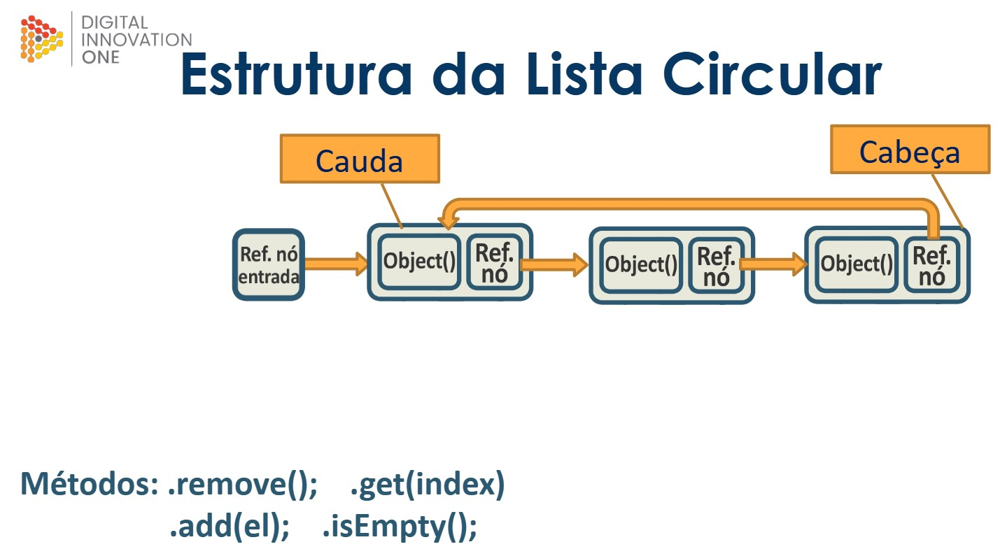

# Listas circulares



Uma lista circular em Java é uma estrutura de dados que permite armazenar uma coleção de elementos com um início e um fim, onde o último elemento aponta de volta para o primeiro elemento, formando assim um ciclo. Diferentemente de uma lista linear tradicional, em que o último elemento aponta para nulo, uma lista circular não tem um final definido, o que significa que é possível percorrer a lista indefinidamente. O primeiro elemento é chamado de “cauda” e o último de “cabeça”.

<br>

### Mostrando em código:
<details>
<summary>Código</summary>

```java
//Class "Main"
package com.projeto.Lista_circular;

public class Main {
    public static void main(String[] args) {
        //Criando lista circular "minha_lista_circ" de strings
        ListaCircular<String> minha_lista_circ = new ListaCircular<>();

        //Inserindo objeto em "minha_lista_circ" e imprimindo a lista
        minha_lista_circ.add("C0");
        System.out.println("Lista inicial: " + minha_lista_circ);

        //Removendo o objeto inserido e imprimindo novamente a lista
        minha_lista_circ.remove(0);
        System.out.println("Lista após remoção de objeto: " + minha_lista_circ);

        //Adicionando multiplos elementos e imprimindo a lista
        minha_lista_circ.add("C1");
        minha_lista_circ.add("C2");
        minha_lista_circ.add("C3");
        System.out.println("Lista após inserções: " + minha_lista_circ);

        //Usando método "get" para pegar elemento de um indice informado
        System.out.println("Objeto de indice 1: "+ minha_lista_circ.get(1));
        System.out.println("Objeto de indice 3: "+ minha_lista_circ.get(4)+"\n"); //Dará a volta na lista

        //Demostrando melhor o looping da lista
        for(int i = 0; i < 20; i++){
            System.out.println("Objeto de indice " + i+": " + minha_lista_circ.get(i));
        }

    }
}
```

```java
//Class "No"
package com.projeto.Lista_circular;

public class No <T> {
    private T conteudo;
    private No<T> no_proximo;

    //Construtor
    public No(T conteudo) {
        this.conteudo = conteudo;
        this.no_proximo = null;
    }

    //Getters e setters de "conteudo"
    public T getConteudo() {
        return conteudo;
    }
    public void setConteudo(T conteudo) {
        this.conteudo = conteudo;
    }
    //Getters e setters de "proximo_no"
    public No<T> getNo_proximo() {
        return no_proximo;
    }
    public void setNo_proximo(No<T> no_proximo) {
        this.no_proximo = no_proximo;
    }

    //Método "toString" para "conteudo"
    @Override
    public String toString() {
        return "No{" + "conteudo=" + conteudo + '}';
    }
}
```

```java
//Class "ListaCircular"
package com.projeto.Lista_circular;

public class ListaCircular<T> {
    private No<T> cabeca;
    private No<T> cauda;
    private int tamanho_lista;

    //Construtor vazio para "ListaCircular"
    public ListaCircular() {
        this.cauda = null;
        this.cabeca = null;
        this.tamanho_lista = 0;
    }

    //Método "size" (Retorna o tamanho da lista)
    public int size(){
        return this.tamanho_lista;
    }
    //Método "isEmpty" (Retorna se a lista está ou não vazia)
    public boolean isEmpty(){
        return this.tamanho_lista == 0 ? true: false;
    }
    //Método "getNo" (localiza um nó específico de acordo com um indice)
    private No<T> getNo(int indice){
        if(this.isEmpty()){
            throw new IndexOutOfBoundsException("A lista está vazia!");
        }
        if(indice == 0){
            return this.cauda;
        }
        No<T> no_auxiliar = this.cauda;
        for(int i = 0; (i < indice) && (no_auxiliar != null); i++){
            no_auxiliar = no_auxiliar.getNo_proximo();
        }
        return no_auxiliar;
    }
    //Método "get" (Retorna elemento específico de acordo com índice)
    public T get (int indice){
        return this.getNo(indice).getConteudo();
    }
    //Método "remove" (Remove objeto da lista)
    public void remove(int indice){
        if(indice >= this.tamanho_lista){
            throw new IndexOutOfBoundsException("O índice é maior que o tamanho da lista");
        }
        No<T> no_auxiliar = this.cauda;
        if(indice == 0){
            this.cauda = this.cauda.getNo_proximo();
            this.cabeca.setNo_proximo(this.cauda);
        } else if (indice == 1) {
            this.cauda.setNo_proximo(this.cauda.getNo_proximo().getNo_proximo());
        }else {
            for(int i =0; i < indice -1; i++){
                no_auxiliar = no_auxiliar.getNo_proximo();
            }
            no_auxiliar.setNo_proximo(no_auxiliar.getNo_proximo().getNo_proximo());
        }
        this.tamanho_lista--;
    }
    //Método "add" (Adiciona novo elemento no inicio da lista circular
    public void add(T conteudo){
        No<T> novo_no = new No<>(conteudo);
        if(this.tamanho_lista == 0){
            this.cabeca = novo_no;
            this.cauda = this.cabeca;
            this.cabeca.setNo_proximo(this.cauda);
        }else {
            novo_no.setNo_proximo(this.cauda);
            this.cabeca.setNo_proximo(novo_no);
            this.cauda = novo_no;
        }
        this.tamanho_lista++;
    }
    //Método "toString" para ver conteúdo interno da lista e suas conexões

    @Override
    public String toString() {
        String str_retorno ="";
        No<T> no_auxiliar = this.cauda;
        for (int i = 0; i < this.size(); i++){
            str_retorno += "[No{conteúdo = " + no_auxiliar + "}]--->";
            no_auxiliar = no_auxiliar.getNo_proximo();
        }
        str_retorno += this.size() != 0 ? "(Retorna ao início)": "[]";
        return str_retorno;
    }
}
```

</details>
