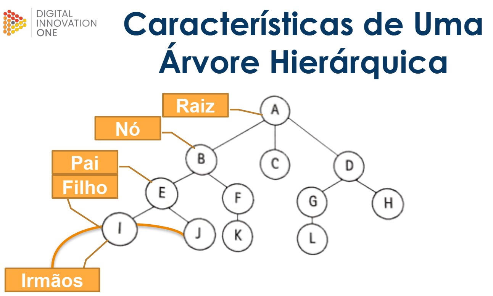
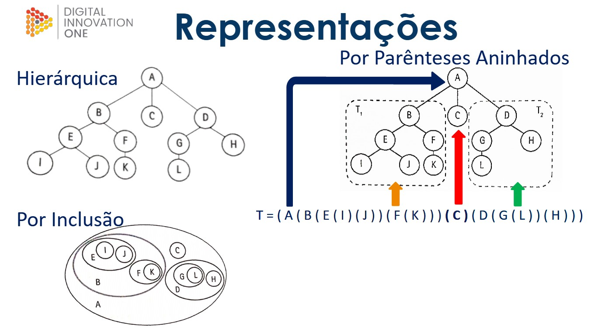
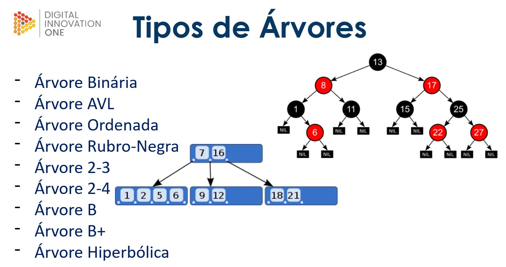
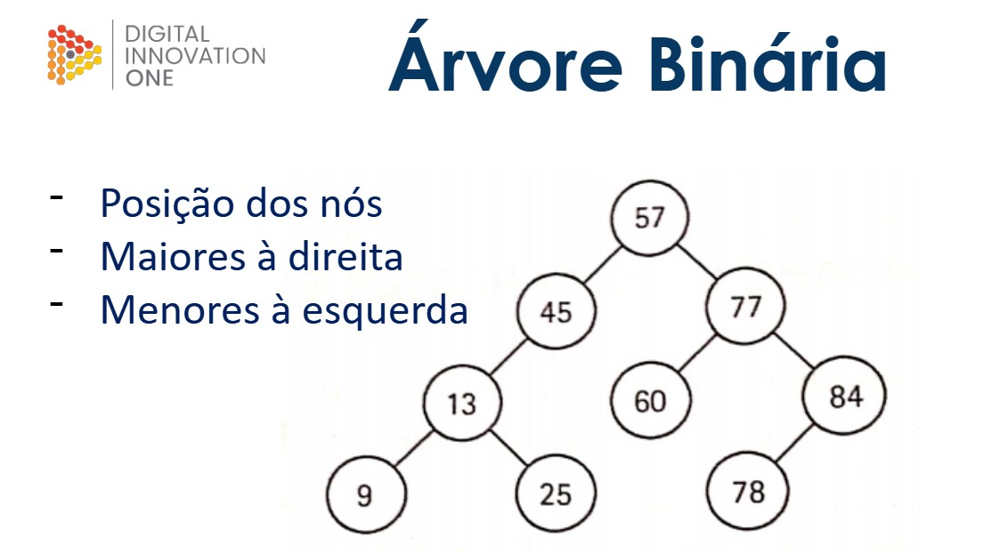
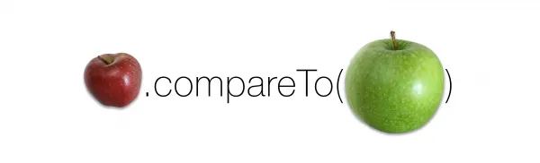
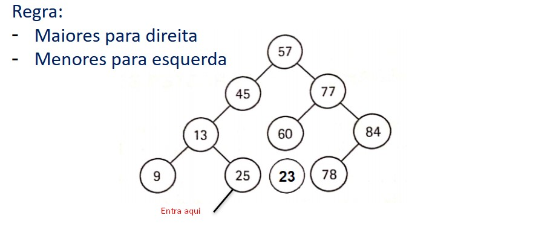
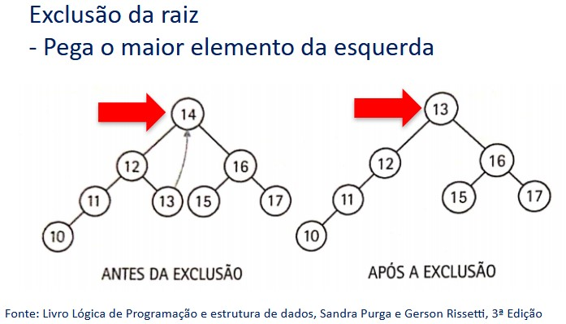
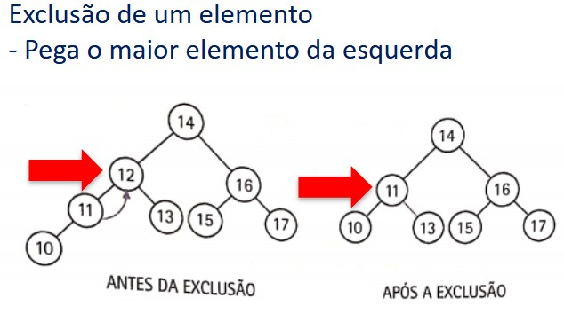
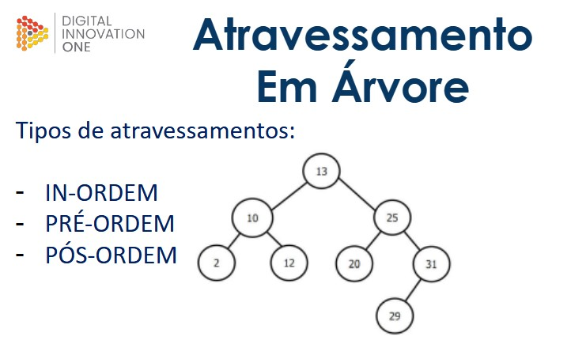

# Árvores binárias



Em Java, uma estrutura de árvore é uma coleção de elementos organizados em uma hierarquia em que cada elemento é chamado de nó. Cada nó pode ter zero ou mais nós filhos, exceto o nó raiz que não tem pai. Cada nó pode ter um valor associado a ele, chamado de chave ou dado. Existem diferentes tipos de árvores em Java, incluindo árvores binárias, árvores de busca binárias, árvores AVL, árvores vermelho-negro, entre outras. Essas estruturas de dados são úteis para muitas aplicações, como a busca em bancos de dados, a representação de hierarquias em sistemas de arquivos, entre outras.

### Uma estrutura de árvore é uma estrutura de dados hierárquica que consiste em nós interconectados através de arestas. Algumas das características relevantes de uma estrutura de árvore incluem:





1. Hierarquia: uma árvore tem uma estrutura hierárquica em que cada nó tem um único nó pai (exceto para a raiz) e pode ter vários nós filhos.
   
2. Raiz: a árvore tem um único nó raiz que é o nó superior da hierarquia e não tem nó pai.

3. Nós: uma árvore consiste em um conjunto de nós, cada um com um valor associado ou dados relevantes.

4. Filhos: cada nó pode ter zero ou mais nós filhos que estão conectados a ele por meio de arestas direcionais.

5.  Folhas: são os nós que não têm filhos, são os nós terminais da árvore.

6. Profundidade: é a distância entre a raiz e um nó, ou seja, o número de arestas que precisam ser percorridas para chegar ao nó a partir da raiz.

7. Altura: é a distância entre um nó e a folha mais distante abaixo dele, ou seja, o número máximo de arestas que precisam ser percorridas para chegar a uma folha a partir do nó.

8.  Percursos: existem várias maneiras de percorrer uma árvore, incluindo pré-ordem, pós-ordem e ordem de nível.

9.  Balanceamento: uma árvore é considerada balanceada se a altura das sub árvores esquerda e direita não difere em mais de uma unidade.

10. Utilização: as estruturas de árvore são usadas em muitas aplicações, como estruturas de diretórios em sistemas de arquivos, estruturas de menu em aplicativos e estruturas de organização hierárquica em empresas e organizações.

<br>

## Explicação teórica de arvore binária



Uma árvore binária em Java é uma estrutura de dados em que cada nó da árvore tem no máximo dois filhos, chamados de filho esquerdo e filho direito. Cada nó pode conter um valor e as sub-árvores formadas pelos filhos esquerdo e direito também são árvores binárias.

### Interface comparable:



Em uma árvore binária, essa interface é frequentemente usada para definir a ordem dos elementos da árvore. Se um objeto implementa a interface Comparable, ele pode ser comparado com outros objetos do mesmo tipo usando o método compareTo(), que retorna um valor inteiro indicando se o objeto é menor, igual ou maior que o objeto comparado. Ao implementar a interface Comparable em uma classe de nó de árvore binária, é possível ordenar a árvore com base nos valores dos objetos armazenados nos nós da árvore. Por exemplo, se a classe de nó representa um número, a implementação da interface Comparable permitiria que a árvore fosse ordenada de maneira crescente ou decrescente, dependendo da implementação do método compareTo().

<br>

## Operações básicas em árvores de busca binária
As operações básicas em árvores de busca binária (BST - Binary Search Trees, em inglês) são as seguintes:

1. Inserção: É o processo de adicionar um novo nó à árvore, mantendo a propriedade da árvore de busca binária. O processo de inserção começa no nó raiz e segue o caminho apropriado para encontrar o local adequado para inserir o novo nó.
    
    

<BR>

2. Remoção: É o processo de remover um nó específico da árvore, mantendo a propriedade da árvore de busca binária. O processo de remoção começa no nó raiz e segue o caminho apropriado para encontrar o nó a ser removido.
    

    

<br>

3. Pesquisa: É o processo de procurar um nó específico na árvore. O processo de pesquisa começa no nó raiz e segue o caminho apropriado para encontrar o nó desejado.

<br>

4. Traversing: É o processo de visitar todos os nós na árvore em uma determinada ordem. Existem três tipos de percurso comumente usados: percurso em ordem (in-order), pré-ordem (pre-order) e pós-ordem (post-order).

<br>

5. Encontrar o máximo e o mínimo: É o processo de encontrar o valor máximo e o valor mínimo na árvore. O valor máximo é encontrado seguindo o caminho mais à direita na árvore, enquanto o valor mínimo é encontrado seguindo o caminho mais à esquerda na árvore.

<br>

## Atravessamento (Traversing) em árvores binárias



1. **Percurso em ordem** (in-order): No percurso em ordem, os nós são visitados na seguinte ordem: primeiro o nó da esquerda, depois o nó raiz e, por último, o nó da direita. Esse tipo de percurso é usado para visitar todos os nós da árvore em ordem crescente, caso a árvore armazene elementos comparáveis. (Raiz no meio/ mostra valores em ordem crescente depois da visita)/ Saida: 2, 10, 12, 13, 20, 25, 29 e 31.
2. **Percurso em pré-ordem** (pre-order): No percurso em pré-ordem, os nós são visitados na seguinte ordem: primeiro o nó raiz, depois o nó da esquerda e, por último, o nó da direita. Esse tipo de percurso é usado para visitar a árvore de cima para baixo, ou seja, visitando primeiro a raiz e, em seguida, explorando todos os nós da subárvore esquerda antes de explorar os nós da subárvore direita. (Raiz primeiro/ primeiro mostra o dado e depois continua visitando os nós) Saida: 13, 10, 2, 12, 25, 20, 31 e 29.
3. **Percurso em pós-ordem** (post-order): No percurso em pós-ordem, os nós são visitados na seguinte ordem: primeiro o nó da esquerda, depois o nó da direita e, por último, o nó raiz. Esse tipo de percurso é usado para visitar a árvore de baixo para cima, ou seja, visitando primeiro todos os nós da subárvore esquerda e direita antes de visitar a raiz. (Raiz por último) Saida: 2,12,10, 20, 29, 25 e 13.

<br>

### Mostrando em código:
<details>
<summary>Pacote src</summary>

```java
//Class "main"
package com.projeto.arvoreBinaria;

import com.projeto.arvoreBinaria.model.Obj;

public class Main {
    public static void main(String[] args){
        //Criando objeto do tipo arvore binária "BinArvore"
        BinArvore<Obj> minha_arvore_binaria = new BinArvore<>();

        //Inserindo elementos dentro da "minha_arvore_binaria"
        minha_arvore_binaria.inserir(new Obj(13)); //Raiz
        minha_arvore_binaria.inserir(new Obj(10));
        minha_arvore_binaria.inserir(new Obj(25));
        minha_arvore_binaria.inserir(new Obj(2));
        minha_arvore_binaria.inserir(new Obj(12));
        minha_arvore_binaria.inserir(new Obj(20));
        minha_arvore_binaria.inserir(new Obj(31));
        minha_arvore_binaria.inserir(new Obj(29));

        //Exibindo "minha_arvore_binaria" em ordem, pre-ordem e pós-ordem
        minha_arvore_binaria.exibir_em_ordem();
        minha_arvore_binaria.exibir_pre_ordem();
        minha_arvore_binaria.exibir_pos_ordem();
    }
}
```

```java
//Class "BinNo
package com.projeto.arvoreBinaria;

//Inserindo upperbounded wild card na classe "BinNo"
public class BinNo<T extends Comparable<T>> {
    private T conteudo; //Conteúdo do Nó
    private BinNo<T> no_esq; //Referência a esquerda
    private BinNo<T> no_dir; //Referência a direita

    //Construtor para conteúdo.
    public BinNo(T conteudo) {
        this.conteudo = conteudo;
        no_esq = no_dir = null;
    }
    //Construtor vazio
    public BinNo() {}

    //Getters and setters de "conteúdo"
    public T getConteudo() {
        return conteudo;
    }
    public void setConteudo(T conteudo) {
        this.conteudo = conteudo;
    }
    //Getters and setters de "no_esq"
    public BinNo<T> getNo_esq() {
        return no_esq;
    }
    public void setNo_esq(BinNo<T> no_esq) {
        this.no_esq = no_esq;
    }
    //Getters and setters de "no_dir"
    public BinNo<T> getNo_dir() {
        return no_dir;
    }
    public void setNo_dir(BinNo<T> no_dir) {
        this.no_dir = no_dir;
    }

    //Método "toString" para conteúdo do Nó
    @Override
    public String toString() {
        return "BinNo{" +
                "conteudo=" + conteudo +
                '}';
    }
}
```

```java
//Class BinArvore
package com.projeto.arvoreBinaria;

public class BinArvore<T extends Comparable<T>> {
    private BinNo<T> raiz;

    //Construtor padrão
    public BinArvore() {
        this.raiz = null;
    }

    /* Método privado "inserir" (Insere conteúdo na árvore através
    de algumas comparações e chamadas recursivas para indentificar onde colocar o novo elemento*/
    private BinNo<T> inserir(BinNo<T> no_atual, BinNo<T> novo_no){
        if(no_atual == null){
            return novo_no;
        } else if (novo_no.getConteudo().compareTo(no_atual.getConteudo()) < 0) {
            no_atual.setNo_esq(inserir(no_atual.getNo_esq(), novo_no));
        }else{
            no_atual.setNo_dir(inserir(no_atual.getNo_dir(), novo_no));
        }
        return no_atual;
    }
    /* Método publico "inserir"(Sobrecarga) (Método para criar um novo objeto na lista
       que recebe parâmetro "conteúdo" */
    public void inserir(T conteudo){
        BinNo<T> novo_no = new BinNo<>(conteudo);
        this.raiz = inserir(raiz, novo_no);
    }
    /* Método público "exibir_em_ordem" (mostrar elementos em ordem crescente/ "raiz no méio")*/
    public void exibir_em_ordem(){
        System.out.println("\n Exibindo: 'In-order'");
        exibir_em_ordem(this.raiz);
    }
    /* Método privado "exibir_em_ordem" (Método recursivo para fazer na ordem:
        se 'no_atual não for 'nulo -> Visite o no da esquerda,
        mostre o conteúdo, visite o da direita. */
    private void exibir_em_ordem (BinNo<T> no_atual){
        if (no_atual != null){
            exibir_em_ordem(no_atual.getNo_esq());
            System.out.print(no_atual.getConteudo() + ", ");
            exibir_em_ordem(no_atual.getNo_dir());
        }
    }
    /* Método público "exibir_pos_ordem" (Mostra elementos com raiz no fim)*/
    public void exibir_pos_ordem(){
        System.out.println("\n Exibindo: 'Post-order'");
        exibir_pos_ordem(this.raiz);
    }
    /* Método privado "exibir_pos_ordem" (Método recursivo para fazer na ordem:
        se 'no_atual não for 'nulo -> Visite o no da esquerda,
        visite o da direita, mostre o conteúdo do atual */
    private void exibir_pos_ordem(BinNo<T> no_atual){
        if (no_atual != null){
            exibir_pos_ordem(no_atual.getNo_esq());
            exibir_pos_ordem(no_atual.getNo_dir());
            System.out.print(no_atual.getConteudo() + ", ");
        }
    }
    /* Método público "exibir_pre_ordem" (Mostra raiz primeiro)*/
    public void exibir_pre_ordem(){
        System.out.println("\n Exibindo: 'Pre-order'");
        exibir_pre_ordem(this.raiz);
    }
    /* Método privado "exibir_pre_ordem" (Método recursivo para fazer na ordem:
        se 'no_atual não for 'nulo -> mostre o conteúdo do atual, Visite o no da esquerda,
        visite o da direita */
    private void exibir_pre_ordem(BinNo<T> no_atual){
        if (no_atual != null){
            System.out.print(no_atual.getConteudo() + ", ");
            exibir_pre_ordem(no_atual.getNo_esq());
            exibir_pre_ordem(no_atual.getNo_dir());
        }
    }

    //Método publico "remover"
    public void remover(T conteudo){
        try {
            BinNo<T> no_atual = this.raiz;
            BinNo<T> no_pai = null;
            BinNo<T> no_filho = null;
            BinNo<T> no_temp = null;

            while ((no_atual != null) && (!no_atual.getConteudo().equals(conteudo))){
                no_pai = no_atual;
                if (conteudo.compareTo(no_atual.getConteudo()) < 0){
                    no_atual = no_atual.getNo_esq();
                }else {
                    no_atual = no_atual.getNo_dir();
                }
            }
            if(no_atual == null){
                System.out.println("Erro! Conteúdo não encontrado. #Bloco_Try ");
            }
            if(no_pai == null){
                if (no_atual.getNo_dir() == null){
                    this.raiz = no_atual.getNo_esq();
                } else if (no_atual.getNo_esq() == null) {
                    this.raiz = no_atual.getNo_dir();
                }else {
                    for (
                         no_temp = no_atual, no_filho = no_atual.getNo_esq();
                         no_filho.getNo_dir() != null;
                         no_temp = no_filho = no_filho.getNo_esq()
                    ){
                        if(no_filho != no_atual.getNo_esq()){
                            no_temp.setNo_dir(no_filho.getNo_esq());
                            no_filho.setNo_esq(raiz.getNo_esq());
                        }
                    }
                    no_filho.setNo_dir(raiz.getNo_dir());
                    this.raiz = no_filho;
                }
            } else if (no_atual.getNo_dir() == null) {
                if(no_pai.getNo_esq() == no_atual){
                    no_pai.setNo_esq(no_atual.getNo_esq());
                }else {
                    no_pai.setNo_dir(no_atual.getNo_esq());
                }
            } else if (no_atual.getNo_esq() == null) {
                if(no_pai.getNo_esq() == no_atual){
                    no_pai.setNo_esq(no_atual.getNo_dir());
                }else {
                    no_pai.setNo_dir(no_atual.getNo_dir());
                }
            }else {
                for (
                        no_temp = no_atual, no_filho = no_atual.getNo_esq();
                        no_filho.getNo_dir() != null;
                        no_temp = no_filho, no_filho = no_filho.getNo_dir()
                ){
                    if (no_filho != no_atual.getNo_esq()){
                       no_temp.setNo_dir(no_filho.getNo_esq());
                       no_filho.setNo_esq(no_atual.getNo_esq());
                    }
                    no_filho.setNo_dir(no_atual.getNo_dir());
                    if(no_pai.getNo_esq() == no_atual){
                        no_pai.setNo_esq(no_filho);
                    }else {
                        no_pai.setNo_dir(no_filho);
                    }
                }
            }

        }catch (NullPointerException erro){ //Tratando erros de index não encontrado
            System.out.println("Erro! Conteúdo não encontrado. #Bloco_Catch ");
        }
    }
}
```

</details>

<details>
<summary>Pacote model</summary>

```java
//Class abstrata "ObjArvore"
package com.projeto.arvoreBinaria.model;

//Classe abstrata para criar meu objeto tipo arvore
public abstract class ObjArvore<T> implements Comparable<T>{
    public abstract boolean equals(Object obj);
    public abstract int hashCode();
    public abstract int compareTo(T outro);
    public abstract String toString();
}
```

```java
//Class "Obj" 
/* extendida de "ObjArvore"*/
package com.projeto.arvoreBinaria.model;

import java.util.Objects;

public class Obj extends ObjArvore<Obj>{
    Integer meu_valor;

    //Construtor
    public Obj(Integer meu_valor){
        this.meu_valor = meu_valor;
    }

    //Sobrescrevendo méodos da classe pai "ObjArvore"

    @Override
    public boolean equals(Object o) {
        if (this == o) return true;
        if (o == null || getClass() != o.getClass()) return false;
        Obj obj = (Obj) o;
        return Objects.equals(meu_valor, obj.meu_valor);
    }
    @Override
    public int hashCode() {
        return Objects.hash(meu_valor);
    }
    @Override
    public int compareTo(Obj outro) {
        int i = 0;
        if(this.meu_valor > outro.meu_valor){
            i = 1;
        } else if (this.meu_valor < outro.meu_valor) {
            i = -1;
        }
        return i;
    }
    @Override
    public String toString() {
        return meu_valor.toString();
    }
}
```

</details>
