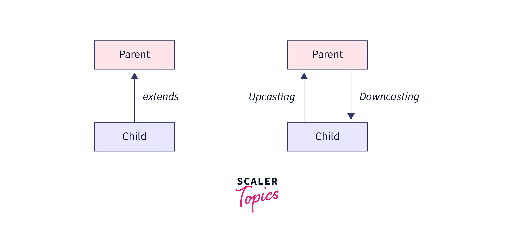

# Herança 

Herança é um conceito fundamental na programação orientada a objetos que permite criar uma hierarquia de classes, onde uma classe filha herda os atributos e métodos de sua classe pai. Isso significa que uma classe filha pode aproveitar o comportamento e a funcionalidade da classe pai, além de adicionar suas próprias características únicas.

- Em Java, para definir uma classe filha que herda da classe pai, usamos a palavra-chave "extends". Por exemplo, considere a seguinte classe pai "Animal":
    ```java
    //Classe pai, classe mãe ou superclasse "Animal"
    public class Animal {
        private String nome;
        private int idade;

        public Animal(String nome, int idade) {
            this.nome = nome;
            this.idade = idade;
        }

        public String getNome() {
            return nome;
        }

        public int getIdade() {
            return idade;
        }

        public void fazerSom() {
            System.out.println("O animal está fazendo som!");
        }
    }
    ```
<br>

- Agora, vamos criar uma classe filha "Cachorro" que herda de "Animal" e adiciona um método "latir":
- Observe que a classe filha "Cachorro" usa a palavra-chave "extends" para herdar de "Animal". Também é importante notar que a classe filha não precisa definir novamente os atributos e métodos que já foram definidos na classe pai.
    ```java
    //Subclasse ou classe filho "Cachorro"
    public class Cachorro extends Animal {
        public Cachorro(String nome, int idade) {
            super(nome, idade);
        }

        public void latir() {
            System.out.println("O cachorro está latindo!");
        }
    }
    ```
<br>

- Agora, podemos criar uma instância da classe "Cachorro" e chamar seus métodos:

    > 💡 Observe que a instância da classe **Cachorro** pode acessar os métodos **"getNome"** e **"getIdade"** da classe pai "Animal", bem como os métodos "fazerSom" e "latir" da classe filha **Cachorro**.


    ```java
    //Classe main
    public static void main(String[] args) {
        Cachorro cachorro = new Cachorro("Rex", 3);
        System.out.println(cachorro.getNome()); // Output: Rex
        System.out.println(cachorro.getIdade()); // Output: 3
        cachorro.fazerSom(); // Output: O animal está fazendo som!
        cachorro.latir(); // Output: O cachorro está latindo!
    }
    ```
<br>

## Tipos de herança 

### Herança simples:
Herança é um recurso da programação orientada a objetos que permite criar novas classes a partir de outras classes já existentes, herdando seus atributos e métodos. A classe que é herdada é chamada de classe pai ou superclasse, e a classe que herda é chamada de classe filha ou subclasse.

A herança simples é quando uma classe filha herda atributos e métodos de uma única classe pai.

<details>
<summary>Código exemplo</summary>

```java
//Superclasse "Pessoa"
public class Pessoa {
    private String nome;
    private int idade;

    public Pessoa(String nome, int idade) {
        this.nome = nome;
        this.idade = idade;
    }

    public String getNome() {
        return nome;
    }

    public int getIdade() {
        return idade;
    }
}

//Subclasse "Aluno"
public class Aluno extends Pessoa {
    private String matricula;

    public Aluno(String nome, int idade, String matricula) {
        super(nome, idade);
        this.matricula = matricula;
    }

    public String getMatricula() {
        return matricula;
    }
}
```

</details>

<br>

### Herança múltipla:
É quando uma classe filha herda atributos e métodos de duas ou mais classes pai. Em Java, a herança múltipla não é permitida diretamente, ou seja, uma classe não pode herdar de mais de uma classe pai. Porém, podemos simular a herança múltipla utilizando interfaces.

Uma interface é uma coleção de métodos abstratos, que são definidos mas não implementados. Uma classe pode implementar uma ou mais interfaces, o que permite que ela tenha múltiplos comportamentos. Por exemplo:

<details>
<summary>Código Exemplo</summary>

```java
public interface Animal {
    void emitirSom();
}

public interface Voador {
    void voar();
}

public class Pato implements Animal, Voador {
    public void emitirSom() {
        System.out.println("Quack quack");
    }

    public void voar() {
        System.out.println("Voando...");
    }
}
/*Neste exemplo, temos duas interfaces, "Animal" e "Voador", que definem métodos abstratos 
"emitirSom" e "voar", respectivamente. A classe "Pato" implementa as duas interfaces, o que 
significa que ela tem o comportamento de um animal e o comportamento de um animal voador.*/
```

```java
public static void main(String[] args) {
    Pato pato = new Pato();
    pato.emitirSom(); // Output: Quack quack
    pato.voar(); // Output: Voando...
}

/*Podemos criar uma instância de "Pato" e chamar seus métodos: Neste exemplo, 
criamos um objeto "Pato" e chamamos seus métodos "emitirSom" e "voar". */
```

</details>

<br>

## Upcast e downcast
Em programação orientada a objetos, a herança é uma relação entre classes na qual uma classe filha herda as propriedades e comportamentos da classe mãe. Quando falamos de upcast e downcast, estamos nos referindo a como um objeto de uma classe é tratado quando é referenciado como um objeto de outra classe relacionada através da hierarquia de herança.

`Upcast` 
Ocorre quando um objeto de uma subclasse é tratado como um objeto de uma classe mãe na hierarquia de herança. Isso pode ser feito implicitamente, sem a necessidade de um casting explícito. 

`downcast`
Ocorre quando um objeto de uma classe mãe é tratado como um objeto de uma subclasse na hierarquia de herança. Isso requer um casting explícito. Geralmente tentamos sempre evitar downcasts pois a subclasse pode conter atributos que não tenhamos na superclasse. Assim, correremos risco de perda de dados. 

#### Representação:


<br>

<details>
<summary>Código exemplo</summary>

```java
public class main{
    public static void main(String[] args) {
        Animal animal = new Cachorro(); // upcast
        animal.fazerBarulho(); // chama o método da subclasse
        //animal.correr(); // erro de compilação: Animal não tem o método correr()

        Cachorro cachorro = (Cachorro) animal; // downcast
        cachorro.fazerBarulho(); // chama o método da subclasse
        cachorro.correr(); // chama o método da subclasse
    }
}
```
```java
class Animal {
    public void fazerBarulho() {
        System.out.println("Fazendo barulho genérico de animal");
    }
}
```

```java
class Cachorro extends Animal {
    public void fazerBarulho() {
        System.out.println("Au au!");
    }

    public void correr() {
        System.out.println("Cachorro correndo");
    }
}
```
</details>

<br>

## Polimorfismo vs sobescrita

### Polimorfismo
É a capacidade de um objeto poder ser referenciado de várias formas. Isso permite que um objeto de uma subclasse seja tratado como um objeto de sua classe pai. O polimorfismo permite escrever código mais flexível e genérico, aumentando a reutilização de código.

<details>
<summary>Código exemplo</summary>

```java
class Animal {
    public void emitirSom() {
        System.out.println("O animal emite um som.");
    }
}

class Cachorro extends Animal {
    @Override
    public void emitirSom() {
        System.out.println("O cachorro late.");
    }
}

class Gato extends Animal {
    @Override
    public void emitirSom() {
        System.out.println("O gato mia.");
    }
}

public class ExemploPolimorfismo {
    public static void main(String[] args) {
        Animal animal1 = new Cachorro();
        Animal animal2 = new Gato();

        animal1.emitirSom(); // Saída: O cachorro late.
        animal2.emitirSom(); // Saída: O gato mia.
    }
}
```

</details>

<br>

### Sobrescrita
É um mecanismo que permite que uma subclasse forneça sua própria implementação para um método definido em sua classe pai. Quando um método é sobrescrito em uma subclasse, o método na subclasse é executado em vez do método na classe pai.

<details>
<summary>Código exemplo</summary>

```java
class Veiculo {
    public void acelerar() {
        System.out.println("O veículo está acelerando.");
    }
}

class Carro extends Veiculo {
    @Override
    public void acelerar() {
        System.out.println("O carro está acelerando rapidamente.");
    }
}

class Moto extends Veiculo {
    @Override
    public void acelerar() {
        System.out.println("A moto está acelerando velozmente.");
    }
}

public class ExemploSobrescrita {
    public static void main(String[] args) {
        Veiculo veiculo1 = new Carro();
        Veiculo veiculo2 = new Moto();

        veiculo1.acelerar(); // Saída: O carro está acelerando rapidamente.
        veiculo2.acelerar(); // Saída: A moto está acelerando velozmente.
    }
}
```

</details>


