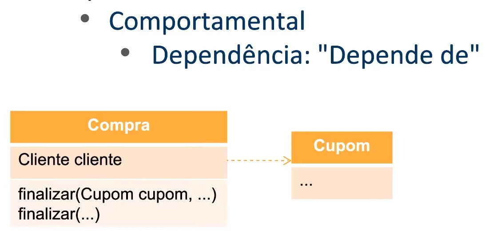
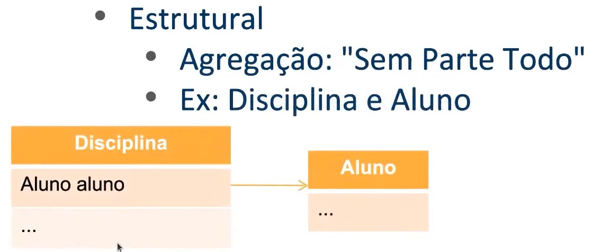
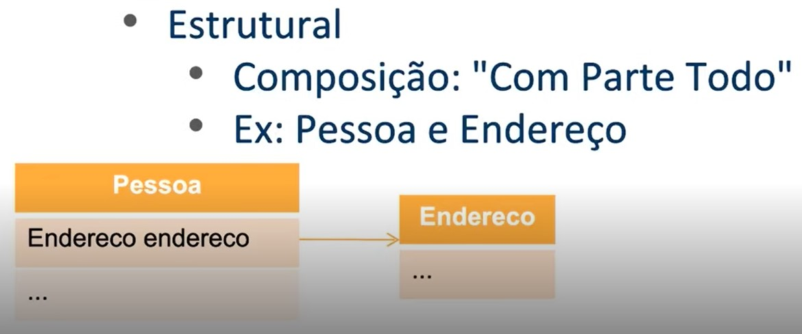

# Associação

Associação em programação orientada a objetos é um tipo de relacionamento entre classes que indica uma relação entre objetos de diferentes classes. Essa relação pode ser de (Comportamental) dependência, (Estrutural) agregação ou composição.

### Comportamental (Dependência)
A dependência indica que uma classe depende de outra para realizar uma operação.



### Estrutural (Agregação)
Na agregação uma classe possui um objeto de outra classe, mas esse objeto pode existir independentemente da classe que o possui. 



### Estrutural (Composição)
Na composição, uma classe possui um objeto de outra classe e esse objeto só existe enquanto a classe que o possui existir.



<br>

---

## Demostrando associações de agregação entre 2 classes:

<details>
<summary>Código</summary>

```java
public class Main {
    public static void main(String[] args) {
        Endereco endereco = new Endereco("Rua 1", 123, "Centro");
        Pessoa pessoa = new Pessoa("Fulano", 30, endereco);
        pessoa.apresentar();
    }
}
```

```java
public class Pessoa {
    private String nome;
    private int idade;
    private Endereco endereco;

    public Pessoa(String nome, int idade, Endereco endereco) {
        this.nome = nome;
        this.idade = idade;
        this.endereco = endereco;
    }

    public void apresentar() {
        System.out.println("Olá, meu nome é " + nome + " e tenho " + idade + " anos.");
        System.out.println("Moro em " + endereco.getLogradouro() + ", " + endereco.getNumero() + " - " + endereco.getBairro());
    }
}
```

</details>

