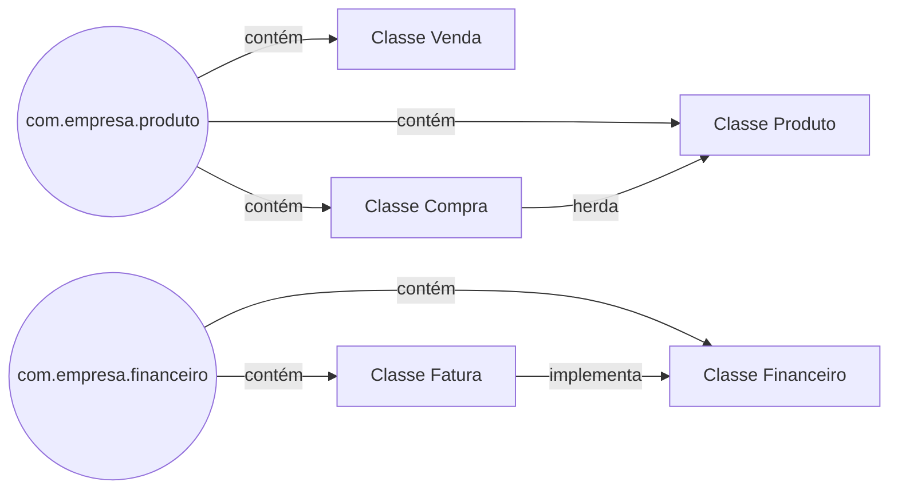

# Pacotes

Os pacotes em programação Java servem para organizar classes relacionadas em uma única unidade lógica. Eles permitem agrupar classes que têm funcionalidades e objetivos semelhantes e facilitam a modularidade, a manutenção e a reutilização de código. Além disso, os pacotes ajudam a evitar conflitos de nome de classe, uma vez que os nomes de classes em um pacote são únicos em todo o sistema.

### Exemplificando uma hierarquia de pacotes:

 

 

 

[Voltar a Programação orientada a objetos com Java](/Arquivos/Conteudo/4%20-%20Programa%C3%A7%C3%A3o%20orientada%20a%20objetos/4.1%20Programacao%20orientada%20a%20objetos%20com%20java.md) 
[Voltar ao inicio](/README.md)