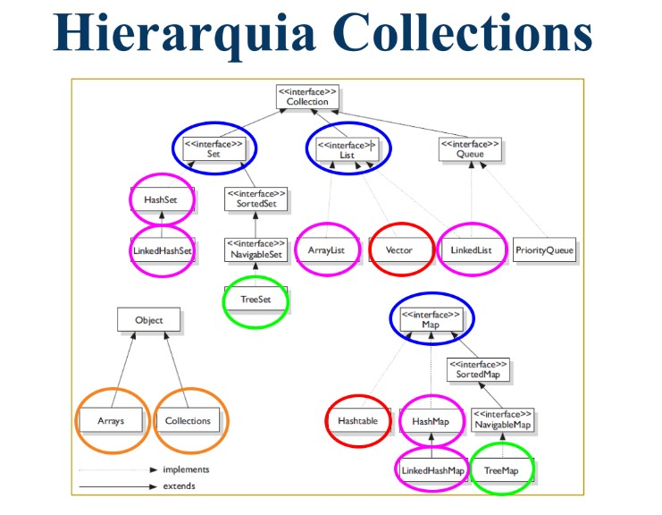

# O que é collection

Collections (Coleções) é um framework (conjunto de classes e interfaces) em Java que fornece uma estrutura de dados para armazenar e manipular grupos de objetos. As classes do framework Collections fornecem implementações para Listas (List), Conjuntos (Set) e Mapas (Map), bem como outras classes de coleção que são úteis em vários contextos de programação. O framework Collections é amplamente utilizado em Java para manipular conjuntos de objetos de forma eficiente e conveniente. Ele oferece muitas funcionalidades úteis, como ordenação, pesquisa, filtragem e transformação de coleções, que simplificam a manipulação de dados em Java.

### Representação da hierarquia de Collections


<br>

#### Exemplo de uso:
<details>
<summary>Código</summary>

```java
import java.util.ArrayList;
import java.util.List;

public class ExemploCollections {

   public static void main(String[] args) {
      // Criando uma lista de números inteiros
      List<Integer> numeros = new ArrayList<Integer>();

      // Adicionando números à lista
      numeros.add(10);
      numeros.add(20);
      numeros.add(30);

      // Iterando pela lista e imprimindo os valores com for each
      for (Integer numero : numeros) {
         System.out.println(numero);
      }
   }
}
```

</details>
