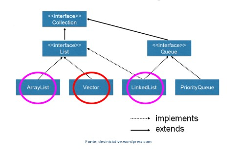

# Lists 

Em Java, `java.util.List` é uma interface que faz parte do framework Collections. A interface List representa uma sequência ordenada de elementos que podem ser acessados por um índice. Ela estende a interface Collection e adiciona métodos para obter, adicionar e remover elementos em posições específicas da lista.

- Algumas das classes populares que implementam a interface List são ArrayList, LinkedList e Vector. Essas classes fornecem diferentes implementações da interface List com diferentes trade-offs de desempenho e uso de memória.
- Com a interface List, é possível manipular sequências de elementos de forma eficiente e flexível em Java.

## Representação da hierarquia:


<br>

### Exemplo de código arraylist
<details>
<summary>Código</summary>

**ArrayList** é uma classe de tamanho dinâmico, o que significa que é fácil adicionar ou remover elementos. Além disso, é mais rápido para acessar elementos pelo índice, pois usa um array interno. No entanto, se você precisar adicionar ou remover elementos no meio da lista com frequência, pode ser mais lento, pois os elementos precisam ser movidos para acomodar a alteração.

```java
import java.util.ArrayList;
import java.util.List;

public class ExemploArrayList {
   public static void main(String[] args) {
      // Criando um ArrayList de String
      List<String> nomes = new ArrayList<>();

      // Adicionando elementos à lista
      nomes.add("João");
      nomes.add("Maria");
      nomes.add("José");

      // Acessando elementos pelo índice
      System.out.println(nomes.get(0)); // João
      System.out.println(nomes.get(1)); // Maria
      System.out.println(nomes.get(2)); // José

      // Iterando pela lista com um loop for-each
      for (String nome : nomes) {
         System.out.println(nome);
      }
   }
}
```

</details>


### Exemplo de código LinkedList
<details>
<summary>Código</summary>

**LinkedList** é uma lista duplamente vinculada, o que significa que é mais rápido para adicionar ou remover elementos no meio da lista. No entanto, acessar elementos pelo índice pode ser mais lento, pois requer percorrer a lista a partir do início ou do final.

```java
import java.util.LinkedList;
import java.util.List;

public class ExemploLinkedList {
   public static void main(String[] args) {
      // Criando uma LinkedList de Double
      List<Double> precos = new LinkedList<>();

      // Adicionando elementos à lista
      precos.add(10.0);
      precos.add(20.0);
      precos.add(30.0);

      // Acessando elementos pelo índice
      System.out.println(precos.get(0)); // 10.0
      System.out.println(precos.get(1)); // 20.0
      System.out.println(precos.get(2)); // 30.0

      // Iterando pela lista com um loop for-each
      for (Double preco : precos) {
         System.out.println(preco);
      }
   }
}
```

</details>

### Exemplo de código Vector
<details>
<summary>Código</summary>

**Vector** é semelhante ao ArrayList, mas é uma classe sincronizada, o que significa que é seguro para uso em ambientes de thread múltiplo. No entanto, isso também significa que pode ser mais lento do que o ArrayList em um ambiente de thread único.

```java
import java.util.Vector;
import java.util.List;

public class ExemploVector {
   public static void main(String[] args) {
      // Criando um Vector de Integer
      List<Integer> numeros = new Vector<>();

      // Adicionando elementos à lista
      numeros.add(10);
      numeros.add(20);
      numeros.add(30);

      // Acessando elementos pelo índice
      System.out.println(numeros.get(0)); // 10
      System.out.println(numeros.get(1)); // 20
      System.out.println(numeros.get(2)); // 30

      // Iterando pela lista com um loop for-each
      for (Integer numero : numeros) {
         System.out.println(numero);
      }
   }
}
```

</details>

<br>

---

## Exercícios práticos:

### Exercícios 1

Dada uma lista com 7 notas de um aluno [7, 8.5, 9.3, 5, 7, 0, 3.6], faça:

1. Crie uma lista e adicione as 7 notas.
2. Exiba a posição da nota 5.0.
3. Adicione na lista a nota 8.0 na posição 4.
4. Substitua a nota 5.0 pela nota 6.0.
5. Verifique se a nota 5.0, ou 5D, ainda está na lista.
6. Imprima o índice com o número equivalente da posição em uma string.
7. Exiba a 3 nota adicionada (Nota no índice 2).
8. Exiba a menor nota da lista.
9. Exiba a maior nota da lista
10. Exiba a soma dos valores de todas as notas da lista.
11. Exiba a média simples das notas da lista.
12. Remova a nota com valor 0.
13. Remova a nota do índice zero
14. Remova as notas menores que 7 e exiba a lista.
15. Apague toda a lista.
16. Demostre que agora a lista esta vazia

<details>
<summary>Código resposta:</summary>

```java
package Ex_01;

import java.util.ArrayList;
import java.util.Collections;
import java.util.Iterator;
import java.util.List;

public class Main {
    public static void main(String[] args) {
        //Criando a lista que armazena doubles
        List<Double> notas = new ArrayList<>();

        //1 - Usando método add para adicionar elementos
        notas.add(7.0);
        notas.add(8.5);
        notas.add(9.3);
        notas.add(5.0);
        notas.add(7.0);
        notas.add(0.0);
        notas.add(3.6);

        //Mostrando lista na tela em formato de string com o método "toString"
        System.out.println("Lista de notas: " + notas.toString());

        //2 - Mostando a posição com nota 5 com o método "indexOf"
        System.out.println("Index que contem nota 5.0: " + notas.indexOf(5D));

        //3 - Adicionando nota "8.0" no indice 4 com o método "add"
        notas.add(4, 8D);

        //Imprimindo lista novamente pra ver se "8.0" esta no indice 4
        System.out.println("Lista com índice 4 alterado para 8.0: " + notas);

        // 4 -Substituindo nota "5.0" no índice 3 por "6.0" com o método "set"
        notas.set(notas.indexOf(5D), 6.0);

        //Imprimindo novamente a lista para conferir se a posição 3 foi alterada para "6.0"
        System.out.println("Nota 5.0 muda para nota 6.0 no indice 3: " + notas);

        //5 - Verificando se a nota 5D ainda esta na lista com o método "contains"
        System.out.println("A nota '5.0' está na lista ? " + notas.contains(5.0));

        //6 - Imprimindo índice e número que o ocupa em uma string usando o "forEach"
        int i = 0;
        for(Double nota: notas){
            System.out.print("Indice:" + i + " nota:" + nota + " ");
            i++;
        }

        //7 - Exibindo a 3 nota adicionada com o método "get"
        System.out.println("\nTerceira nota adicionada (índice 2): " + notas.get(2));

        /* 8 - Exibindo a menor nota usando um método de "Collections" que é a superclasse de "List".
         O método é o "min"*/
        System.out.println("Menor nota da lista: " + Collections.min(notas));

        //9 - Exibindo a maior nota da lista com método da classe "collection" chamado "max"
        System.out.println("Maior nota da lista: " + Collections.max(notas));

        /*10 - Fazendo a soma dos elementos da lista com variável do tipo "Iterator"
        + variavel de controle + laço while*/
        Iterator<Double>  iterator = notas.iterator();
        double soma_nums_list = 0D;
        while (iterator.hasNext()) {
            Double next = iterator.next();
            soma_nums_list += next;
        }

        //Mostrando soma de valores da lista
        System.out.println("A soma das notas da lista é: " + soma_nums_list);

        //11 - Mostrando a média das notas da lista (Usando size para pegar quantidade de termos)
        System.out.println("A média de notas é: " + (soma_nums_list/notas.size()));

        //12 - Removendo a nota de valor "0D" com "remove" (Usando objeto como parâmetro)
        System.out.println("A nota 0D foi removida ? " + notas.remove(0D));

        //Mostrando novamente a lista de notas para comprovar que nota 0D foi removida
        System.out.println("Lista sem nota 0.0: " + notas);

        //13 - Removendo a nota do índice zero com "remove" (Usando índice como parâmetro)
        System.out.println("A nota removida será: " + notas.remove(0));

        //Mostrando a lista novamente para confirmar exclusão de nota 7 que estava no índice 0
        System.out.println("Lista sem índice 0 (Nota 7D): " + notas);

        //14 - Removendo as notas menores que 7 e exibindo a lista (Usando iterador + remove + while)
        Iterator<Double> iterator1 = notas.iterator();
        while (iterator1.hasNext()){
           Double next = iterator1.next();
           if(next < 7) iterator1.remove();
        }

        //Mostrando a lista para confirmar exclusão de notas menore que 7
        System.out.println("Sem notas menores que 7: " + notas);

        //15 - Apagando todos os números da lista com o método "clear"
        notas.clear();

        //Mostrando que a lista agora esta vazia
        System.out.println("Lista vazia" + notas);

        //16 - Demostrando que a lista esta vazia com o método "isEmpty"
        System.out.println("A lista esta vazia ? " + notas.isEmpty());
    }
}
```

</details>

<br>

### Exercício 2

Dadas as seguintes informações sobre meus gatos, gato1 (Nome: Jon/ Idade: 16 meses/ Cor: preto), gato2 (Nome: Simba / Idade: 6 anos /Cor: Tigrado  ) gato3 (Nome: Jon/ Idade: 12 meses /Cor: Amarelo), crie uma lista e ordene essa lista exibindo:

1. Nome - Idade - Cor.
2. Mostre por ordem de inserção.
3. Mostre em ordem aleatória.
4. Mostre a lista com nomes em ordem alfabética.
5. Mostre a lista de acordo com a idade.
6. Mostre a lista de acordo com a cor (Cor em ordem alfabética)
7. Mostre de acordo com nome, cor e idade simultaneamente (Se nome for igual, compara cor, e assim vai).

<details>
<summary>Código resposta:</summary>

```java
package Ex_02;

import java.util.ArrayList;
import java.util.Collections;
import java.util.Comparator;
import java.util.List;

public class Main {
    public static void main(String[] args) {
        //1 - Criando lista de "Gatos"
        List<Gato> lista_gatos = new ArrayList<>(){{

            //Adicionando objetos do tipo Gato na lista
            add(new Gato("Jon", 18, "preto"));
            add(new Gato("Simba", 6, "tigrado"));
            add(new Gato("Jon", 12, "amarelo"));
        }};

        //2 - Mostrando a lista de Gatos por ordem de inserção
        System.out.println("Mostrando por ordem de inserção: " + lista_gatos);

        //3 - Mostrando lista na ordem aleatória com o método de "Collections" chamado "shuffle"
        Collections.shuffle(lista_gatos);
        System.out.println("Mostrando em ordem aleatória: " + lista_gatos);

        /* 4 - Mostrando a lista em ordem alfabética (Usando o método "sort" de Collections
        e usando a implementação de "CompareTo" na classe "Gato" */
        Collections.sort(lista_gatos);
        System.out.println("Em ordem alfabética: " + lista_gatos);

        /* 5 - Mostrando a lista de acordo com a idade dos gatos (Usando a classe "ComparatorIdade"
         + metodo "sort" de "Collections"*/
        lista_gatos.sort(new ComparatorIdade());
        System.out.println("Por idade: " + lista_gatos);
        /*OBS Tambem teriamos a opção de fazer:
         lista_gatos.sort (new comparatorIdade()) */

        /* 6 - Mostrando a lista de acordo com a cor dos gatos em ordem alfabéticagatos
        (Usando a classe "ComparatorCor" + metodo "sort" da subclasse "lista_gatos"*/
        lista_gatos.sort(new ComparatorCor());
        System.out.println("Cor em ordem alfabética: " + lista_gatos);

        /* 7 - Comparação simultanea de nome, cor e idade (Se nome for igual, vai pra idade.
        Se idade for igual, vai pra cor) - Usando método "compare" da classe "ComparatorNomeCorIdade"*/
        //Tambem poderiamos fazer: lista_gatos.sort(new ComparatorNomeCorIdade())
        Collections.sort(lista_gatos, new ComparatorNomeCorIdade());
        System.out.println("Comparações sucessivas: " + lista_gatos);
    }
}

//Classe gato
class Gato implements Comparable<Gato>{

    //Atributos de gato
    private String nome;
    private Integer idade;
    private String cor;

    //Construtor
    public Gato(String nome, Integer idade, String cor) {
        this.nome = nome;
        this.idade = idade;
        this.cor = cor;
    }

    //Getters e setters
    public String getNome() {
        return nome;
    }
    public void setNome(String nome) {
        this.nome = nome;
    }
    public Integer getIdade() {
        return idade;
    }
    public void setIdade(Integer idade) {
        this.idade = idade;
    }
    public String getCor() {
        return cor;
    }
    public void setCor(String cor) {
        this.cor = cor;
    }

    //Sobrescrevendo Método toString
    @Override
    public String toString() {
        return "{Nome:" + nome + " Idade:" + idade + " Cor:" + cor + "}";
    }

    //Sobrescrevendo método "compareTo" vindo da interface "Comparable"
    @Override
    public int compareTo(Gato gato) {
        return this.getNome().compareToIgnoreCase(gato.getNome());
    }
}

//Classe "ComparatorIdade"
class ComparatorIdade implements Comparator<Gato> {

    //Sobrescrevendo o método "compare"
    @Override
    public int compare(Gato g1, Gato g2) {
        return Integer.compare(g1.getIdade(), g2.getIdade());
    }
}

//Classe "ComparatorCor"
class ComparatorCor implements Comparator<Gato> {

    //Sobrescrevendo o método "compare"
    @Override
    public int compare(Gato g1, Gato g2) {
        return g1.getCor().compareToIgnoreCase(g2.getCor());
    }
}

//Classe "ComparatorNomeCorIdade"
class ComparatorNomeCorIdade implements Comparator<Gato>{

    @Override
    public int compare(Gato g1, Gato g2) {
        int temp_nome = g1.getNome().compareToIgnoreCase(g2.getNome());
        if(temp_nome != 0) return temp_nome;
        int temp_cor = g1.getCor().compareToIgnoreCase(g2.getCor());
        if(temp_cor != 0) return temp_cor;
        return Integer.compare(g1.getIdade(), g2.getIdade());
    }
}
```

</details>

<br>

### Exercício 3 (plus da internet)

Faça um programa que receba a temperatura média dos 6 primeiros meses do ano e armazene-as em uma lista. Após isso, calcule a média semestral das temperaturas e mostre todas as temperaturas acima desta média, e em que mês elas ocorreram (Mostras o mês por extenso: 1 - Janeiro/ 2 - Fevereiro  e assim vai).

<details>
<summary>Código resposta:</summary>

</details>

<br>

### Exercício 4 (Exercício proposto)

Utilizando listas, faça um programa que faça 5 perguntas para uma pessoa sobre um crime. Se a pessoa responder positivamente a 2 questões, ela deve ser classificada como “suspeita”, entre 3 e 4 como “cumplice” e 5 como assassina. Caso contrário, ela será classificada como inocente.

As perguntas são: 

1. Telefonou para a vítima ? 
2. Esteve no local do crime ?
3. Mora perto da vítima ?
4. Devia para a vítima ?
5. Já trabalhou com a vítima

<details>
<summary>Código resposta:</summary>

</details>

<br>

<br>

<br>

[Voltar a Collections](/Arquivos/Conteudo/4%20-%20Programa%C3%A7%C3%A3o%20orientada%20a%20objetos/4.2%20Collections.md)<br>
[Voltar ao inicio](/README.md)