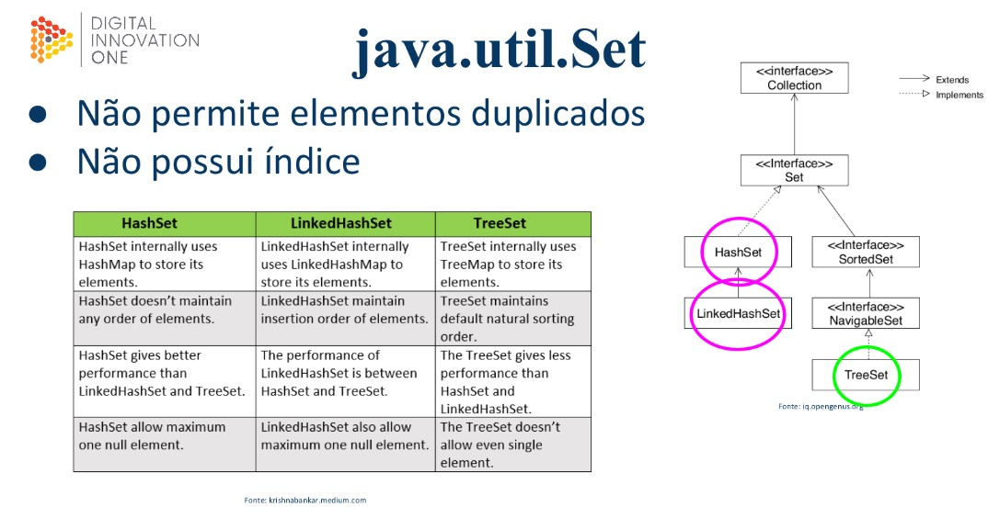

# Set

Em Java, um Set é uma coleção de elementos únicos, o que significa que não pode haver elementos duplicados dentro do Set. Para usar um Set em Java, é necessário importar a classe Set do pacote java.util.

Um **Set** é implementado através de uma classe concreta, como **HashSet**, **LinkedHashSet** ou **TreeSet**. A diferença entre essas implementações é a maneira como os elementos são armazenados dentro do **Set** e como eles são iterados.

`HashSet`
É a implementação mais comum de Set em Java. Ela não garante a ordem dos elementos dentro do Set. Os elementos são armazenados em um hash table e a ordem de inserção não é mantida. O HashSet é a implementação mais eficiente em termos de tempo de execução para as operações add, remove e contains.

`LinkedHashSet` 
É uma subclasse de HashSet que mantém a ordem de inserção dos elementos no Set. Isso é alcançado mantendo uma lista duplamente encadeada dos elementos. O LinkedHashSet é ligeiramente mais lento do que o HashSet em termos de tempo de execução para as operações add, remove e contains, mas é mais rápido do que o TreeSet.

`TreeSet`
É uma implementação de Set que mantém os elementos em ordem crescente ou decrescente. Os elementos são armazenados em uma árvore balanceada. O TreeSet é mais lento do que o HashSet e o LinkedHashSet em termos de tempo de execução para as operações add, remove e contains, mas é mais rápido do que o ArrayList para buscar elementos.

<br>

### Representação de hierarquia


<br>

### Exemplo de uso do set

#### Hashset 

<details>
<summary>Código</summary>

>Não mantem os elementos em ordem

```java
import java.util.HashSet;
import java.util.Set;

public class ExemploSet {
    public static void main(String[] args) {
        // Criando um Set vazio
        Set<Integer> meuSet = new HashSet<Integer>();

        // Adicionando elementos ao Set
        meuSet.add(1);
        meuSet.add(2);
        meuSet.add(3);
        meuSet.add(4);

        // Removendo elementos do Set
        meuSet.remove(2);

        // Verificando se um elemento está presente no Set
        if (meuSet.contains(1)) {
            System.out.println("O elemento 1 está presente no Set");
        }

        // Exibindo todos os elementos do Set
        System.out.println("Os elementos do Set são: " + meuSet);

        // Realizando a união entre dois Sets
        Set<Integer> outroSet = new HashSet<Integer>();
        outroSet.add(3);
        outroSet.add(4);
        outroSet.add(5);
        outroSet.add(6);
        Set<Integer> uniaoSet = new HashSet<Integer>(meuSet);
        uniaoSet.addAll(outroSet);
        System.out.println("A união entre os dois Sets é: " + uniaoSet);

        // Realizando a interseção entre dois Sets
        Set<Integer> intersecaoSet = new HashSet<Integer>(meuSet);
        intersecaoSet.retainAll(outroSet);
        System.out.println("A interseção entre os dois Sets é: " + intersecaoSet);

        // Realizando a diferença entre dois Sets
        Set<Integer> diferencaSet = new HashSet<Integer>(meuSet);
        diferencaSet.removeAll(outroSet);
        System.out.println("A diferença entre os dois Sets é: " + diferencaSet);
    }
}
```

</details>

<br>

#### LinkedHashSet 

<details>
<summary>Código</summary>

> Mantem ordem de inserção

```java
import java.util.LinkedHashSet;

public class ExemploLinkedHashSet {

    public static void main(String[] args) {
        // Criando um LinkedHashSet de Strings
        LinkedHashSet<String> set = new LinkedHashSet<>();

        // Adicionando elementos ao set
        set.add("banana");
        set.add("maçã");
        set.add("laranja");
        set.add("uva");
        set.add("abacaxi");

        // Imprimindo os elementos do set
        System.out.println("Elementos do LinkedHashSet: " + set);

        // Removendo um elemento do set
        set.remove("uva");

        // Imprimindo os elementos do set após a remoção
        System.out.println("Elementos do LinkedHashSet após a remoção: " + set);
    }
}
```

</details>

<br>

#### TreeSet 

<details>
<summary>Código</summary>

> Mantem a ordem dos elementos do menor para o maior (Possui método comparable interno)
> >Não permite elemento **“null”**

```java
import java.util.TreeSet;

public class ExemploTreeSet {

    public static void main(String[] args) {
        // Criando um TreeSet de inteiros
        TreeSet<Integer> set = new TreeSet<>();

        // Adicionando elementos ao set
        set.add(10);
        set.add(5);
        set.add(20);
        set.add(15);
        set.add(25);

        // Imprimindo os elementos do set
        System.out.println("Elementos do TreeSet: " + set);

        // Obtendo o primeiro e último elemento do set
        int primeiro = set.first();
        int ultimo = set.last();

        // Imprimindo o primeiro e último elemento do set
        System.out.println("Primeiro elemento do TreeSet: " + primeiro);
        System.out.println("Último elemento do TreeSet: " + ultimo);
    }
}
```

</details>

<br>

---

## Exercícios práticos:

### Exercício 1

Crie um conjunto HashSet e adicione as seguintes regras:

1. Insira essas notas: 7d, 8.5, 9.3, 5d, 7d, 0d, 3.6.
2. Confira se a nota “5” esta no conjunto.
3. Exiba a menor nota do conjunto.
4. Exiba a maior nota do conjunto.
5. Exiba a soma de valores do conjunto.,
6. Exiba a média simples das notas do conjunto.
7. Remova a nota “0.0”.
8. Remova todas as notas abaixo de 7.
9. Crie uma outra lista LinkedHashSet com os mesmos elementos que a HashSet inicial.
10. Mostre os itens da nova lista LinkedHashSet na ordem que foram adicionados.
11. Crie uma lista “treeSet” e mostre os números do menor para o maior.
12. Apague o primeiro conjunto e demostre que ele esta vazio.

<details>
<summary>Código resposta:</summary>

```java
package Ex_1;

import java.util.*;

public class Main {
    public static void main(String[] args) {
        //1 - riando conjunto "notas" e armazenando as notas passadas (Com HashSet)
        Set<Double> notas = new HashSet<>(Arrays.asList(7d, 8.5, 9.3, 5d, 7d, 0d, 3.6));

        //Mostrando o conjunto de "notas" em forma de String
        System.out.println("Conjunto de notas: " + notas.toString());

        //2 - Verificando de "5.0" esta no conjunto
        System.out.println("Nota 5 está no conjunto ? " + notas.contains(5.0));

        //3 - Exibindo a menor nota do conjunto
        System.out.println("Menor nota do conjunto: " + Collections.min(notas));

        //4 - Exibindo a maior nota do conjunto
        System.out.println("Maior nota do conjunto: " + Collections.max(notas));

        //5 - Exibindo a soma de valores do conjunto "notas"
        Iterator<Double> iterator = notas.iterator();
        Double soma_numeros_conjunto = 0.0;
        while (iterator.hasNext()){
            Double next = iterator.next();
            soma_numeros_conjunto += next;
        }
        //Imprimindo a soma dos números
        System.out.println("Soma dos números do conjunto 'notas': " + soma_numeros_conjunto);

        //6 - Mostrando a média das notas
        System.out.println("Média de 'notas': " + (soma_numeros_conjunto / notas.size()));

        //7 - Removendo a nota "0d"
        notas.remove(0d);
        //Mostrando "notas" para conferir se a nota "0.0" foi removida
        System.out.println("Conjunto 'notas' sem o '0d': " + notas);

        //8 - Removendo as notas abaixo de 7
        Iterator<Double> iterator1 = notas.iterator();
        while (iterator1.hasNext()){
            Double next = iterator1.next();
            if (next < 7) iterator1.remove();
        }
        //Mostrando as notas e conferindo se as menores que 7 foram removidas
        System.out.println("Somente notas acima ou igual a 7: " + notas);

        //9 - Lista LinkedHashSet com os mesmo elementos da HashSet inicial
        Set<Double> notas2 = new LinkedHashSet<>();
        //Adicionando elementos
        notas2.add(7d);
        notas2.add(8.5);
        notas2.add(9.3);
        notas2.add(5d);
        notas2.add(7d);
        notas2.add(0d);
        notas2.add(3.6);

        //10 - Mostando as notas de "LinkedHashSet" na ordem que foram adicionadas
        System.out.println("Lista LikedHashSet na ordem de adição dos itens: " + notas2);

        //11 - Criando lista TreeSet e mostrando os números do menor para o maior
        Set <Double> notas3 = new TreeSet<>(notas2);
        //Mostrando os elementos (O prórprio treeSet organiza do maior para o menor com o comparable interno)
        System.out.println("Lista TreeSet do menor pro maior: " + notas3);

        //12 - Apagando elementos do conjunto "notas"
        notas.clear();
        //Demostrando que "notas" esta vazio
        System.out.println("O conjunto notas esta vazio ? " + notas.isEmpty());
    }
}
```

</details>

<br>

### Exercício 2

Dadas as informações sobre minhas séries favoritas, crie um conjunto e ordene exibindo:

1. Nome - Gênero - Tempo de episódio 
    - Nome: Got, Gênero: Fantasia, Tempo_eps: 60
    - Nome: Dark, Gênero: Drama, Tempo_eps: 60
    - Nome: That ‘70s show, Gênero: Comédia. Tempo_eps: 25
2. Mostre a lista na ordem aleatória (HashSet)
3. Mostre na ordem de inserção (LinkedHashSet)
4. Mostre de acordo com o tempo de episódio / menor no começo maior no final (TreeSet)

<details>
<summary>Código resposta:</summary>

```java
//Classe main

package Ex_2;

import java.util.HashSet;
import java.util.LinkedHashSet;
import java.util.Set;
import java.util.TreeSet;

public class Main {
    public static void main(String[] args) {
        //1 - Criando lista de séries e inserindo elementos
        Set<Series> series = new HashSet<>(){{
            add(new Series("Got", "Fantasia", 60));
            add(new Series("Dark", "Drama", 60));
            add(new Series("That '70s show", "Comédia", 25));
        }};

        //2 - Mostrando lista na ordem aleatória
        for(Series serie: series) System.out.println(
                "Nome: "+ serie.getNome() + " - Gênero: " + serie.getGenero()
                        + " - Tempo de eps: " + serie.getTempo_eps()
        );

        //3 - Criando lista de séries com LinkedHashSet para mostrar por ordem de inserção
        Set<Series> series2 = new LinkedHashSet<>(){{
            add(new Series("Got", "Fantasia", 60));
            add(new Series("Dark", "Drama", 60));
            add(new Series("That '70s show", "Comédia", 25));
        }};
        //Mostrando a lista na ordem de inserção
        System.out.println("Ordem de LinkedHashSet: " + series2);

        //4 - Mostrando séries de acordo com o tempo de eps (TreeSet)
        Set<Series> series3 = new TreeSet<>(series2);
        //Mostrando a nova lista
        System.out.println("Ordem de TreeSet: " + series3);
    }
}
```

</details>

<br>

### Exercício 3 (Plus)
Crie um conjunto contendo as cores do arco-íris e: 

1. Exiba todas as cores uma abaixo da outra.
2. Exiba a quantidade de cores que o conjunto arco-íres tem.
3. Exiba as cores em ordem alfabética.
4. Exiba as cores na ordem inversa da que foi informada.
5. Exiba todas as cores que começam com a letra V.
6. Remova todas as cores que não comecem com a letra V.
7. Limpe o conjunto e demostre que esta vazio

<details>
<summary>Código resposta:</summary>

</details>

<br>

### Exercício 4 (Proposto)

Crie uma classe LinguagemFavorita que possua os atributos nome, ano_de_criacao, Ide. Em seguida, crie um conjunto com 3 linguagens e faça um programa que ordene esse conjunto por:

1. Ordem de inserção
2. Ordem alfabética (Nome)
3. Ordem alfabética (Ide)
4. Ordem de ano de criação
5. Ordem nome, ano de criação e Ide

<details>
<summary>Código resposta:</summary>

</details>

