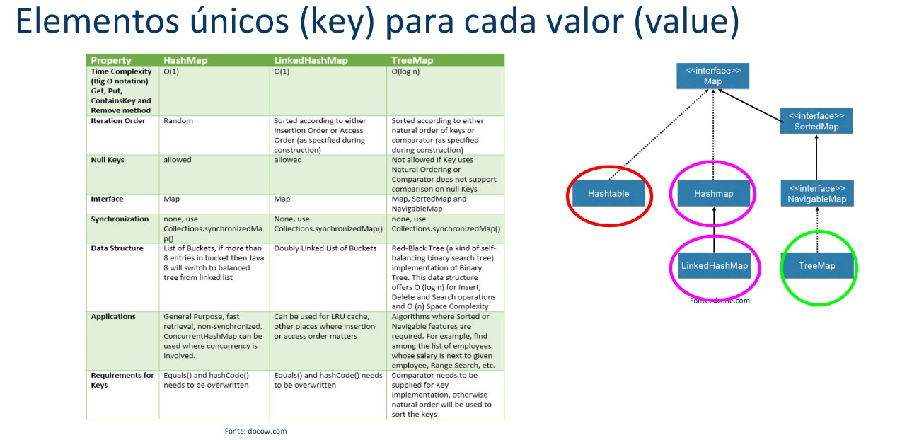

# Map

O "map" é uma interface em Java que define uma coleção de pares de chave-valor, onde cada chave é única. Ele é uma parte da API de coleções Java e é usado para armazenar e acessar elementos com base em suas chaves. Existem várias implementações de "map" em Java, incluindo "HashMap", "TreeMap" e "LinkedHashMap". Cada implementação tem suas próprias características e benefícios, dependendo das necessidades específicas do projeto.

- O "map" é uma interface que estende a interface "java.util.Collection". No entanto, diferente de outras coleções, ele armazena pares de chave-valor em vez de objetos individuais. Ele também estende a interface "java.util.Map", que define operações básicas, como put(), get(), remove(), containsKey() e containsValue().
- Ao usar um "map", você pode armazenar e recuperar elementos usando as chaves, em vez de acessá-los por posição na coleção. Isso torna o "map" uma estrutura de dados eficiente para encontrar, inserir e remover elementos em tempo constante.

<br>

## Diferenças entre `HashMap`, `TreeMap` e `LinkedHashMap`:

### `HashMap`
É a implementação mais comum da interface "Map" em Java. Ela armazena pares de chave-valor em uma tabela hash, o que torna o acesso aos elementos muito rápido. No entanto, os elementos não são mantidos em nenhuma ordem específica.

<details>
<summary>Código exemplo:</summary>

```java
import java.util.HashMap;
import java.util.Map;

public class ExemploHashMap {
    public static void main(String[] args) {
        // criando um objeto HashMap
        Map<String, Integer> mapa = new HashMap<>();

        // adicionando pares chave-valor ao mapa
        mapa.put("chave1", 10);
        mapa.put("chave2", 20);
        mapa.put("chave3", 30);

        // percorrendo o mapa e imprimindo os valores
        for (String chave : mapa.keySet()) {
            System.out.println(chave + " = " + mapa.get(chave));
        }
    }
}
```

</details>

<br>

### `LinkedHashMap` 

É uma implementação da interface "Map" que mantém a ordem em que os elementos foram inseridos. Ela armazena pares de chave-valor em uma tabela hash, como o "HashMap", mas mantém uma lista duplamente vinculada dos elementos na ordem em que foram adicionados.

<details>
<summary>Código exemplo:</summary>

```java
import java.util.LinkedHashMap;
import java.util.Map;

public class ExemploLinkedHashMap {
    public static void main(String[] args) {
        // criando um objeto LinkedHashMap
        Map<String, Integer> mapa = new LinkedHashMap<>();

        // adicionando pares chave-valor ao mapa
        mapa.put("chave1", 10);
        mapa.put("chave2", 20);
        mapa.put("chave3", 30);

        // percorrendo o mapa e imprimindo os valores
        for (String chave : mapa.keySet()) {
            System.out.println(chave + " = " + mapa.get(chave));
        }
    }
}
```

</details>

<br>

### `TreeMap` 

É uma implementação da interface "Map" que mantém os elementos em ordem crescente com base nas chaves. Ela armazena pares de chave-valor em uma árvore binária de pesquisa, o que torna o acesso aos elementos um pouco mais lento do que o "HashMap" e o "LinkedHashMap". No entanto, a ordem dos elementos é garantida.

<details>
<summary>Código resposta:</summary>

```java
import java.util.Map;
import java.util.TreeMap;

public class ExemploTreeMap {
    public static void main(String[] args) {
        // criando um objeto TreeMap
        Map<String, Integer> mapa = new TreeMap<>();

        // adicionando pares chave-valor ao mapa
        mapa.put("chave3", 30);
        mapa.put("chave1", 10);
        mapa.put("chave2", 20);

        // percorrendo o mapa e imprimindo os valores
        for (String chave : mapa.keySet()) {
            System.out.println(chave + " = " + mapa.get(chave));
        }
    }
}
```

</details>

<br>

## Representação de hierarquias



<br>

---

## Exercícios práticos:

### Exercício 1

Dado o modelo dos carros e os seus respectivos consumos na estrada, faça:

1. Insira numa lista HashMap:
    - modelo: Gol - consumo: 14.4 km/L
    - modelo: Uno - consumo: 15.6 km/L
    - modelo: Mobi - consumo: 16.1 k m/L
    - modelo: HB20 - consumo: 14.5 k m/L
    - modelo: Kwid - consumo: 15.6 km/L
2. Substitua o consumo do gol para 15.2 km/L.
3. Confira se o modelo Tucson esta na lista.
4. Exiba o consumo do Uno.
5. Exiba os modelos (KeySet).
6. Exiba os consumos dos carros (Values).
7. Mostre o modelo mais econômico e seu consumo.
8. Exiba o modelo menos econômico e seu consumo.
9. Exiba a soma dos consumos.
10. Exiba a média do consumo dos automóveis.
11. Remova os modelos com consumo igual a 15.6.
12. Mostre os veículos na ordem que foram adicionados (Use linkedHashMap).
13. Exiba a lista em ordem alfabética de acordo com o nome do veículo (Use TreeMap).
14. Apague a lista de carros e demostre que esta vazia.

<details>
<summary>Código resposta:</summary>

```java
package Ex01;

import java.util.*;

public class Main {
    public static void main(String[] args) {
        //1 - Criando lista map
        Map<String, Double> carros_populares = new HashMap<>(){{
            //Adicionando elementos com o método put
            put("Gol", 14.4);
            put("Uno", 15.6);
            put("Mobi", 16.1);
            put("HB20", 14.5);
            put("Kwid", 15.6);
        }};

        //Imprimindo a lista de "carros_populares" em string
        System.out.println("Lista de carros: " + carros_populares.toString());

        //2 - Substituindo o consumo do "gol"
        carros_populares.put("Gol", 15.2);

        //Imprimindo a lista novamente para confirmar alteração no consumo do Gol
        System.out.println("Altera consumo Gol: " + carros_populares.toString());

        //3 - Verificando se o "Tucson" esta na lista
        System.out.println("Tucson esta na lista ?" + carros_populares.containsKey("Tucson"));

        //4 - Exibindo o consumo do Uno
        System.out.println("Consumo do Uno: " + carros_populares.get("Uno"));

        //5 - Exibindo os modelos de veículos
        Set<String> modelos = carros_populares.keySet();
        System.out.println("Modelos: " + modelos);

        //6 - Mostrando o consumo dos veículos
        Collection<Double> consumo = carros_populares.values();
        System.out.println("Consumo dos carros: " + consumo);

        //7 - Mostrando o modelo mais econômico
        Double consumo_economico = Collections.max(carros_populares.values());
        Set<Map.Entry<String, Double>> entries = carros_populares.entrySet();
        String modelo_eficiente = "";

        for(Map.Entry<String, Double> entry: entries){
            if(entry.getValue().equals(consumo_economico)){
                modelo_eficiente = entry.getKey();

                //Mostrando o modelo mais eficiente
                System.out.println("Modelo mais econômico: " + modelo_eficiente + " - " +consumo_economico );
            }
        }

        //8 - Exibindo veículo menos econômico
        Double consumo_menos_eficiente = Collections.min(carros_populares.values());
        String modelo_menos_eficiente = "";

        for(Map.Entry<String, Double> entry: carros_populares.entrySet()){
            if(entry.getValue().equals(consumo_menos_eficiente)){
                modelo_eficiente = entry.getKey();

                //Imprimindo modelo menos econômico
                System.out.println("Modelo menos econômico: " + modelo_eficiente + " - " + consumo_menos_eficiente);
            }
        }

        //9 - Mostrando a soma dos consumos dos veículos
        Iterator<Double> iterator = carros_populares.values().iterator();
        Double soma_consumos = 0d;

        while (iterator.hasNext()){
            soma_consumos += iterator.next();
        }

        //Exibindo soma de consumo dos carros
        System.out.println("A soma de consumos dos carros é: " + soma_consumos);

        //10 - Exibindo média de consumo dos automóveis
        System.out.println("A média do consumo dos carros é: " + soma_consumos / carros_populares.size());

        //11 - Removendo veículos com consumo de 15.6
        Iterator <Double> iterator1 = carros_populares.values().iterator();

        while (iterator1.hasNext()){
            if(iterator1.next().equals(15.6)){
                iterator1.remove();
            }
        }

        //Mostrando a lista com as remoções realizadas
        System.out.println("Sem os carros de 15.6 km/L: " + carros_populares);

        //12 - Usando "LinkedHashMap" para mostrar carros na ordem de adição
        Map<String, Double> carros_populares2 = new LinkedHashMap<>(){{
            //Adicionando elementos com o método put
            put("Gol", 14.4);
            put("Uno", 15.6);
            put("Mobi", 16.1);
            put("HB20", 14.5);
            put("Kwid", 15.6);
        }};

        //Mostrando os carros com LinkedHashMap
        System.out.println("Exibindo na ordem de adição: " + carros_populares2);

        //13 - Mostrando lista em ordem alfabética de acordo com o nome
        Map<String, Double> carros_populares3 = new TreeMap<>(carros_populares2);

        //Mostrando a lista na ordem alfabética
        System.out.println("Mostrando em ordem alfabética: " + carros_populares3);

        //14 - Apagando a lista e demostrando que está vazia
        carros_populares.clear();

        //Demostrando lista vazia
        System.out.println("A lista 'carros populares' esta vazia ? " + carros_populares.isEmpty());
    }
}
```

</details>

<br>

### Exercício 2

Dadas as seguintes informações sobre meus autores e seus livros crie um dicionário map e ordene em:

1. Crie uma lista com (use o hashMap):
    - autor: Stephen Hawking - título: Uma breve história o tempo - quant_pag: 256
    - autor: Charles Duhigg - título: O poder do hábito - quant_pag: 408
    - autor: Yuval Noah Harari - título: 21 lições para o século 21 - quant_pag: 432
2. Mostre aleatoriamente somente o nome do autor e o nome do livro.
3. Mostre os livros na ordem de inserção (Use o linkedHashMap).
4. Mostre os livros na ordem alfabética de acordo com nome do autor/ chave (Use o treeMap).
5. Mostre os livros em ordem alfabética de acordo com nome do livro/ valor (Use TreeSet).
6. Mostre os livros de acordo com a quantidade de páginas (Usando o TreeSet)

<details>
<summary>Código resposta:</summary>

```java
//Classe main

package Ex02;

import java.util.*;

public class Man {
    public static void main(String[] args) {
        //1 - Criando a lista de livros
        Map<String, Livro> colecao_livros = new HashMap<>(){{
            //Adicionando os livros
            put("Stephen Hawking", new Livro("Uma breve história o tempo", 256) );
            put("Charles Duhigg", new Livro("O poder do hábito", 408) );
            put("Yuval Noah Harari", new Livro("21 lições para o século 21", 432) );
        }};

        //2 - Mostrando somente autor e nome do livro em ordem aleatória
        System.out.println("-- Ordem Aleatória --");
        for(Map.Entry<String, Livro> livro: colecao_livros.entrySet()){
            System.out.println(livro.getKey() + " - " + livro.getValue().getNome());
        }

        //3 - Mostrando os livros em ordem de inserção com o "LinkedHashMap"
        Map<String, Livro> colecao_livros2 = new LinkedHashMap<>(){{
            //Adicionando os livros
            put("Stephen Hawking", new Livro("Uma breve história o tempo", 256) );
            put("Charles Duhigg", new Livro("O poder do hábito", 408) );
            put("Yuval Noah Harari", new Livro("21 lições para o século 21", 432) );
        }};

        System.out.println("\n-- Ordem de inserção --");
        for (Map.Entry<String, Livro> livro: colecao_livros2.entrySet()){
            System.out.println(livro.getKey() + " - " + livro.getValue().getNome());
        }

        //4 - Mostrando livros na ordem alfabética de acordo com a chave com o "TreeMap"
        Map<String, Livro> colecao_livros3 = new TreeMap<>(colecao_livros2);

        System.out.println("\n-- Ordem alfaética --");
        for (Map.Entry<String, Livro> livro: colecao_livros3.entrySet()){
            System.out.println(livro.getKey() + " - " + livro.getValue().getNome());
        }

        //5 - Mostrando livros em ordem alf de acordo com o nome dos livros com o "TreeSet"
        Set<Map.Entry<String, Livro>> colecao_livros4 = new TreeSet<>(new ComparatorNome());
        colecao_livros4.addAll(colecao_livros.entrySet());

        //Mostrando na ordem alfabética de acordo com nome do livro
        System.out.println("\n-- Ordem alfabética de acordo com nome do livro --");
        for (Map.Entry<String, Livro> livro: colecao_livros4){
            System.out.println(livro.getKey() + " - " + livro.getValue().getNome());
        }

    }
}
```

</details>

<br>

### Exercício 3 (Plus)
Dada a população estimada de alguns estados do nordeste brasileiro, faça:

1. Crie um dicionário map com:
    - estado: PE/ população: 9.616.621
    - estado: AL/ população: 3.351.543
    - estado: CE/ população: 9.187.103
    - estado: RN/ população: 3.534.265
2. Mostre a lista dos estados e populações.
3. Substitua a população do estado de RN por 3.534.165.
4. Confira se o estado PB (Paraiba) está na lista. Caso não esteja adicione:
    - estado: PB/ população: 4.039.277
5. Exiba a população de PE
6. Exiba todos os estados e populações de acordo com ordem de inserção.
7. Exiba os estados e populações em ordem alfabética.
8. Exiba estado com menor população e sua quantidade.
9. Exiba o estado com a maior população e sua quantidade.
10. Exiba a soma de população dos estados.
11. Exiba a média da população desses estados.
12. Remova os estados com a população menor que 4.000.000.
13. Apague a lista e demostre que esta vazia.

<details>
<summary>Código resposta:</summary>

</details>

<br>

### Exercício 4 (Plus)

Faça um programa que simule um lançamento de dado.

- Lance o dado 100 vezes e armazene os valores.
- Depois mostre quantas vezes cada falor foi inserido.

<details>
<summary>Código resposta:</summary>

</details>

<br>

<br>

<br>

[Voltar a Collections](/Arquivos/Conteudo/4%20-%20Programa%C3%A7%C3%A3o%20orientada%20a%20objetos/4.2%20Collections.md)<br>
[Voltar ao inicio](/README.md)