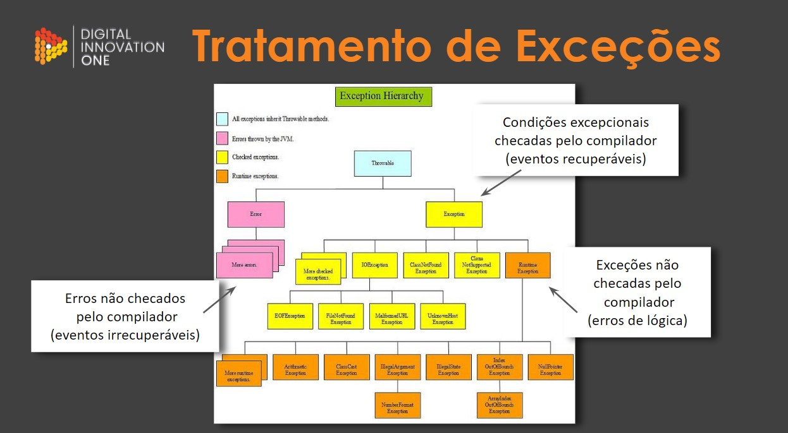

# Tratamento de exceções em Java

## Palavras Reservadas:

- try, catch, finally: Cada uma dessas palavras, juntas, definem blocos para o tratamento de exceções.
- throws: Declara que um método pode lançar uma ou várias exceções.
- throw: Lança explicitamente uma exception.

###  Error 🔸
- Usado pela JVM, serve para indicar quando existe algum problema de recurso do programa, tornando a execução impossível de continuar.
- O “Erro” é algo que não pode mais ser tratado, ao contrário da “Exceção” que trata seus erros, pois todas as subclasses de Exception (menos as subclasses RuntimeException) são exceções que obrigatóriamente devem ser tratadas.

### Unchecked Exception 🔸
- Herdam da classe *RuntimeException* ou da classe *Error*.
- O compilador não verifica o código para ver se a exceção foi capturada ou declarada.
- Se uma exceção não-verificada ocorrer e não tiver sido capturada, o programa terminará ou executará com resultados inesperados.
- Em geral, podem ser evitadas com uma codificação adequada.

### Checked Exception 🔸 
- As exceções que são herdadas da classe *Exception*, mas não de *RuntimeException*.
- O compilador impõe um requisito do tipo "capturar ou declarar".
- O compilador verifica cada chamada de método e declaração de método para determinar se o método lança (*throws*) exceções verificadas.
- Se lançar, o compilador assegura que a exceção verificada é capturada ou declarada em uma cláusula *throws*.
- Caso não capturada nem declarada, ocorre um erro de compilação.

### Exception Personalizada 🔸 
- Programadores podem achar útil declarar suas próprias classes de exceção.
- Essas Exceptions são específicas aos problemas que podem ocorrer quando outro programador empregar suas classes reutilizáveis.
- Uma nova classe de exceção deve estender uma classe de exceção existente que assegura que a classe pode ser utilizada com o mecanismo de tratamento de exceções, logo essas Exceções customizadas são derivadas da classe Exception.
- *Importante*: Antes de criar a nossa própria exceção, é recomendado verificar se já existe alguma exceção na biblioteca Java que já nos forneça o que precisamos. Afinal, não queremos reinventar a roda!

### Blocos try/catch/finally 🔸

#### `try`
- Região onde se encontra o código que queremos verificar se irá ou não lançar uma exceção.
- Caso ocorra uma exceção em algum ponto, o restante do código contido no bloco *try* não será executado.
- O bloco *try* não pode ser declarado sozinho, por tanto, precisa estar seguido de um ou vários blocos *catch* e/ou de um bloco *finally*.

#### `catch`
- Região onde se encontra o possível tratamento da exceção. Isso significa que só será executado caso o bloco *try* apresentar alguma exceção.
- Recebe como argumento a classe ou subclasse da possível exceção.
- No seu escopo ficam as instruções de como tratar essa exceção.
- Pode haver mais de um bloco *catch*, porém, será executado apenas o primeiro bloco que identificar a exceção.
- *Importante*: Caso você utilize mais de um *catch* e houver exceções de uma mesma hierarquia de classes, certifique-se que a classe mais genérica esteja como argumento do último *catch*. Caso contrário, qualquer exceção sempre cairá neste primeiro *catch*, assim fazendo com que a exception mais específica não seja verificada.

#### `finally`
- Este bloco é opcional, mas caso seja construído, quase sempre será executado. (A menos que seja forçada sua parada, por exemplo, com um System.exit(0), no *catch*)
- Dentro do bloco *finally*, poderá conter outros blocos *try, catch,* bem como outro *finally*.

### Cláusulas throws e throw
#### throws

- Usada na assinatura do método.
- Necessária apenas para exceções checked.
- Informa ao chamador que este método pode lançar uma das exceções listadas no escopo do método. Isso obriga a fazer a captura dessa exception (*try-catch*) ou relançar o *throws*.

#### throw

- É usada para lançar explicitamente uma exceção de um método ou de qualquer bloco de código.
- Usada principalmente para lançar exceções personalizadas

##### Importante! 

- O fluxo de execução "normal" do programa para imediatamente apos a execução da cláusula *throw*. O bloco *try* envolvente mais próximo é verificado para encontrar um bloco *catch* que corresponda ao tipo de exceção.
- Caso encontre essa correspondência, o controlado é transferido para esse bloco. Caso contrário, o próximo bloco *try* envolvente é verificado e assim por diante.
- Outro caso, é se nenhuma captura for encontrada, o manipulador da exceção padrão interromperá o programa.

<br>

## Hierarquia de exceções



As exceções em Java são organizadas em uma hierarquia de classes. Todas as exceções são subclasses da classe Throwable. Dentro da classe Throwable, existem duas subclasses principais: Exception e Error.

- A classe Exception representa as exceções que podem ser tratadas durante a execução do programa.
- A classe Error representa problemas que normalmente estão fora do controle do programador, como falta de memória.
- Existem outras subclasses de Exception, como RuntimeException, que representam erros que podem ser evitados com uma codificação adequada.
- É importante entender a hierarquia de exceções para saber qual tipo de exceção capturar e como tratá-la corretamente.

### Exemplo de tratamento de exceções:
<details>
<summary>Código</summary>

```java
public class Main {
    public static void main(String[] args) {
        try {
            // Código que pode gerar uma exceção
            Scanner scanner = new Scanner(System.in);
            System.out.println("Digite um número inteiro:");
            int numero = Integer.parseInt(scanner.nextLine());
            
            // Divisão por zero
            int resultado = 10 / 0;
            
            // ArrayIndexOutOfBoundsException
            int[] numeros = new int[5];
            numeros[10] = 2;
            
        } catch (NumberFormatException e) {
            // Tratamento para quando o usuário não digita um número inteiro
            System.out.println("Erro: digite um número inteiro válido.");
            
        } catch (ArithmeticException e) {
            // Tratamento para quando ocorre uma divisão por zero
            System.out.println("Erro: divisão por zero.");
            
        } catch (ArrayIndexOutOfBoundsException e) {
            // Tratamento para quando se tenta acessar um índice inválido de um array
            System.out.println("Erro: índice inválido do array.");
            
        } catch (Exception e) {
            // Tratamento para qualquer outra exceção não prevista nos catches anteriores
            System.out.println("Erro desconhecido: " + e.getMessage());
            
        } finally {
            // Bloco que sempre é executado, mesmo que ocorra uma exceção ou não
            System.out.println("Fim do programa.");
        }
    }
}
```

</details>

<br>

### Analise de cada caso de exceções 

<details>
<summary>Código exemplo Unchecked exception</summary>

```java
package Tratamento_de_erros.unchecked_exceptions;

import javax.swing.*;

public class Main {

    public static void main(String[] args) {
        boolean continue_looping = true;

        do{
            String a = JOptionPane.showInputDialog("Numerador: ");
            String b = JOptionPane.showInputDialog("Denominador: ");

            //Tratando possível Erro -> Caso usuário digite algo diferente de um número*/
            try {
                int resultado = Dividir(Integer.parseInt(a), Integer.parseInt(b));
                System.out.println("O resultado é: " + resultado);
                continue_looping = false;
            }
            //tratando em caso usuário digite String ao invés de número
            catch (NumberFormatException num){
                // Para ver a pila de erro da exception no console
                num.printStackTrace();

                //Exibindo mensagem na tela
                JOptionPane.showMessageDialog(null, "Erro! Aceitamos " +
                        "apenas números inteiros " + num.getMessage());
            }
            //Tratando caso denominador = 0
            catch (ArithmeticException num_0){
                // Para ver a pila de erro da exception no console
                num_0.printStackTrace();

                //Exibindo mensagem na tela
                JOptionPane.showMessageDialog(null, "Erro! O " +
                        "denominador não pode ser zero " + num_0.getMessage());
            }
            //Executado independe das condições acima
            finally {
                System.out.println("Chegou no finally!");
            }
        }while (continue_looping);

        System.out.println("O código continua...");
    }

    public static int Dividir(int num_a, int num_b){
        return num_a/ num_b;
    }
}
```

</details>

<details>
<summary>Código exemplo checked exception</summary>

```java
package Checked_exception;

import javax.swing.*;
import java.io.*;

public class Main {
    public static void main(String[] args) {
        String nome_arquivo = "romances-Blake-Crouch.txt";
        try {
            ImprimirArquivoNoConsole(nome_arquivo);
        }
        //Tratando erro caso o arquivo não esteja na raiz do projeto (Arquivo não encontrado)
        catch (FileNotFoundException arq) {
            //Imprimindo pilha do erro no console
            arq.printStackTrace();

            //Mostrando erro para o usuário
            JOptionPane.showMessageDialog(null,
                    "Erro! O documento que desenha imprimir não foi encontrado " + arq.getCause());
        }
        //Tratando de "IOException" (Erro genérico) -> Leitura, escrita ou impressão do documento
        catch (IOException arq){
            //Imprimindo pilha do erro no console
            arq.printStackTrace();

            //Mostrando erro para o usuário
            JOptionPane.showMessageDialog(null,
                    "Ocorreu um erro inesperado. Procure o suporte." + arq.getCause());
        }
        //Opcional para executar independente de tratamento de erro ou execução de try
        finally {
            System.out.println("Chegou no bloco finally!");
        }

        System.out.println("Apesar da exception ou não, o programa continua...");
    }

    //Com o "trows" eu jogo as exceções a serem tratadas por quem chama o método "ImprimrirArquivoConsole"
    public static void ImprimirArquivoNoConsole(String nome_do_arqivo) throws IOException {
        File file = new File(nome_do_arqivo);

        BufferedReader br = new BufferedReader(new FileReader(file.getName()));
        String line = br.readLine();

        BufferedWriter bw = new BufferedWriter(new OutputStreamWriter(System.out));

        do{
            bw.write(line);
            bw.newLine();
            line= br.readLine();
        }while (line != null);
            bw.flush();
            br.close();
    }
}
```

</details>

<details>
<summary>Código exemplo custom exception</summary>

<details>
<summary>1° Estudo</summary>

```java
package Custom_Exception;

import javax.swing.*;
import java.io.*;

public class Main {
    public static void main(String[] args) {
        String nome_do_arquivo = JOptionPane.showInputDialog("Nome do arquivo a ser exibido: ");

        imprimirArquivoNoConsole(nome_do_arquivo);
        System.out.println("\nCom exception ou não, o programa continua...");
    }

    public static void imprimirArquivoNoConsole(String nome_do_arquivo) {

        try {
            BufferedReader br = lerArquivo(nome_do_arquivo);
            String line = br.readLine();
            BufferedWriter bw = new BufferedWriter(new OutputStreamWriter(System.out));
            do {
                bw.write(line);
                bw.newLine();
                line = br.readLine();
            } while (line != null);
            bw.flush();
            br.close();
        }
        //Exception criada (Acionada para tratar erro de abertura de arquivo)
        catch (ImpossivelAberturaDeArquivoException element) {
            JOptionPane.showMessageDialog(null,
                    element.getMessage());
            //element.printStackTrace();
        } catch (IOException ex) {
            JOptionPane.showMessageDialog(null,
                    "Ocorreu um erro não esperado, por favor, fale com o suporte." + ex.getMessage());
            ex.printStackTrace();
        }
    }

    public static BufferedReader lerArquivo(String nome_do_arquivo) throws ImpossivelAberturaDeArquivoException {

        File file = new File(nome_do_arquivo);
        try {
            return new BufferedReader(new FileReader(nome_do_arquivo));
        } catch (FileNotFoundException element) {
            throw new ImpossivelAberturaDeArquivoException(file.getName(), file.getPath());
        }
    }
}

class ImpossivelAberturaDeArquivoException extends Exception {
    private String nome_do_arquivo;
    private String diretorio;

    public ImpossivelAberturaDeArquivoException(String nome_do_arquivo, String diretorio) {
        super("O arquivo " + nome_do_arquivo + " não foi encontrado no diretório " + diretorio);
        this.nome_do_arquivo = nome_do_arquivo;
        this.diretorio = diretorio;
    }

    /*@Override
    public String toString() {
        return "ImpossivelAberturaDeArquivoException{" +
                "nomeDoArquivo='" + nomeDoArquivo + '\'' +
                ", diretorio='" + diretorio + '\'' +
                '}';
    }*/

}
```

</details>

<details>
<summary>2° Estudo</summary>

```java
package Custom_Exception;

import javax.swing.*;

public class Main {
    public static void main(String[] args) {
        int[] numerador = {4,5,8,10};
        int[] denominador = {2,4,0,2,8};

        for (int i = 0; i< denominador.length; i++){
            try {
                if (numerador[i] % 2 != 0) {
                    throw new DivisaoNaoExataExecption("Divisão não exata! ", numerador[i], denominador[i]);
                }
                int resultado = numerador[i] / denominador[i];
                System.out.println(resultado);
            }
            catch (DivisaoNaoExataExecption num) {
                //Mostrando a pilah de erro
                num.printStackTrace();

                //Mostrando mensagem para o usuário
                JOptionPane.showMessageDialog(null, num.getMessage());

            }
        }
            System.out.println("O programa continua...");
    }
}
```

</details>


</details>

<br>

#### Referência
[Cami-la exceptions-java](https://github.com/cami-la/exceptions-java/tree/master)<br>
[Documentação java](https://docs.oracle.com/en/java/javase/11/docs/api/java.base/java/lang/Error.html)<br>
[Diagram of exception hierarchy](https://www.programcreek.com/2009/02/diagram-for-hierarchy-of-exception-classes/)<br>
[Dev midia trabalhando com excecões](https://www.devmedia.com.br/trabalhando-com-excecoes-em-java/27601)

<br>

<br>

<br>

[Voltar ao inicio](/README.md)