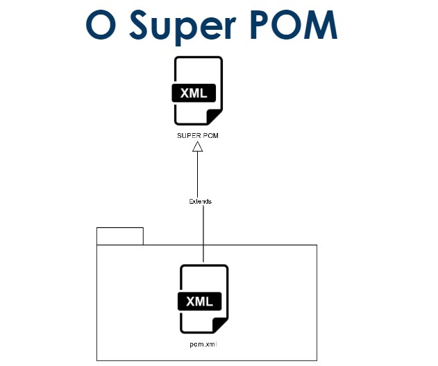
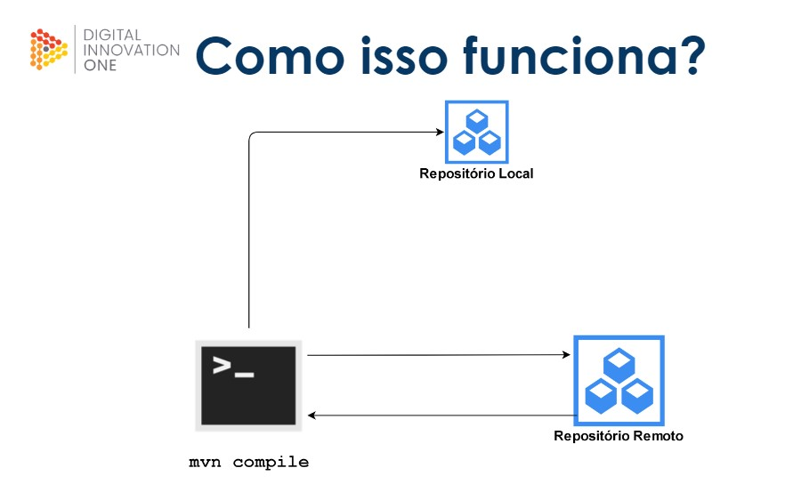
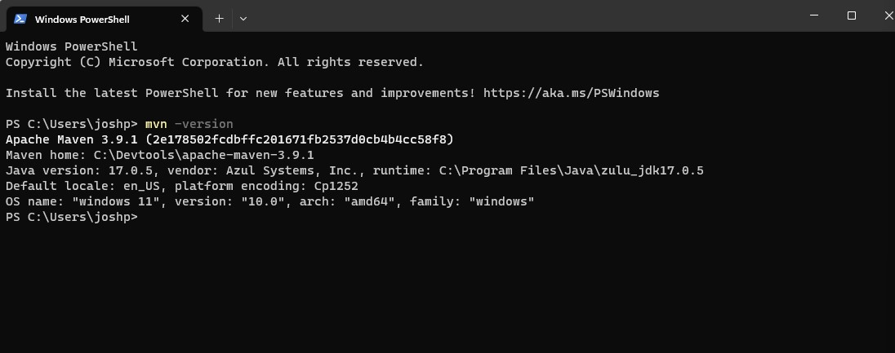

# O que é apache Maven ?

[Wikipidia - Explicando funcionamento do Maven](https://en.wikipedia.org/wiki/Apache_Maven)

## O que é o Apache Maven?
O Apache Maven é uma ferramenta de automação de construção de projetos de software baseada em Java. Ele fornece um formato padrão para o gerenciamento de dependências, construção de projetos, criação de artefatos, publicação e documentação de projetos Java.

### Quando foi criado?
O Apache Maven foi criado em 2004 por Jason van Zyl, como um substituto do antigo projeto Jakarta Turbine, que não atendia às necessidades de gerenciamento de dependências e construção de projetos de software.

### Para que serve?
O Apache Maven é utilizado para facilitar a criação e gerenciamento de projetos Java, automatizando processos repetitivos, como a compilação, empacotamento e distribuição de artefatos. Algumas das principais funções do Maven incluem:

- Gerenciamento de dependências: o Maven permite declarar as dependências do projeto em um arquivo XML (pom.xml), que é baixado automaticamente a partir dos repositórios Maven.
- Construção de projetos: o Maven usa convenções para estruturar os diretórios de código-fonte, permitindo uma construção mais eficiente e padronizada.
- Criação de artefatos: o Maven empacota o código-fonte em um ou mais formatos, como JAR, WAR ou ZIP, tornando mais fácil distribuir o projeto.
- Publicação de artefatos: o Maven permite a publicação de artefatos em um ou mais repositórios remotos, facilitando o compartilhamento do código-fonte.
- Documentação de projetos: o Maven pode gerar documentação a partir do código-fonte do projeto, facilitando o entendimento do funcionamento do software.

Em resumo, o Apache Maven é uma ferramenta essencial para o desenvolvimento de projetos Java, permitindo uma gestão mais eficiente de dependências e automatização de tarefas repetitivas, tornando o processo de construção de projetos mais fácil e padronizado.

<br>

## Arquivo POM (Project Object Model)

O arquivo POM (Project Object Model) é um arquivo XML utilizado pelo Apache Maven para gerenciar projetos de software. Ele contém informações sobre o projeto, como as dependências, plugins, configurações de compilação e testes, informações de distribuição, entre outras.

**Algumas das informações contidas no arquivo POM incluem:**

- groupId: o identificador do grupo de artefatos do projeto
- artifactId: o identificador único do projeto dentro do grupo
- version: a versão do projeto
- dependencies: as dependências do projeto, com seus identificadores e versões
- plugins: os plugins do Maven que serão utilizados no projeto
- profiles: perfis de configuração do Maven que podem ser utilizados para diferentes ambientes

O arquivo POM é criado pelo desenvolvedor do projeto e é utilizado pelo Maven para realizar diversas tarefas, como compilação, testes, empacotamento, distribuição e publicação de artefatos. Ele pode ser modificado conforme necessário para atender às necessidades específicas do projeto.

<details>
<summary>Exemplo arquivo POM</summary>

```xml
<!-- Informações gerais sobre o projeto -->
<project xmlns="http://maven.apache.org/POM/4.0.0" 
         xmlns:xsi="http://www.w3.org/2001/XMLSchema-instance"
         xsi:schemaLocation="http://maven.apache.org/POM/4.0.0 
                             http://maven.apache.org/xsd/maven-4.0.0.xsd">
                             
    <!-- Versão do formato do arquivo POM -->
    <modelVersion>4.0.0</modelVersion>
    
    <!-- Informações sobre o projeto -->
    <groupId>com.example</groupId> <!-- ID do grupo do projeto -->
    <artifactId>my-project</artifactId> <!-- ID do artefato do projeto -->
    <version>1.0-SNAPSHOT</version> <!-- Versão do projeto -->
    
    <!-- Dependências do projeto -->
    <dependencies>
        <dependency>
            <groupId>junit</groupId> <!-- ID do grupo da dependência -->
            <artifactId>junit</artifactId> <!-- ID do artefato da dependência -->
            <version>4.12</version> <!-- Versão da dependência -->
            <scope>test</scope> <!-- Escopo da dependência -->
        </dependency>
    </dependencies>
    
    <!-- Build do projeto -->
    <build>
        <plugins>
            <plugin>
                <groupId>org.apache.maven.plugins</groupId> <!-- ID do grupo do plugin -->
                <artifactId>maven-compiler-plugin</artifactId> <!-- ID do artefato do plugin -->
                <version>3.8.1</version> <!-- Versão do plugin -->
                <configuration>
                    <source>1.8</source> <!-- Versão do compilador -->
                    <target>1.8</target> <!-- Versão do bytecode gerado -->
                </configuration>
            </plugin>
        </plugins>
    </build>
    
</project>
```

</details>

<br>

## Super Pom

#### Representação:


O Super POM (Project Object Model) é o arquivo POM padrão do Apache Maven, que define as configurações e dependências padrão para todos os projetos Maven. Ele é um modelo que serve como uma base para todos os projetos Maven e é incluído automaticamente em todos os projetos Maven como um pai.

O Super POM contém informações sobre a versão do Maven, as configurações padrão de compilação, empacotamento, testes, entre outras informações. Ele também possui informações sobre as dependências padrão, que incluem bibliotecas comuns, como o JUnit, que é frequentemente utilizado para testes.

Os desenvolvedores podem substituir as configurações padrão do Super POM em seus próprios arquivos POM para atender às necessidades específicas de seus projetos.

<br>

### Repositórios


Em Maven, um repositório é um diretório onde são armazenados os artefatos, que podem ser dependências ou plugins, necessários para construir um projeto. O Maven utiliza esses repositórios para gerenciar as dependências do projeto e para recuperar os plugins necessários durante a fase de build.

Existem dois tipos principais de repositórios do Maven: o repositório local e os repositórios remotos.

- Repositório local: é um diretório no computador do desenvolvedor onde o Maven armazena os artefatos baixados de repositórios remotos. O repositório local é criado automaticamente pelo Maven e está localizado na pasta ".m2" do diretório do usuário.
    - No windows o caminho é: C:\Users<nome_do_usuario>.m2
    - No Linux: /home/<nome_do_usuario>/.m2
- Repositórios remotos: são repositórios de artefatos que estão localizados em servidores remotos. Esses repositórios podem ser públicos ou privados e o Maven pode acessá-los por meio de URLs configuradas no arquivo settings.xml ou no POM.xml do projeto. Dependências remotas ficam no Maven central. Também podemos configurar para acessar repositórios remotos exclusivos.

Ao construir um projeto, o Maven primeiro verifica se as dependências necessárias estão disponíveis no repositório local. Se a dependência não estiver presente no repositório local, o Maven a procurará nos repositórios remotos configurados no arquivo de configuração. Se a dependência for encontrada, ela será baixada e armazenada no repositório local para uso futuro.

<br>

## Como instalar o Maven

### Link úteis:
[Maven download official](https://maven.apache.org/download.cgi)
[Dicas de programação - Como instalar o Maven](https://dicasdeprogramacao.com.br/como-instalar-o-maven-no-windows/)
[TreinaWeb - Instalação do Maven no windows](https://www.youtube.com/watch?v=Wejymb4AmzA&ab_channel=TreinaWeb)

### Confirmar instalação com o comando: 
```bash
#No terminal vamos digitar:
mvn --version
```

#### A resposta fica algo como:



<br>

<br>

<br>

[Voltar a Gerenciamento de dependências e build em Java com Maven](/Arquivos/Conteudo/4%20-%20Programa%C3%A7%C3%A3o%20orientada%20a%20objetos/4.5%20Gerenciamento%20de%20dependencias%20e%20build%20em%20java%20com%20maven.md)<br>
[Voltar ao inicio](/README.md)