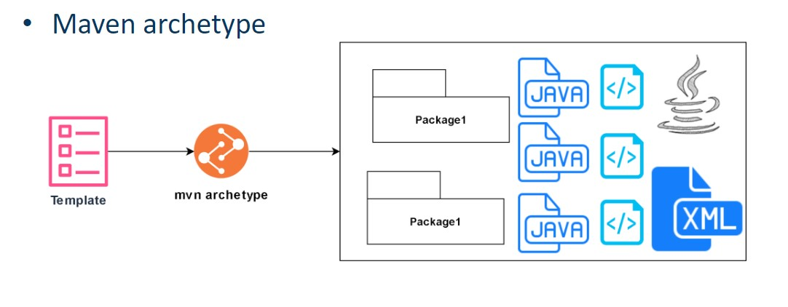

# Criando projeto com Maven

Para criar um projeto no Maven vamos fazer:
```bash
mvn archetype:generate -DgroupId=nome_do_grupo -DartifactId=nome_do_projeto 
-Darchetype=maven-archetype-quickstart -DinteractiveMode=false
```

<br>

## Alguns comandos úteis do Apache Maven:
### Comando para compilar: compile

O comando "compile" compila o código-fonte do projeto e gera os arquivos de classe (.class), além de copiar outros recursos para o diretório "target". Ele deve ser executado sempre que houver alterações no código-fonte.

**Exemplo de código:**

```bash
mvn compile
```
Para obter informações detalhadas sobre o processo de compilação, você pode ativar a saída de depuração usando o comando:
```
bashCopy code
mvn -X compile
```

<br>

### Comando para testar: test
O comando "test" executa os testes automatizados presentes no projeto. Ele procura por testes na pasta "src/test/java" e os executa, exibindo os resultados no console.

**Exemplo de código:**

```
bashCopy code
mvn test
```

<br>

### Comando para empacotar: package

O comando "package" empacota o projeto em um arquivo .jar, .war ou .ear, dependendo do tipo de projeto, e coloca-o no diretório "target". Além disso, ele também executa as fases anteriores, como compilação e teste. É útil para preparar o projeto para a distribuição.

**Exemplo de código:**

```
bashCopy code
mvn package

```

<br>

### Comando para instalar localmente: install

O comando "install" é similar ao "mvn package", mas o pacote gerado é instalado no repositório local do Maven. Isso permite que outros projetos que dependam desse pacote possam encontrá-lo no repositório local e utilizá-lo.

**Exemplo de código:**

```
bashCopy code
mvn install

```

<br>

### Comandos dependency:

Comando para mostrar a árvore de dependências do projeto: dependency:tree

O comando "dependency:tree" exibe a árvore de dependências do projeto. Ele lista todas as dependências utilizadas pelo projeto, incluindo as dependências transitivas, ou seja, as dependências das dependências.

**Exemplo de código:**

```
bashCopy code
mvn dependency:tree

```

<br>

### Comando para imprimir o caminho de classe das dependências de escopo "compile":

Este comando é usado para imprimir o caminho de classe das dependências de escopo "compile". Isso inclui as dependências necessárias tanto para compilar quanto para executar o projeto.

**Exemplo de código:**

```
bashCopy code
mvn dependency:build-classpath -DincludeScope=compile

```

<br>

### Comando para imprimir o caminho de classe das dependências de escopo "test":

Este comando é usado para imprimir o caminho de classe das dependências de escopo "test". Isso inclui as dependências necessárias apenas para executar os testes do projeto.

**Exemplo de código:**

```
bashCopy code
mvn dependency:build-classpath -DincludeScope=test
```

<br>

### Comando para imprimir o caminho de classe das dependências de escopo "runtime":

Este comando é usado para imprimir o caminho de classe das dependências de escopo "runtime". Isso inclui as dependências necessárias apenas para executar o projeto em tempo de execução.

**Exemplo de código:**

```
bashCopy code
mvn dependency:build-classpath -DincludeScope=runtime

```

<br>

### Comando para limpar diretório de trabalho: clean

O comando "clean" remove o diretório "target", que contém todos os arquivos gerados pelo Maven durante a compilação e empacotamento do projeto. Ele é útil para limpar o projeto antes de realizar uma nova compilação.

**Exemplo de código:**

```
bashCopy code
mvn clean
```

<br>

### Comando para preparar para distribuição e limpar diretórios de trabalho: clean install

O comando "clean install" combina as funcionalidades dos comandos "mvn clean" e "mvn install". Ele remove o diretório "target", compila o código-fonte, executa os testes automatizados, empacota o projeto em um arquivo .jar, .war ou .ear e instala o pacote gerado no repositório local do Maven. É um comando útil para preparar o projeto para a distribuição, garantindo que todas as etapas tenham sido realizadas corretamente.

**Exemplo de código:**

```
bashCopy code
mvn clean install
```

<br>

## Maven Archetype



É um modelo ou padrão para a criação de projetos Maven. Ele contém uma estrutura de diretórios e arquivos predefinida que segue um determinado padrão para um determinado tipo de projeto. O Maven Archetype é útil porque permite criar rapidamente um novo projeto com uma estrutura padrão e já com algumas dependências predefinidas. Isso ajuda a reduzir o tempo e o esforço necessários para configurar um novo projeto Maven. Existem vários arquétipos disponíveis para diferentes tipos de projetos, como aplicativos da Web, aplicativos de console, bibliotecas, etc.

### Links úteis:
[Apache Maven projects](https://maven.apache.org/archetypes/)<br>
[MVN repository](https://mvnrepository.com/)<br>
[Maven-archetype.list](https://gist.github.com/zbigniewTomczak/4235871)<br>
[Baeldung - Guide to Maven Achetype](https://www.baeldung.com/maven-archetype)

<br>

## Como adicionar dependências no Maven ?
Para adicionar dependências em um projeto Maven, é necessário incluir o elemento **`<dependencies>`** no arquivo **`pom.xml`** do projeto e adicionar as informações da dependência dentro dele.

Cada dependência é definida por meio dos elementos **`<dependency>`**, que contêm as informações do groupId, artifactId e version da dependência.

<details>
<summary>Exemplo de adição de dependência no pom:</summary>

```xml
<!-- Adicionando a dependência do Apache Commons Lang -->
<dependencies>
  <dependency>
    <groupId>org.apache.commons</groupId>
    <artifactId>commons-lang3</artifactId>
    <version>3.12.0</version>
  </dependency>
</dependencies>
```

</details>
