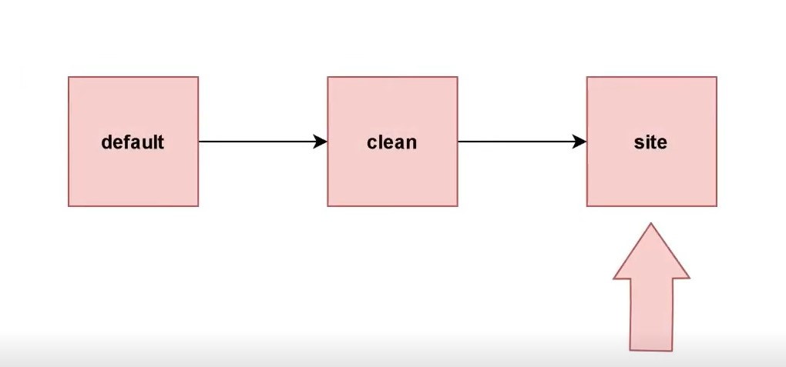

# Maven build lifecycle

O Maven Build Lifecycle é uma sequência bem definida de fases que o Maven executa para construir e distribuir um projeto. Cada fase é composta por um conjunto de metas (goals) que o Maven executa.

#### Existem três Build Lifecycles padrão no Maven:

1. **`default`** - gerencia a construção do projeto, desde a compilação até a criação do pacote distribuível.
2. **`clean`** - gerencia a limpeza do projeto, eliminando todos os arquivos gerados pela construção anterior.
3. **`site`** - gerencia a criação da documentação do projeto.

Cada Build Lifecycle é composto por uma série de fases (ou fases de construção) e cada fase é composta por uma ou mais metas. As fases são executadas em ordem sequencial, com cada fase dependendo da fase anterior.



<br>

## Tabela com as fases padrão de cada Build Lifecycle e as metas associadas a cada fase:

| Build Lifecycle | Fases Padrão | Metas Padrão |
| --- | --- | --- |
| default | validate | validate |
|  | initialize | initialize |
|  | generate-sources | generate-sources |
|  | process-sources | process-sources |
|  | generate-resources | generate-resources |
|  | process-resources | process-resources |
|  | compile | compile |
|  | process-classes | process-classes |
|  | generate-test-sources | generate-test-sources |
|  | process-test-sources | process-test-sources |
|  | generate-test-resources | generate-test-resources |
|  | process-test-resources | process-test-resources |
|  | test-compile | test-compile |
|  | process-test-classes | process-test-classes |
|  | test | test |
|  | prepare-package | prepare-package |
|  | package | package |
|  | pre-integration-test | pre-integration-test |
|  | integration-test | integration-test |
|  | post-integration-test | post-integration-test |
|  | verify | verify |
|  | install | install |
|  | deploy | deploy |
| clean | pre-clean | pre-clean |
|  | clean | clean |
|  | post-clean | post-clean |
| site | pre-site | pre-site |
|  | site | site |
|  | post-site | post-site |
|  | site-deploy | site-deploy |

<br>

## Comandos úteis:

#### Para executar uma fase específica do Build Lifecycle, é possível usar o comando:

```xml
mvn fase_que-queremos

#Ex
mvn compile
```

#### Para executar uma meta específica dentro de uma fase, é possível usar o comando:

```xml
mvn fase_que_queremos: meta_que_queremos

#ex
mvn clean clean
```

