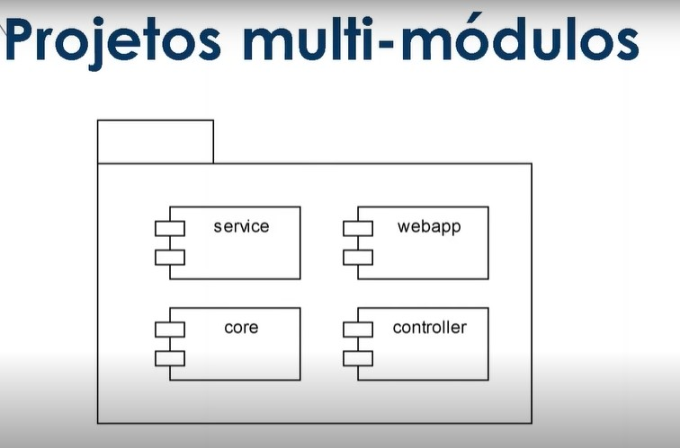

# Projetos multi-módulos



Projetos multi módulos no Maven são projetos que possuem vários módulos ou subprojetos, onde cada módulo é um projeto Maven independente, com seu próprio arquivo `pom.xml` e diretório de código-fonte. Esses módulos são agrupados em um projeto principal que é responsável por coordenar a construção, a distribuição e a documentação de todos os módulos.

A principal vantagem dos projetos multi módulos é a capacidade de gerenciar projetos grandes e complexos de maneira mais organizada, já que cada módulo pode ser construído e testado independentemente dos outros. Isso também permite uma melhor reutilização de código e uma melhor gestão de dependências entre os módulos.

Para criar um projeto multi módulos no Maven, é necessário criar um diretório para o projeto principal e criar um arquivo **`pom.xml`** para ele. Em seguida, é necessário criar diretórios para cada módulo e criar um arquivo **`pom.xml`** para cada um. No arquivo **`pom.xml`** do projeto principal, é necessário adicionar as informações dos módulos que fazem parte do projeto.

Para construir um projeto multi módulos, basta executar o comando mvn install na raiz do projeto principal. Isso fará com que o Maven construa cada um dos módulos na ordem especificada no arquivo pom.xml do projeto principal. Os projetos multi módulos podem ser muito úteis em projetos complexos, permitindo uma melhor organização, reutilização de código e gerenciamento de dependências.

<details>
<summary>Exemplo de projeto multi módulos</summary>

```xml
xmlCopy code
<project>
  <modelVersion>4.0.0</modelVersion>
  <groupId>com.example</groupId>
  <artifactId>myproject</artifactId>
  <version>1.0.0</version>
  <packaging>pom</packaging> <!-- adiciono -->

  <modules>
    <module>module1</module>
    <module>module2</module>
    <module>module3</module>
  </modules>
</project>

```

> Nesse exemplo, o projeto principal é o myproject e possui três módulos: module1, module2 e module3. Cada um desses módulos terá seu próprio diretório e arquivo pom.xml.

</details>

<br>

<br>

<br>

[Voltar a Gerenciamento de dependências e build em Java com Maven](/Arquivos/Conteudo/4%20-%20Programa%C3%A7%C3%A3o%20orientada%20a%20objetos/4.5%20Gerenciamento%20de%20dependencias%20e%20build%20em%20java%20com%20maven.md)<br>
[Voltar ao inicio](/README.md)