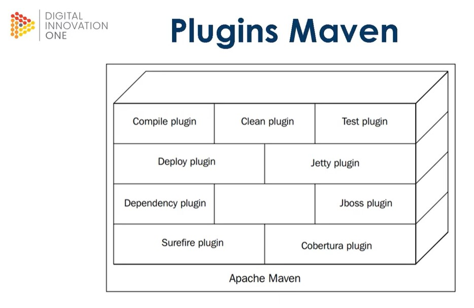

# Plugins


Plugins no Maven são componentes de software que são responsáveis por executar tarefas específicas durante o ciclo de vida de construção do projeto. Eles são baseados no modelo de programação "Inversão de Controle" (IoC) do Maven, que permite que os plugins sejam configurados por meio do arquivo `pom.xml`.

## Para que servem os plugins no Maven?

Os plugins no Maven servem para automatizar tarefas comuns durante a construção de um projeto, como compilação, teste, empacotamento, implantação e documentação. Eles são projetados para serem altamente configuráveis, permitindo que os desenvolvedores personalizem a maneira como as tarefas são executadas.

### Como os plugins são configurados no Maven?

Os plugins no Maven são configurados no arquivo **`pom.xml`** do projeto. Cada plugin tem um elemento **`<plugin>`** que contém informações como o nome do plugin, a versão, a lista de metas disponíveis e as configurações específicas do plugin.

### Como os plugins são executados no Maven?

Os plugins no Maven são executados automaticamente durante o ciclo de vida de construção do projeto, conforme especificado pelo arquivo **`pom.xml`**. Cada plugin é configurado para ser executado em uma ou mais fases do ciclo de vida do Maven. Por exemplo, o plugin **`maven-compiler-plugin`** é executado na fase de compilação para compilar o código-fonte do projeto.

### Como posso encontrar e usar plugins no Maven?

O Maven possui um repositório central de plugins, que pode ser pesquisado pelo nome do plugin ou pela função que ele executa. Os desenvolvedores podem adicionar plugins ao arquivo **`pom.xml`** do projeto, especificando o nome do plugin e sua versão. O Maven fará o download e instalará automaticamente o plugin a partir do repositório central durante o processo de construção.

#### Posso criar meus próprios plugins no Maven?

Sim, é possível criar seus próprios plugins no Maven usando a estrutura de plugin do Maven. Os plugins personalizados podem ser úteis para automatizar tarefas específicas do projeto ou para integrar com outras ferramentas de construção ou de terceiros. Para criar um plugin personalizado, é necessário definir uma classe Java que implemente uma ou mais metas, e depois configurar o plugin no arquivo **`pom.xml`** do projeto.

<details>
<summary>Exemplo de como adicionar o plugin maven-compiler-pluginno arquivo pom.xmldo projeto:</summary>

```xml
<project>
  ...
  <build>
    <plugins>
      <plugin>
        <groupId>org.apache.maven.plugins</groupId>
        <artifactId>maven-compiler-plugin</artifactId>
        <version>3.8.1</version>
        <configuration>
          <source>1.8</source>
          <target>1.8</target>
        </configuration>
      </plugin>
    </plugins>
  </build>
  ...
</project>
```

### Para ver informações do plugin no terminal vamos fazer:

```bash
mvn nome_do_plugin: help

#Ex
mvn dependency: help
mvn javadoc: help
```

</details>
