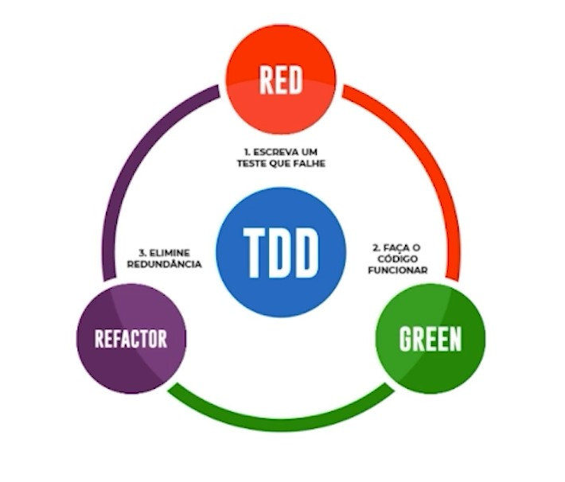

# Boas práticas

## Busque simplicidade

- Preocupe-se com os nomes dos testes
- Preocupe-se com a facilidade da leitura

### Comece a testar cedo

- Procure escrever o código de teste o mais próximo possível do código de execução.
- Veja um pouco sobre TDD.

### Busque organização

- Nomenclatura
- Testes precisam ser determinísticos.

### Economize tempo automatizando

- Ferramentas de cobertura de código (Jacoco).
- Automatize a execução dos seus testes.
- Pesquisar sobre príncípios FIRST