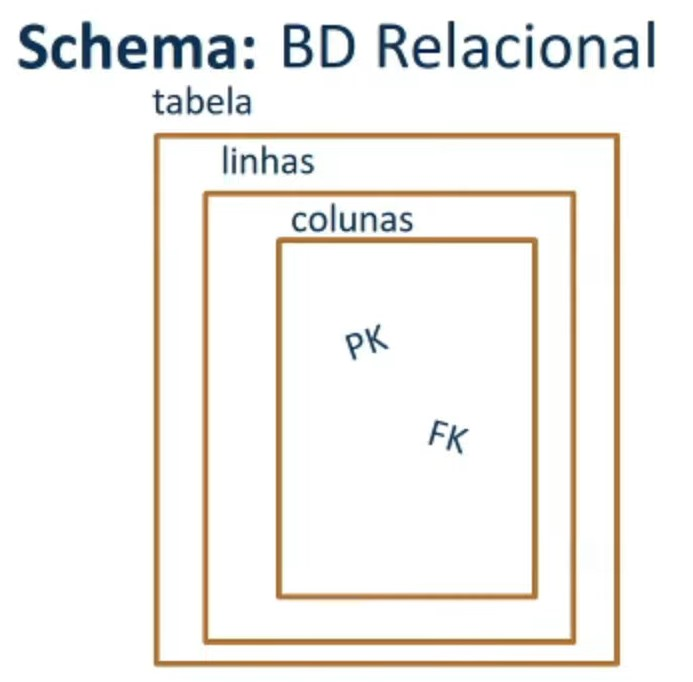
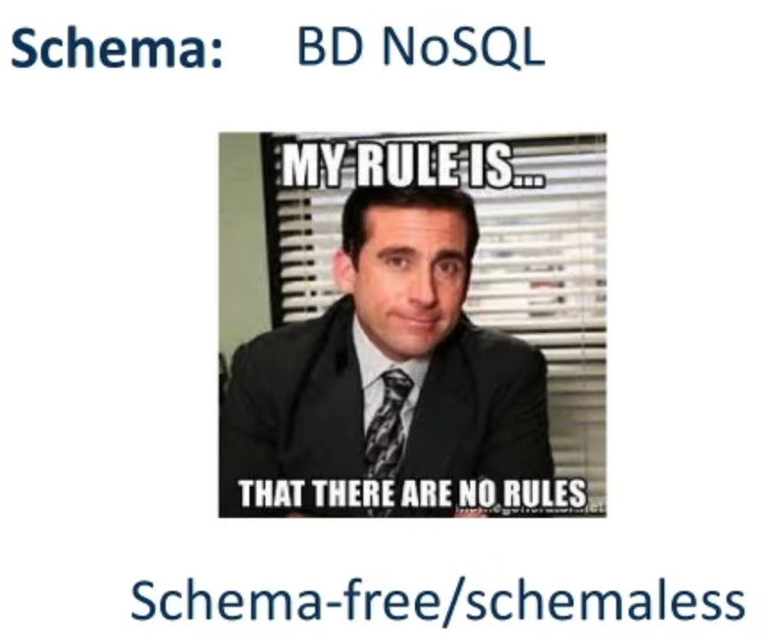

# Introdução de NoSQL no mercado

## Uso de NoSQL no mercado
Os bancos de dados NoSQL (Not Only SQL) foram introduzidos no mercado para atender às necessidades de empresas que precisavam armazenar e processar grandes quantidades de dados de maneira mais escalável e flexível do que era possível com os bancos de dados relacionais tradicionais. A história dos bancos NoSQL remonta ao início dos anos 2000, quando grandes empresas de tecnologia, como Google, Amazon e Yahoo!, começaram a lidar com grandes quantidades de dados que não podiam ser eficientemente processados pelos bancos de dados relacionais tradicionais. Essas empresas desenvolveram suas próprias soluções de banco de dados NoSQL, como o Bigtable do Google e o Dynamo da Amazon, que permitiam o armazenamento e processamento de grandes quantidades de dados de maneira mais escalável e distribuída. Com o tempo, outras empresas e desenvolvedores começaram a adotar soluções NoSQL e desenvolveram suas próprias soluções. Hoje em dia, os bancos de dados NoSQL são amplamente utilizados em diversos setores, incluindo finanças, saúde, comércio eletrônico e mídia social. Existem vários tipos de bancos NoSQL, incluindo bancos de dados de documentos, bancos de dados de colunas, bancos de dados de chave-valor e bancos de dados de grafos. Cada tipo é otimizado para um conjunto específico de casos de uso e oferece recursos e funcionalidades exclusivos para atender às necessidades dos usuários.

Em 2009, o engenheiro da Amazon, Werner Vogels, publicou um artigo no blog da empresa sobre a "escalabilidade evolutiva", destacando a importância de bancos de dados distribuídos para lidar com grandes volumes de dados. Isso chamou a atenção de muitos desenvolvedores e empresas, que começaram a buscar alternativas ao modelo relacional tradicional. Outra iniciativa importante foi o lançamento do Apache Cassandra, um banco de dados distribuído de código aberto desenvolvido pela empresa de software Facebook em 2008. O Cassandra foi projetado para suportar a escala horizontal em grandes clusters de servidores e logo se tornou popular entre empresas de tecnologia que precisavam lidar com grandes volumes de dados. Com o tempo, outros bancos de dados NoSQL foram surgindo, cada um com suas próprias características e propósitos. Alguns exemplos incluem o MongoDB, o Redis, o Couchbase e o Amazon DynamoDB.

 

## Diferenças entre SQL e NoSQL

### Estrutura de dados:

#### Relacional

- Banco de dados relacionais são organizados em tabelas, com colunas e linhas que representam campos e registros, respectivamente.

#### No SQL

- Bancos de dados NoSQL geralmente não possuem uma estrutura de dados fixa, permitindo que os dados sejam armazenados em diferentes formatos, como documentos, pares chave-valor ou grafos.

 

### Esquema

#### Relacional
- Bancos de dados relacionais têm um esquema estrito, que define os tipos de dados e restrições que podem ser aplicados em cada coluna.

#### No SQL
- Bancos de dados NoSQL, em contraste, geralmente têm um esquema mais flexível e dinâmico, permitindo que os dados sejam adicionados sem a necessidade de especificar um esquema rígido.

 

### Consulta
#### Relacional
- Bancos de dados relacionais são projetados para consultas complexas e transações seguras, usando a linguagem SQL (Structured Query Language).

#### No SQL
- Bancos de dados NoSQL geralmente não suportam SQL, e as consultas são feitas usando outras linguagens ou APIs específicas.

 

### Escalabilidade

#### Relacional
- Bancos de dados relacionais são escalonados verticalmente, o que significa que as atualizações de hardware são necessárias para aumentar a capacidade de armazenamento e processamento.

#### No SQL
- Bancos de dados NoSQL, por outro lado, são escalonados horizontalmente, permitindo que eles sejam distribuídos por vários servidores para lidar com grandes quantidades de dados e tráfego.

 

### Uso

#### Relacional
- Bancos de dados relacionais são amplamente utilizados em aplicações tradicionais de negócios, como sistemas de gerenciamento de inventário, sistemas de gerenciamento de pedidos e sistemas de gerenciamento de recursos humanos.

#### No SQL
- Bancos de dados NoSQL são frequentemente usados em aplicativos web e móveis, como gerenciamento de conteúdo, análise de big data, redes sociais e jogos online.

Em resumo, os bancos de dados relacionais são adequados para aplicações com estruturas de dados previsíveis e consultas complexas, enquanto os bancos de dados NoSQL são ideais para aplicações com dados não estruturados ou semiestruturados, grande volume de dados e alta escalabilidade.