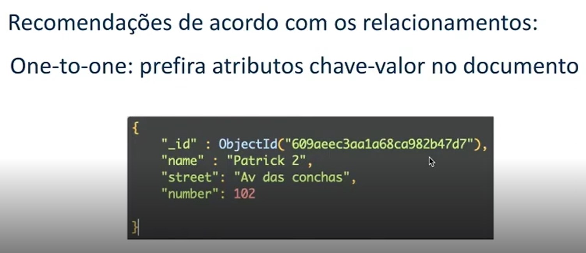

# Schema design e boas práticas

### Embedding

Embedding no MongoDB refere-se à capacidade de armazenar documentos relacionados dentro de um único documento pai. Isso é feito por meio da criação de um array de documentos embutidos dentro de um documento pai. Essa abordagem é útil em muitos casos, especialmente quando se trabalha com dados que se relacionam de forma hierárquica.

- Por exemplo, suponha que você esteja criando um aplicativo de blog e queira armazenar os comentários de cada postagem em seu próprio documento. Em vez de criar uma coleção separada para os comentários e usar referências, você pode incorporar os documentos de comentários diretamente no documento de postagem. Dessa forma, você pode recuperar todos os dados relacionados de uma postagem (incluindo seus comentários) com apenas uma consulta ao banco de dados.

Embora o embedding possa ser uma abordagem poderosa e útil, existem algumas boas práticas que você deve seguir para garantir um bom desempenho e escalabilidade do seu aplicativo.

#### Importante!
1. Pense cuidadosamente no design do seu esquema - antes de incorporar documentos, certifique-se de que a estrutura de dados faça sentido e atenda às necessidades do seu aplicativo. Também é importante pensar no desempenho e na escalabilidade do seu esquema.
2. Limite o tamanho dos documentos incorporados - documentos incorporados podem se tornar muito grandes, o que pode impactar o desempenho do seu aplicativo. Tente limitar o tamanho dos documentos incorporados e evite armazenar dados não estruturados ou grandes quantidades de dados em um único documento.
3. Considere a atualização de documentos incorporados - se você precisar atualizar um documento incorporado, pode ser necessário atualizar vários documentos pai, o que pode ser ineficiente e causar bloqueios. Considere como suas consultas e atualizações afetarão o desempenho e a escalabilidade do seu aplicativo.
4. Pense na consulta de documentos incorporados - embutir documentos pode tornar a consulta de dados mais eficiente em muitos casos, mas também pode tornar as consultas mais complexas e difíceis de otimizar. Pense cuidadosamente na consulta de dados e considere usar índices para melhorar o desempenho.
5. Use documentos incorporados com moderação - enquanto o embedding pode ser útil em muitos casos, não é a solução para todos os problemas de modelagem de dados. Use documentos incorporados com moderação e considere outras opções, como referências, quando apropriado.

Em resumo, o embedding é uma técnica poderosa e útil para modelar dados hierárquicos no MongoDB. No entanto, é importante pensar cuidadosamente no design do seu esquema e seguir as boas práticas recomendadas para garantir um bom desempenho e escalabilidade do seu aplicativo.

#### Pros de uso:
- Consulta informações em uma única query
- Atualiza o registro em uma única operação
  
#### Contras:
- Possui tamanho limite de 16mb por documento

 

## Referencia

Referências no MongoDB são uma técnica de modelagem de dados que envolve a criação de relacionamentos entre documentos em coleções diferentes. Ao contrário do embedding, onde os documentos relacionados são armazenados dentro de um único documento, as referências permitem que você armazene a referência a outro documento em uma coleção separada.

Por exemplo, suponha que você esteja criando um aplicativo de blog e queira armazenar informações do autor de cada postagem. Em vez de incorporar todos os dados do autor diretamente no documento de postagem, você pode criar uma coleção separada para os autores e usar referências para se relacionar com a coleção de postagens. Dessa forma, você pode recuperar informações sobre o autor de uma postagem com uma consulta ao banco de dados.

Existem algumas boas práticas que você deve seguir ao usar referências no MongoDB:

#### Importante!
1. Identifique as coleções relacionadas - antes de criar referências, certifique-se de identificar quais coleções estão relacionadas e como elas se relacionam. Isso ajudará a garantir que seu esquema seja bem projetado e atenda às necessidades do seu aplicativo.
2. Crie índices nas chaves de referência - ao criar referências, é importante criar índices nas chaves de referência para garantir o desempenho das consultas. Isso ajuda o MongoDB a localizar rapidamente os documentos relacionados.
3. Use o método `$lookup` para fazer junções - ao consultar documentos relacionados, use o método $lookup para fazer junções entre as coleções. Isso permite que você combine os documentos de várias coleções em uma única consulta.
4. Considere o desempenho e a escalabilidade - ao usar referências, é importante pensar no desempenho e na escalabilidade do seu aplicativo. Certifique-se de que suas consultas sejam eficientes e que o número de referências seja gerenciável.
5. Evite aninhamento excessivo - evite criar uma hierarquia muito profunda de referências. Isso pode tornar as consultas mais complexas e difíceis de otimizar.

Em resumo, as referências são uma técnica de modelagem de dados poderosa e útil no MongoDB. Elas permitem que você crie relacionamentos entre documentos em coleções diferentes e são uma boa opção quando os documentos relacionados são muito grandes para serem incorporados. No entanto, é importante seguir as boas práticas recomendadas para garantir um bom desempenho e escalabilidade do seu aplicativo.

### Pros de uso:

- Documentos pequenos
- Não duplica informações
- Usado quando os dados não são acessados em todas as consultas

### Contra :
- Duas ou mais queries ou utilização do $lookup

 

## Representação schema design

 

 

### Boas práticas gerais no uso do MongoDB

- Evite documentos muito grandes (Quanto maior o documento, maior o overhead de busca).
- Use nome campos e objetivos curtos.
- Analise as suas queries utilizando o explain().
- Atualize apenas os campos alterados.
- Evite negações em queries (Isso força o escaneamento completo da quer).
- Lists/ Arrays dentro de documentos não podem crescer ilimitadamente.

 

## Diferenças entre Json e Bson

### Estrutura de dados

- JSON (JavaScript Object Notation) é uma forma de representar dados em formato de texto. Ele usa uma estrutura de dados baseada em objetos, que consiste em pares de chave-valor.
- BSON (Binary JSON) é uma extensão do formato JSON que codifica os dados em binário. Ele também usa uma estrutura de dados baseada em objetos, mas adiciona suporte para tipos de dados adicionais que não estão presentes em JSON (Ex: Date e ObjectID).

### Armazenamento de dados

- JSON é amplamente utilizado para transferência de dados em aplicativos web e móveis, bem como para armazenamento de dados em bancos de dados NoSQL como o MongoDB. Quando armazenado em um banco de dados, o JSON é geralmente armazenado como um documento BSON, que permite uma melhor compactação e suporte a tipos de dados adicionais.
- BSON é usado principalmente para armazenamento de dados em bancos de dados NoSQL, como o MongoDB. Ele é projetado para ser compacto e eficiente em termos de espaço de armazenamento e velocidade de processamento.

### Suporte a tipos de dados

- JSON suporta tipos de dados básicos, como string, número, booleano, null, array e objeto. No entanto, ele não suporta tipos de dados binários, como imagens ou arquivos de áudio.
- BSON suporta todos os tipos de dados que o JSON suporta, além de tipos de dados binários, como BinData e UUID. Ele também suporta tipos de dados adicionais, como data e timestamp.

### Desempenho

- JSON é um formato de texto simples e legível por humanos, o que significa que é fácil de entender e depurar. No entanto, ele pode ser ineficiente em termos de espaço de armazenamento e processamento devido à sua estrutura de texto.
- BSON é um formato binário compacto que é otimizado para leitura e gravação de dados em bancos de dados NoSQL. Ele é mais eficiente em termos de espaço de armazenamento e processamento do que JSON.

