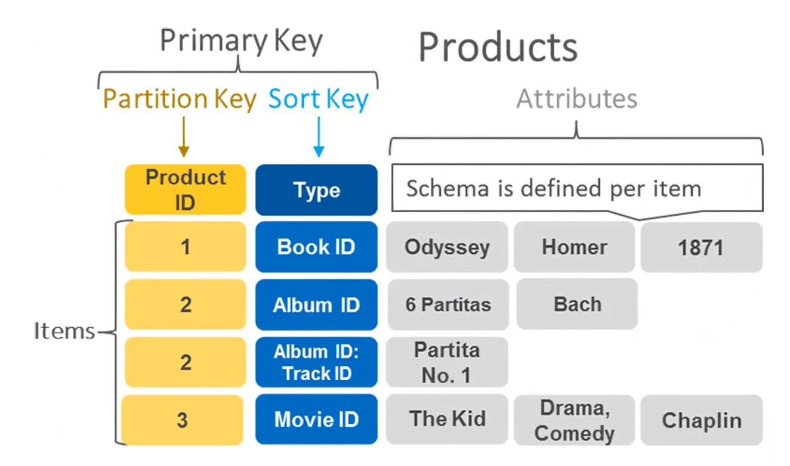

# Introdução Dynamo DB

DynamoDB é um banco de dados NoSQL gerenciado, oferecido pela Amazon Web Services (AWS), que permite armazenar e recuperar dados de maneira rápida e escalável e serverless.

## Como foi criado

DynamoDB foi desenvolvido pela Amazon como uma resposta à necessidade de armazenar e acessar grandes volumes de dados de maneira rápida e escalável. Ele foi projetado para ser um banco de dados distribuído, altamente disponível e tolerante a falhas, que pode lidar com cargas de trabalho intensivas de leitura e gravação.

O DynamoDB foi inspirado em outros sistemas de banco de dados distribuídos, como o Apache Cassandra e o Google Bigtable. No entanto, ele tem algumas diferenças importantes em relação a esses sistemas, como o suporte para consultas mais complexas e transações ACID (Atomicidade, Consistência, Isolamento e Durabilidade).

### Vantagens de uso

Algumas das vantagens de usar o DynamoDB incluem:

1. Escalabilidade: o DynamoDB é altamente escalável e pode lidar com cargas de trabalho intensivas sem degradar o desempenho. Ele é capaz de lidar com milhões de solicitações por segundo e pode lidar com picos repentinos de tráfego.
2. Alta disponibilidade: o DynamoDB é projetado para ter alta disponibilidade e tolerância a falhas. Ele usa replicação síncrona para garantir que os dados estejam sempre disponíveis e pode se recuperar automaticamente de falhas.
3. Desempenho: o DynamoDB é projetado para ser extremamente rápido e pode fornecer baixa latência para consultas e gravações de dados.
4. Flexibilidade: o DynamoDB oferece suporte a vários tipos de dados, incluindo valores escalares, conjuntos e documentos complexos.
5. Transações: o DynamoDB oferece suporte a transações ACID, permitindo que você execute operações de leitura e gravação em vários itens de tabela de maneira atômica.

### Outros pontos relevantes relevantes
Além das vantagens de uso, aqui estão alguns outros tópicos relevantes sobre o DynamoDB:

1. Modelo de dados: o DynamoDB usa um modelo de dados de chave-valor, em que os dados são armazenados como pares de chave e valor. Cada tabela do DynamoDB pode ter uma ou mais chaves primárias, que são usadas para identificar exclusivamente cada item na tabela.
2. API: o DynamoDB oferece uma API simples e intuitiva para acessar os dados armazenados na tabela. A API suporta operações de leitura, gravação, consulta e exclusão de itens na tabela.
3. Custos: o DynamoDB é um serviço pago e seus custos variam de acordo com o uso. No entanto, ele oferece vários recursos para ajudar a controlar os custos, como o provisionamento de capacidade sob demanda e o uso de políticas de cobrança.
4. Integração com outros serviços AWS: o DynamoDB é altamente integrado com outros serviços da AWS, como o Amazon S3, o Amazon Kinesis e o AWS Lambda. Isso permite que você crie aplicativos altamente escaláveis e flexíveis usando uma variedade de serviços da AWS.

 

## Os principais componentes do Amazon DynamoDB incluem:

1. Tables: As tabelas no DynamoDB são semelhantes às tabelas em bancos de dados relacionais. Elas são a principal unidade de armazenamento de dados no DynamoDB. Cada tabela contém itens e cada item pode ter um conjunto diferente de atributos. As tabelas no DynamoDB não têm um esquema rígido e os atributos podem variar de item para item.
2. Items: são os objetos individuais armazenados em uma tabela. Cada item é identificado por uma chave primária única que pode ser simples ou composta.
3. Attributes: são os dados individuais armazenados em um item, que consistem em um nome e um valor. O valor pode ser de vários tipos de dados, como string, número, booleano, etc.
4. Partitions: O DynamoDB divide automaticamente as tabelas em várias partições para suportar uma escala elástica e alta disponibilidade. Cada partição é armazenada em um conjunto de discos distribuídos em diferentes máquinas.
5. Streams: O DynamoDB Streams é um recurso que permite capturar alterações de dados em uma tabela. As alterações podem ser gravadas em um stream e consumidas em tempo real para processamento adicional ou backup de dados.

### componentes do DynamoDB
- Primary Key (Chave Primária): é a principal maneira de identificar itens em uma tabela. A chave primária pode ser simples (apenas uma coluna) ou composta (duas ou mais colunas). O DynamoDB suporta dois tipos de chaves primárias: Partition Key e Partition Key + Sort Key.
- Partition Key (Chave de Partição): é uma coluna que é usada para distribuir itens em diferentes partições de forma aleatória. O valor da chave de partição determina em qual partição o item será armazenado.
- Partition Key + Sort Key (Chave de Partição + Chave de Ordenação): também conhecida como chave composta, é uma combinação de duas colunas que são usadas para distribuir itens em diferentes partições e ordená-los dentro de cada partição. A chave de partição determina em qual partição o item será armazenado, enquanto a chave de ordenação é usada para ordenar os itens dentro de cada partição.
- Secondary Indexes (Índices Secundários): O DynamoDB suporta a criação de índices secundários para permitir consultas rápidas e eficientes em diferentes campos dos itens da tabela. Os índices secundários podem ser globais (que abrangem todas as partições da tabela) ou locais (que abrangem apenas uma única partição).
- Read and Write Capacity Units (Unidades de Capacidade de Leitura e Escrita): são métricas usadas para dimensionar e provisionar a capacidade de leitura e gravação da tabela. Cada operação de leitura ou gravação consome uma quantidade de unidades de capacidade correspondente ao tamanho do item e à complexidade da consulta.
- SDKs e APIs: O DynamoDB oferece SDKs para várias linguagens de programação, além de uma API RESTful que pode ser usada para acessar e manipular dados.

### Representação de diagrama do DynamoDB

 

 

## Tipos de dados usados no DynamoDB

### Tipos escalares: 
São tipos de dados simples, com apenas um valor por atributo. Os tipos escalares suportados pelo DynamoDB são:

- String: sequência de caracteres Unicode.
- Number: número de ponto flutuante.
- Binary: dados binários brutos.
- Boolean: true ou false.
- Null: valor nulo.

### Tipos de documentos: 
São tipos de dados complexos, que podem conter vários valores aninhados em um único atributo. Os tipos de documentos suportados pelo DynamoDB são:

- Map: coleção de pares de chave-valor, onde as chaves são strings e os valores podem ser qualquer tipo de dados, inclusive outro map ou lista.
- List: coleção ordenada de valores, onde os valores podem ser qualquer tipo de dados, inclusive outro map ou lista.

### Tipos de conjunto: 
são tipos de dados que representam conjuntos de valores. Os tipos de conjunto suportados pelo DynamoDB são:

- String Set: conjunto de strings.
- Number Set: conjunto de números de ponto flutuante.
- Binary Set: conjunto de dados binários brutos.

 

## Modos de leitura e gravação

### Modo de leitura e gravação sob demanda (on-demand)

No modo sob demanda, você paga apenas pelo que usar, sem a necessidade de provisionar capacidade de leitura e gravação. O preço é calculado com base na quantidade de solicitações de leitura/gravação e na quantidade de armazenamento utilizado. O DynamoDB ajusta automaticamente a capacidade de leitura/gravação para atender às necessidades de tráfego e ao volume de solicitações de leitura/gravação.

#### As vantagens do modo sob demanda incluem:

- Escalabilidade automática: a capacidade de leitura/gravação é escalada automaticamente para atender ao tráfego e ao volume de solicitações, sem a necessidade de ajustes manuais.
- Pagamento por uso: você paga apenas pelo que usar, sem a necessidade de provisionar capacidade de leitura/gravação.
- Flexibilidade: é possível alterar facilmente o nível de capacidade de leitura/gravação em qualquer momento, sem tempo de inatividade ou interrupções.

 

### Modo de leitura e gravação provisionado (provisioned)

No modo provisionado, você precisa provisionar capacidade de leitura e gravação com antecedência, com base na quantidade estimada de tráfego e volume de solicitações. O preço é calculado com base na capacidade de leitura/gravação provisionada e na quantidade de armazenamento utilizado.

#### As vantagens do modo provisionado incluem:

- Previsibilidade: a capacidade de leitura/gravação é fixa e previsível, o que facilita o planejamento de custos.
- Desempenho consistente: o desempenho é garantido pela capacidade de leitura/gravação provisionada, que pode ser ajustada para atender às necessidades de tráfego e volume de solicitações.
- Controle: é possível controlar de forma mais precisa o nível de capacidade de leitura/gravação e o uso de recursos, o que pode ser importante em cenários com restrições de orçamento ou de recursos.

 

 

 

[Voltar a Desafio Boas práticas DynamoDB](/Arquivos/Conteudo/5%20-%20Trabalhando%20com%20banco%20de%20dados%20sql%20e%20nosql/5.3%20Desafio%20boas%20praticas%20dynamodb.md) 
[Voltar ao inicio](/README.md)