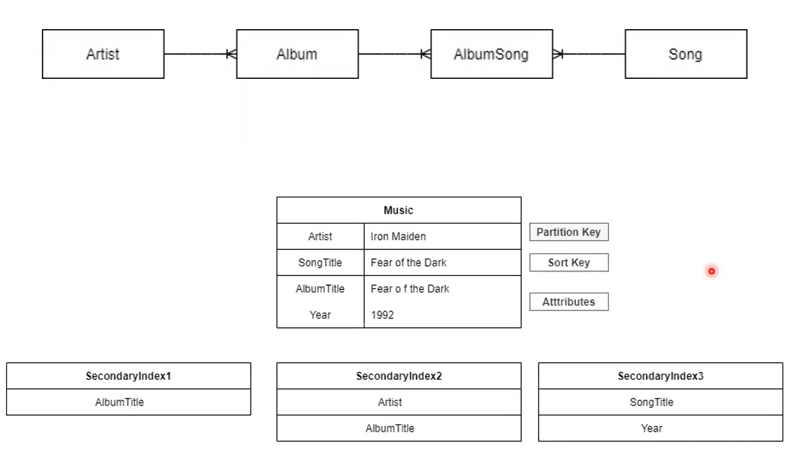

# Mãos a obra

## Projeto

- Crie uma tabela no DynamoDb utilizando o Amazon CLI.
- Insira dados
- Crie índices globais secundários
- Realize algumas pesquisas

### Representação de como ficará o banco:

 

 

### Links úteis:
[cassianobrexbit - Repositório original do projeto](https://github.com/cassianobrexbit/dio-live-dynamodb) 
[Youtube/TreinaWeb - Como instalar e configurar o AWS-CLI ](https://www.youtube.com/watch?v=hBRnWjz9YxM&ab_channel=TreinaWeb) 
[Youtube/Douglas Mugnos - Primeiros passos com AWS CLI! Como usar o aws cli ?](https://www.youtube.com/watch?v=nqazfZEj2G0&ab_channel=DouglasMugnos)

 

### Meu projeto
[Arquivos](/Arquivos/Conteudo/5%20-%20Trabalhando%20com%20banco%20de%20dados%20sql%20e%20nosql/Codigo/Desafio%20DynamoDB/)

 

 

 

[Voltar a Desafio Boas práticas DynamoDB](/Arquivos/Conteudo/5%20-%20Trabalhando%20com%20banco%20de%20dados%20sql%20e%20nosql/5.3%20Desafio%20boas%20praticas%20dynamodb.md) 
[Voltar ao inicio](/README.md)