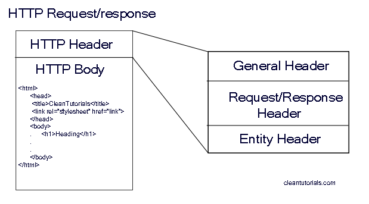

# Como funciona o protocolo HTTP

## O que é o protocolo HTTP?

HTTP (Hypertext Transfer Protocol) é um protocolo de comunicação utilizado para transferir dados pela internet. Ele é responsável por estabelecer uma conexão entre o cliente (geralmente um navegador web) e o servidor (onde estão armazenados os dados) para transmitir solicitações e respostas.

### Como é usado o protocolo HTTP?
O protocolo HTTP é usado em todas as transações web que envolvem a troca de dados, desde o carregamento de uma página da web até o envio de informações de um formulário. Quando um usuário acessa um site, o navegador faz uma solicitação ao servidor por meio do protocolo HTTP. O servidor responde com um conjunto de dados que são interpretados pelo navegador e apresentados ao usuário em uma página web.

Além disso, o HTTP também é utilizado para comunicação entre sistemas, como em APIs que permitem que diferentes aplicações possam trocar informações e integrar suas funcionalidades.

#### O que é a RFC 1945?

A RFC 1945 é um documento que descreve a versão 1.0 do protocolo HTTP. Ela foi publicada em maio de 1996 e estabelece as regras e os requisitos para o funcionamento do protocolo.

Entre as especificações presentes na RFC 1945, estão a definição dos métodos HTTP, como GET, POST e PUT, e das respostas do servidor, como 200 OK e 404 Not Found. A RFC 1945 também aborda questões como cache de

#### O que é a RFC 2116?
A RFC 2116 é um documento que descreve a versão 1.1 do protocolo HTTP. Ela foi publicada em junho de 1997 e é uma atualização da RFC 1945, incorporando novos recursos e correções de bugs.

- Entre as principais mudanças introduzidas na versão 1.1 do HTTP estão a possibilidade de usar conexões persistentes, que permitem a reutilização de conexões TCP, e a adição de novos métodos HTTP, como OPTIONS e DELETE. A RFC 2116 também define novas respostas do servidor, como 201 Created e 204 No Content, e estabelece novas regras para cabeçalhos HTTP e controle de cache.

 

## Papel do cliente e do servidor em uma transferência HTTP

- O cliente é geralmente um navegador web, que faz uma solicitação (Request) ao servidor para obter informações ou executar alguma ação. O navegador envia uma mensagem de solicitação HTTP para o servidor, que contém informações como o método HTTP a ser usado (por exemplo, GET ou POST), o recurso solicitado (por exemplo, uma página da web) e quaisquer parâmetros adicionais necessários.
- O servidor, por sua vez, recebe a solicitação HTTP do cliente, processa-a e retorna uma resposta HTTP correspondente (Response). A resposta HTTP contém informações como o código de status (por exemplo, 200 OK ou 404 Not Found), os cabeçalhos de resposta (que podem incluir informações como o tipo de conteúdo e a data da última modificação) e, opcionalmente, um corpo de mensagem (que pode conter os dados solicitados pelo cliente).

### Protocolos de transporte:

#### TCP (Transmission Control Protocol) - Mais usado devido ao Handshake triplo

O TCP é um protocolo de comunicação confiável e orientado a conexão, que é amplamente utilizado para transferência de dados na internet. Algumas das características do TCP incluem:

- Confiabilidade: o TCP garante que todos os dados sejam entregues de forma confiável e sem erros, retransmitindo quaisquer pacotes perdidos ou corrompidos.
- Orientado a conexão: antes de iniciar a transferência de dados, o TCP estabelece uma conexão entre o remetente e o destinatário, garantindo que os dados sejam entregues na ordem correta e sem duplicatas.
- Controle de fluxo: o TCP controla a quantidade de dados que são enviados em uma determinada conexão, garantindo que o remetente não sobrecarregue o destinatário com mais dados do que ele pode processar.
- Controle de congestionamento: o TCP monitora a rede e reduz automaticamente a taxa de transmissão de dados se detectar congestionamento, evitando a perda de pacotes e a degradação do desempenho.

#### UDP (User Datagram Protocol)

O UDP é um protocolo de comunicação simples e sem conexão, que é usado para transferência de dados em tempo real, como voz e vídeo. Algumas das características do UDP incluem:

- Não confiabilidade: o UDP não garante que todos os dados sejam entregues, e pacotes perdidos ou corrompidos não são retransmitidos. Isso pode ser aceitável para alguns aplicativos que valorizam a velocidade e a simplicidade em vez da confiabilidade.
- Sem conexão: o UDP não estabelece uma conexão antes de enviar dados, o que significa que os pacotes podem chegar fora de ordem ou serem duplicados.
- Sem controle de fluxo ou congestionamento: o UDP não tem mecanismos de controle de fluxo ou congestionamento, o que significa que um remetente pode sobrecarregar o destinatário com mais dados do que ele pode processar.

 

## Three-way handshake (Handshake triplo)

O handshake triplo (ou "three-way handshake", em inglês) é um processo fundamental do protocolo TCP (Transmission Control Protocol), que é usado em conjunto com o protocolo HTTP para estabelecer uma conexão confiável entre um cliente e um servidor na internet.

O handshake triplo envolve três etapas, que são as seguintes:

1. O cliente envia uma mensagem SYN (Synchronize) para o servidor, indicando que deseja iniciar uma conexão.
2. O servidor responde com uma mensagem SYN-ACK (Synchronize-Acknowledge), confirmando que a conexão foi estabelecida e que está pronta para receber dados do cliente.
3. O cliente envia uma mensagem ACK (Acknowledge), confirmando que recebeu a resposta do servidor e que a conexão foi estabelecida com sucesso.

O objetivo do handshake triplo é garantir que ambos os lados da conexão estejam sincronizados e prontos para se comunicar antes que os dados comecem a ser transmitidos. Isso ajuda a evitar problemas como perda de dados, duplicação de pacotes e outros erros de comunicação.

No contexto do protocolo HTTP, o handshake triplo é usado para estabelecer uma conexão confiável entre um navegador da web (cliente) e um servidor da web, permitindo que o navegador solicite páginas da web e outros recursos do servidor com segurança e eficiência.

 

## Principais métodos usados no HTTP

1. GET: O método GET é usado para recuperar informações do servidor. Quando um navegador faz uma solicitação GET, ele solicita uma página ou recurso específico do servidor e o servidor envia essa informação de volta para o navegador.
2. POST: O método POST é usado para enviar dados para um servidor, geralmente como parte de um formulário da web. Quando um usuário envia um formulário, os dados são enviados para o servidor usando o método POST.
3. PUT: O método PUT é usado para atualizar recursos existentes no servidor. Quando um usuário faz uma solicitação PUT, ele envia um novo conjunto de dados para substituir um recurso existente no servidor.
4. DELETE: O método DELETE é usado para excluir recursos existentes no servidor. Quando um usuário faz uma solicitação DELETE, ele solicita que o servidor exclua um recurso específico.
5. PATCH: O método PATCH é usado para fazer atualizações parciais em um recurso existente no servidor. Quando um usuário faz uma solicitação PATCH, ele envia um conjunto de instruções para modificar parte de um recurso existente no servidor.

Existem outros métodos HTTP disponíveis, como OPTIONS, HEAD, CONNECT e TRACE, mas eles são usados com menos frequência. Cada método é usado para um tipo específico de solicitação de dados e ajuda a garantir que a comunicação entre o cliente e o servidor seja eficiente e segura.

 

## HTTP entity body

A entidade do corpo (ou "HTTP entity body", em inglês) é uma parte da mensagem HTTP que contém os dados associados a uma solicitação ou resposta HTTP. O corpo da entidade é usado para transmitir informações adicionais além dos metadados, como cabeçalhos e status, que estão incluídos nas outras partes da mensagem HTTP.

- Para solicitações HTTP, a entidade do corpo geralmente contém dados enviados do cliente para o servidor. Por exemplo, se um usuário preencher um formulário em uma página da web e enviar a solicitação usando o método POST, os dados preenchidos pelo usuário serão incluídos no corpo da entidade da solicitação. Esses dados podem incluir informações como nome, endereço e outras informações específicas do usuário.
- Para respostas HTTP, a entidade do corpo geralmente contém os dados que o servidor envia de volta para o cliente em resposta a uma solicitação. Isso pode incluir informações como o conteúdo de uma página da web ou um arquivo baixado, além de outros dados que o servidor possa enviar de volta como parte da resposta.
- Os dados na entidade do corpo podem ser enviados em diferentes formatos, como texto, JSON, XML, arquivos binários, entre outros. O tipo de dados e o formato dependem da aplicação específica que está usando o protocolo HTTP para enviar e receber informações.

### HOL head of line blocking

HOL (Head-of-Line) blocking é um problema que pode ocorrer em redes que usam o protocolo TCP (Transmission Control Protocol) para transportar dados, especialmente em situações em que múltiplas conexões são estabelecidas simultaneamente.

Quando vários pacotes de dados são enviados simultaneamente em diferentes conexões TCP, é possível que um pacote seja atrasado ou perdido, o que pode fazer com que todos os pacotes subsequentes na mesma conexão sejam bloqueados até que o pacote perdido seja retransmitido. Isso ocorre porque o TCP garante que os pacotes sejam entregues na ordem correta, o que significa que nenhum pacote subsequente pode ser entregue até que todos os pacotes anteriores na mesma conexão tenham sido entregues com sucesso. O resultado é que um único pacote perdido ou atrasado pode afetar a entrega de todos os pacotes subsequentes na mesma conexão, levando a um bloqueio na cabeça da linha de pacotes. Isso pode levar a atrasos significativos na entrega de dados e afetar negativamente o desempenho da rede.

- Para minimizar o impacto do HOL blocking, os sistemas de rede podem usar técnicas como a segmentação de conexões TCP em múltiplos fluxos menores, o uso de múltiplos caminhos de rede ou a priorização de fluxos de tráfego mais importantes. Outra técnica comum é o uso de buffers de recepção de pacotes para armazenar temporariamente pacotes recebidos, permitindo que os pacotes subsequentes sejam entregues em vez de serem bloqueados por pacotes perdidos ou atrasados.

 

 

[Voltar a Principais protocolos de comunicação da internet](/Arquivos/Conteudo/6%20-%20Ganhando%20produtividade%20com%20spring%20framwork/6.1%20Principais%20protocolos%20de%20comunicacao%20na%20internet.md) 
[Voltar ao inicio](/README.md)