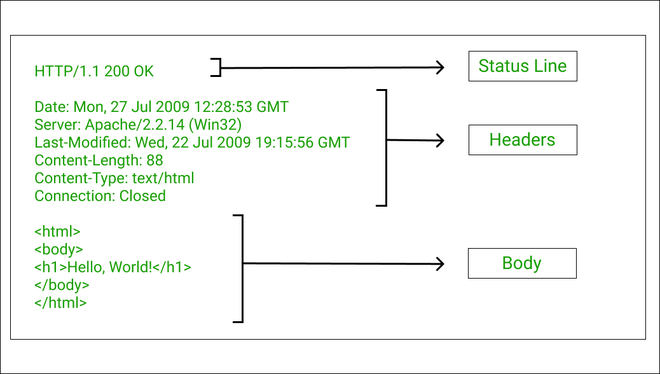

# Mensagens HTTP (Request e response)

[Link: HTTP status cat](https://http.cat/)

## Representação das principais características de request HTTP

### Estudando os componentes da requisição:
1. Método: o método especifica a ação que o cliente deseja realizar no servidor. Os métodos comuns incluem GET, POST, PUT, DELETE, entre outros.
2. URI (Uniform Resource Identifier): é um identificador único para o recurso que o cliente está solicitando. Ele geralmente inclui o nome do servidor, o caminho do arquivo e os parâmetros opcionais.
3. Versão do protocolo HTTP: a versão do protocolo HTTP que está sendo usada na solicitação.
4. Cabeçalhos: os cabeçalhos contêm informações adicionais sobre a solicitação, como o tipo de conteúdo que o cliente aceita, informações sobre o navegador usado pelo cliente e outras informações relevantes.
5. Corpo da mensagem: opcionalmente, uma solicitação HTTP também pode incluir um corpo da mensagem, que contém dados adicionais que o cliente está enviando ao servidor, como dados de formulário em uma solicitação POST.
6. Uma das características fundamentais de uma solicitação HTTP é que ela é escrita em ASCII (American Standard Code for Information Interchange), que é um conjunto de caracteres que é amplamente utilizado para codificar texto em dispositivos eletrônicos. Isso garante que a solicitação possa ser lida e compreendida por qualquer sistema que esteja usando o protocolo HTTP, independentemente do tipo de hardware ou sistema operacional usado.

As solicitações HTTP são a base para a comunicação entre clientes e servidores na web. Elas permitem que os clientes solicitem recursos específicos e enviem informações aos servidores, permitindo que as aplicações web funcionem de forma dinâmica e interativa.

 

## Representação das principais características de resonse

### Estudando os componentes da resposta:

Uma resposta HTTP (HTTP response) é a mensagem que um servidor envia a um cliente em resposta a uma solicitação HTTP. As principais características de uma resposta HTTP incluem:

1. Código de status: um código de status de três dígitos que indica o resultado da solicitação do cliente. Alguns exemplos de códigos de status incluem 200 OK (solicitação bem-sucedida), 404 Not Found (recurso não encontrado) e 500 Internal Server Error (erro interno do servidor).
2. Versão do protocolo HTTP: a versão do protocolo HTTP que está sendo usada na resposta.
3. Cabeçalhos: os cabeçalhos contêm informações adicionais sobre a resposta, como o tipo de conteúdo que está sendo retornado, informações sobre o servidor e outras informações relevantes.
4. Corpo da mensagem: o corpo da mensagem contém os dados que o servidor está enviando de volta ao cliente. Isso pode incluir texto, HTML, arquivos de imagem, dados JSON ou outros tipos de dados, dependendo do tipo de recurso que foi solicitado.
5. As respostas HTTP também são escritas em ASCII (American Standard Code for Information Interchange), que é um conjunto de caracteres amplamente utilizado para codificar texto em dispositivos eletrônicos. Isso garante que a resposta possa ser lida e compreendida por qualquer sistema que esteja usando o protocolo HTTP, independentemente do tipo de hardware ou sistema operacional usado. O uso de ASCII é um dos elementos fundamentais da interoperabilidade do protocolo HTTP.

As respostas HTTP são essenciais para a comunicação entre clientes e servidores na web. Elas permitem que os servidores enviem dados de volta aos clientes, permitindo que as aplicações web funcionem de forma dinâmica e interativa. Além disso, as respostas HTTP também permitem que os clientes saibam se a solicitação foi bem-sucedida ou não e forneçam informações adicionais sobre o recurso solicitado.

 

## Classificação dos métodos usados no HTTP
### Métodos Seguros (Safe Methods):

Os métodos seguros são aqueles que não modificam o estado do servidor. Eles são chamados de seguros porque podem ser usados sem risco de modificação indesejada de dados no servidor. Os métodos seguros incluem:

1. GET: é usado para recuperar informações de um servidor.
2. HEAD: é usado para solicitar apenas os cabeçalhos de uma resposta.
3. OPTIONS: é usado para obter as opções e recursos disponíveis no servidor.

### Métodos Inseguros (Unsafe Methods):

Os métodos inseguros são aqueles que modificam o estado do servidor. Eles são chamados de inseguros porque podem alterar os dados no servidor e, portanto, devem ser usados com cuidado. Os métodos inseguros incluem:

1. POST: é usado para enviar dados do cliente para o servidor, geralmente usado em formulários.
2. PUT: é usado para atualizar um recurso existente no servidor.
3. DELETE: é usado para excluir um recurso do servidor.
4. PATCH: é usado para modificar um recurso existente no servidor.

 

 

[Voltar a Principais protocolos de comunicação da internet](/Arquivos/Conteudo/6%20-%20Ganhando%20produtividade%20com%20spring%20framwork/6.1%20Principais%20protocolos%20de%20comunicacao%20na%20internet.md) 
[Voltar ao inicio](/README.md)