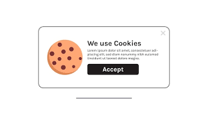
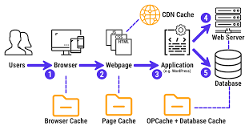

# Pra que serve cookies e cache

## O que é Cookies ?

Cookies são pequenos arquivos de texto que são armazenados em um navegador da web. Eles são criados por um servidor da web quando o usuário interage com um site e contêm informações sobre as preferências do usuário, dados de login, itens no carrinho de compras e outras informações relevantes. Os cookies são armazenados no computador do usuário e podem ser acessados pelo servidor sempre que o usuário visita o site.

### Os cookies têm várias finalidades, incluindo:

1. Autenticação de usuários: os cookies são usados para autenticar usuários e manter suas sessões de login ativas.
2. Personalização de conteúdo: os cookies permitem que os sites personalizem o conteúdo que é exibido para um usuário com base em suas preferências e histórico de navegação.
3. Rastreamento de usuários: os cookies são frequentemente usados por anunciantes para rastrear o comportamento do usuário na web.

 

## O que é Cache ?

O cache é uma tecnologia usada para armazenar temporariamente dados com o objetivo de melhorar o desempenho e reduzir o tempo de carregamento de um site ou aplicação. Quando um usuário acessa um site, o navegador faz uma solicitação ao servidor da web para obter os dados necessários. Se esses dados forem armazenados em cache, o navegador pode recuperá-los mais rapidamente, sem precisar fazer uma nova solicitação ao servidor.

### Existem vários tipos de cache, incluindo:

- Cache do navegador: o navegador armazena em cache as imagens, arquivos de script e outras informações do site para que possam ser recuperadas mais rapidamente na próxima vez que o usuário acessar o site.
- Cache do servidor: o servidor da web pode armazenar em cache as respostas para solicitações frequentes para reduzir a carga de processamento do servidor.
- Cache em nível de rede: os caches de rede podem ser usados para armazenar dados em vários pontos de uma rede, permitindo que os dados sejam acessados mais rapidamente pelos usuários.

 

## Proxy server

Um proxy server é um servidor intermediário que atua como um intermediário entre um cliente (por exemplo, um navegador da web) e um servidor remoto. Em outras palavras, quando um cliente faz uma solicitação a um servidor remoto, o proxy server intercepta a solicitação e, em seguida, envia a solicitação em nome do cliente para o servidor remoto.

Existem várias razões pelas quais um proxy server pode ser usado, incluindo:

1. Melhorar o desempenho: o proxy server pode armazenar em cache informações frequentemente acessadas e entregá-las diretamente ao cliente, sem precisar fazer uma solicitação ao servidor remoto todas as vezes.
2. Acesso restrito: um proxy server pode ser configurado para permitir ou bloquear o acesso a determinados sites ou recursos da web com base nas políticas da organização.
3. Anonimato: ao usar um proxy server, o endereço IP do cliente é ocultado, o que pode ser útil para ocultar a identidade do usuário ou evitar restrições de acesso geográfico.
4. Segurança: o proxy server pode atuar como um firewall, bloqueando o acesso a sites ou recursos suspeitos ou perigosos.

Em resumo, o proxy server é usado como uma camada intermediária entre o cliente e o servidor remoto, para melhorar o desempenho, impor políticas de acesso restrito, garantir o anonimato ou aumentar a segurança.

 

 

[Voltar a Principais protocolos de comunicação da internet](/Arquivos/Conteudo/6%20-%20Ganhando%20produtividade%20com%20spring%20framwork/6.1%20Principais%20protocolos%20de%20comunicacao%20na%20internet.md) 
[Voltar ao inicio](/README.md)