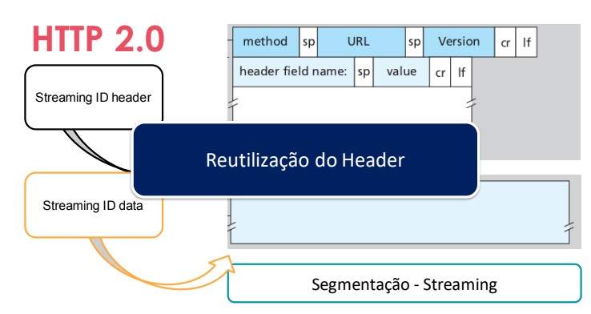

# HTTP 2.0 atualização do protocolo

## Diferenças entre HTTP anteriores e HTTP 2.0

HTTP/2.0 é a nova versão do protocolo HTTP, a principal forma de comunicação entre servidores e clientes na web. Abaixo estão algumas das principais diferenças entre HTTP/2.0 e suas versões anteriores:

### Multiplexação de fluxo

HTTP/2.0 permite que vários fluxos de dados sejam enviados em uma única conexão, ao contrário do HTTP/1.1, onde cada solicitação e resposta exigia uma nova conexão. Isso significa que o HTTP/2.0 é capaz de lidar com várias solicitações simultaneamente e, portanto, pode carregar páginas da web mais rapidamente.

### Priorização de fluxo

HTTP/2.0 introduz a capacidade de priorizar fluxos de dados para evitar bloqueios de solicitações importantes por solicitações menos importantes. Isso ajuda a garantir que a página da web seja carregada mais rapidamente.

### Compactação de cabeçalho

HTTP/2.0 usa uma técnica de compactação de cabeçalho que reduz o tamanho do cabeçalho da solicitação e da resposta, o que economiza largura de banda e acelera o carregamento da página.

### TLS (Transport Layer Security)

HTTP/2.0 requer o uso do protocolo TLS, que criptografa a comunicação entre o servidor e o cliente. Isso ajuda a proteger a privacidade dos usuários e torna mais difícil para os invasores interceptar a comunicação.

### Negociação no handshake

No HTTP/2.0, o handshake é negociado entre o cliente e o servidor antes do início da comunicação. Durante o handshake, o cliente e o servidor concordam em usar o HTTP/2.0 e estabelecem os parâmetros de comunicação, incluindo o protocolo de segurança a ser usado. O handshake no HTTP/2.0 é diferente do HTTP/1.1, que usa o handshake para estabelecer uma conexão TCP antes de iniciar a comunicação HTTP. No HTTP/2.0, a conexão TCP é estabelecida antes do handshake e é reutilizada para várias solicitações e respostas. Isso ajuda a melhorar o desempenho e a eficiência da comunicação. Além disso, o handshake no HTTP/2.0 inclui o envio de uma lista de recursos (conhecida como HPACK) que o servidor pode enviar para o cliente sem que o cliente os solicite. Isso é conhecido como push de servidor, e ajuda a melhorar ainda mais o desempenho da navegação na web.

 

## Push de servidor

HTTP/2.0 permite que o servidor envie recursos para o cliente antes mesmo que ele os solicite. Isso pode ser útil para fornecer recursos que são necessários para carregar uma página, mas que o cliente ainda não solicitou, como imagens, folhas de estilo e scripts. Lembrando que não vem por default.

 

#### Ilustração de formato de requisição HTTP 1.1 (Baseado no modelo OSI)

 

#### Ilustração de formato de requisição HTTP 2.0 (Baseado no modelo OSI) 

 

### Ilustração da diferença de requisições HTTP 1.1 vs HTTP 2.0

