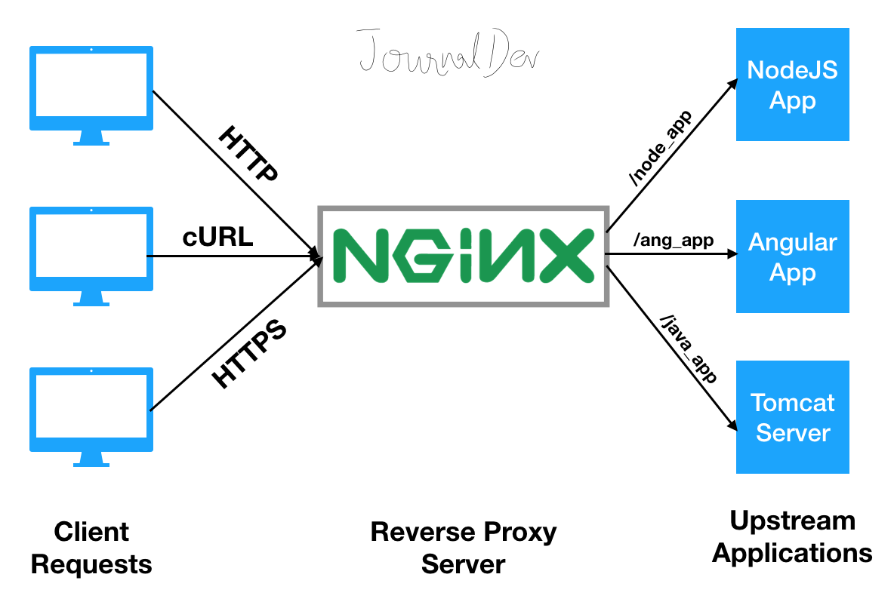

# Servidores/Sistema de aplicação

## Apache server 

### História do Apache Server:
O Apache Server é um servidor web de código aberto que foi desenvolvido pela Apache Software Foundation. Foi criado em 1995 por um grupo de desenvolvedores liderados por Brian Behlendorf, e o nome "Apache" foi escolhido porque o servidor originalmente consistia em um conjunto de patches ("apache" em inglês significa "índio apache" e patch significa "remendo") para o servidor HTTP NCSA.

A partir da versão 1.0, o Apache Server tornou-se rapidamente popular entre os usuários da Internet e em pouco tempo se tornou o servidor web mais utilizado no mundo. Em 2009, o Apache Server ultrapassou a marca de 100 milhões de sites ativos, o que o tornou o servidor web mais utilizado na história da Internet.

### Principais Características do Apache Server:

#### Algumas das principais características do Apache Server incluem:

1. Código aberto: O Apache Server é um software livre, o que significa que é disponibilizado gratuitamente e os usuários podem modificar e distribuir o código-fonte.
2. Multiplataforma: O Apache Server é compatível com uma ampla variedade de plataformas, incluindo Linux, Windows, macOS, Solaris, FreeBSD, NetBSD e outras.
3. Flexibilidade: O Apache Server é altamente configurável e pode ser personalizado para atender às necessidades específicas de cada usuário.
4. Modularidade: O Apache Server é baseado em módulos, o que significa que os recursos podem ser adicionados ou removidos conforme necessário.
5. Confiabilidade: O Apache Server é conhecido por sua confiabilidade e estabilidade, o que o torna uma escolha popular para servidores de alto tráfego.
6. Segurança: O Apache Server é projetado com segurança em mente e inclui recursos como suporte a SSL/TLS e autenticação de usuário. Suporte HTTP 2.0.
7. Suporte à linguagem de programação: O Apache Server suporta várias linguagens de programação, incluindo PHP, Perl, Python e Ruby, permitindo que os desenvolvedores criem aplicativos web dinâmicos e interativos.

 

## Xampp server

O XAMPP é um pacote de software livre que inclui o servidor web Apache, o banco de dados MySQL, a linguagem de script PHP e outras ferramentas, como o phpMyAdmin e o OpenSSL. Foi criado pela Apache Friends em 2002 e é amplamente utilizado para testes de desenvolvimento web local em ambientes Windows, Linux e macOS.

#### Principais Características do XAMPP:

Algumas das principais características do XAMPP incluem:

1. Instalação fácil: O XAMPP é fácil de instalar e configurar, permitindo que os desenvolvedores configurem rapidamente um ambiente de desenvolvimento local completo.
2. Multiplataforma: O XAMPP é compatível com várias plataformas, incluindo Windows, Linux e macOS.
3. Controle de versão: O XAMPP é fornecido com um sistema de controle de versão integrado, que permite que os desenvolvedores trabalhem em equipe e acompanhem as alterações no código.
4. Configuração personalizável: O XAMPP permite que os usuários personalizem facilmente as configurações do servidor, incluindo a versão do PHP, a configuração do banco de dados e as configurações de segurança.
5. Recursos adicionais: O XAMPP inclui recursos adicionais, como o phpMyAdmin, que permite aos desenvolvedores gerenciar facilmente seus bancos de dados MySQL.
6. Ambiente de desenvolvimento completo: Com o XAMPP, os desenvolvedores podem configurar um ambiente de desenvolvimento completo local, incluindo servidor web, banco de dados e linguagem de script.
7. Compatibilidade com aplicativos web: O XAMPP é compatível com uma ampla variedade de aplicativos web e frameworks, como WordPress, Joomla e Drupal.

 

## NGINX

### História do NGINX:

O NGINX é um servidor web de alto desempenho de código aberto, que foi criado em 2004 por Igor Sysoev, um engenheiro de software russo. Inicialmente, o NGINX foi desenvolvido para resolver os problemas de escalabilidade e desempenho enfrentados pelo servidor web Apache em ambientes de alto tráfego. Desde então, o NGINX se tornou um dos servidores web mais populares do mundo e é amplamente utilizado por grandes empresas como Netflix, Airbnb e Dropbox.

#### Principais Características do NGINX:

Algumas das principais características do NGINX incluem:

1. Alto desempenho: O NGINX é conhecido por sua capacidade de lidar com um grande número de conexões simultâneas e entregar conteúdo estático rapidamente.
2. Escalabilidade: O NGINX é altamente escalável e pode lidar com grandes volumes de tráfego sem comprometer o desempenho.
3. Configuração flexível: O NGINX é altamente configurável e pode ser personalizado para atender às necessidades específicas de cada usuário.
4. Suporte a vários protocolos: O NGINX suporta vários protocolos, incluindo HTTP/HTTPS, TCP, UDP, SMTP e POP3, permitindo que ele seja usado para uma ampla variedade de aplicações.
5. Modularidade: O NGINX é baseado em módulos, o que significa que os recursos podem ser adicionados ou removidos conforme necessário.
6. Confiabilidade: O NGINX é conhecido por sua confiabilidade e estabilidade, o que o torna uma escolha popular para servidores de alto tráfego.
7. Balanceamento de carga: O NGINX inclui recursos avançados de balanceamento de carga, permitindo que o tráfego seja distribuído de forma eficiente entre vários servidores.

 

 

[Voltar a Principais protocolos de comunicação da internet](/Arquivos/Conteudo/6%20-%20Ganhando%20produtividade%20com%20spring%20framwork/6.1%20Principais%20protocolos%20de%20comunicacao%20na%20internet.md) 
[Voltar ao inicio](/README.md)