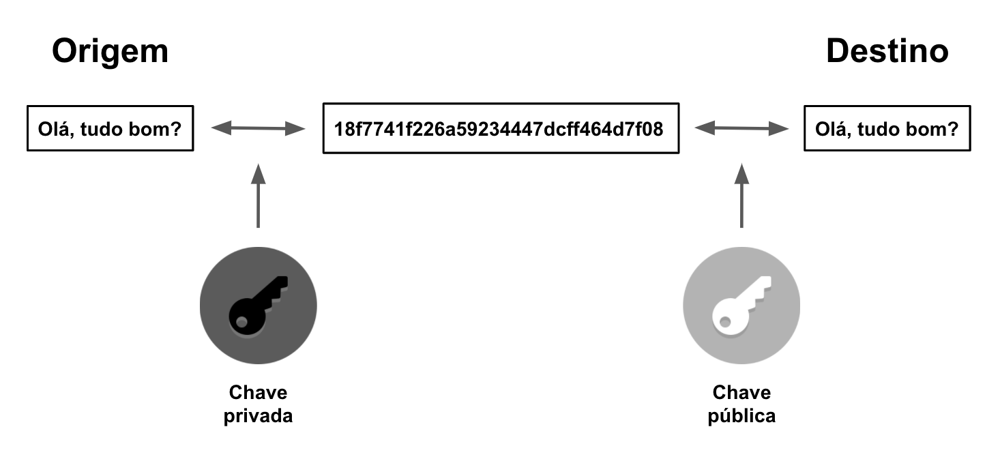

# Conceitos básicos de segurança da informação

## Criptografia por chave

A criptografia por chave, também conhecida como criptografia simétrica, é um método de criptografia em que uma única chave é usada tanto para cifrar quanto para decifrar a informação. Isso significa que a mesma chave é usada pelo remetente e pelo destinatário para proteger a confidencialidade dos dados.

- É um método de criptografia em que uma única chave é usada para cifrar e decifrar os dados
- A mesma chave é usada pelo remetente e pelo destinatário
- É amplamente utilizado em comunicações seguras, como VPNs e TLS/SSL

### Tipos de chaves:
A criptografia pode ser realizada por meio de duas técnicas principais: criptografia simétrica e criptografia assimétrica. Ambas as técnicas usam chaves para proteger a confidencialidade dos dados, mas há diferenças importantes entre elas.

**Criptografia Simétrica**

Na criptografia simétrica, uma única chave é usada tanto para cifrar quanto para decifrar a informação. Essa chave é compartilhada entre o remetente e o destinatário da mensagem. Isso significa que qualquer pessoa que conheça a chave pode acessar a informação protegida.

Algumas características da criptografia simétrica são:

- É um método simples e rápido para cifrar grandes quantidades de dados.
- Requer que o remetente e o destinatário compartilhem a mesma chave, o que pode ser um desafio em cenários onde a comunicação é feita por canais inseguros.
- Exemplos de algoritmos de criptografia simétrica são AES, DES e 3DES.

 

**Criptografia Assimétrica**

Na criptografia assimétrica, duas chaves são usadas: uma chave pública e uma chave privada. A chave pública pode ser compartilhada com qualquer pessoa, enquanto a chave privada é mantida em segredo pelo proprietário. A chave pública é usada para cifrar a informação e a chave privada é usada para decifrá-la.

Algumas características da criptografia assimétrica são:

- É mais seguro do que a criptografia simétrica, pois a chave privada nunca é compartilhada com terceiros.
- Permite a criação de certificados digitais que podem ser usados para autenticar a identidade de uma pessoa ou organização.
- Exemplos de algoritmos de criptografia assimétrica são RSA e ECC.

 

## Certificado digital

Um certificado digital é um documento eletrônico que serve como uma identidade digital. Ele é usado para autenticar a identidade de um indivíduo, organização ou servidor e garantir a integridade da comunicação criptografada.

- É um documento eletrônico que serve como uma identidade digital
- É usado para autenticar a identidade de um indivíduo, organização ou servidor
- Garante a integridade da comunicação criptografada
- É amplamente utilizado em transações comerciais on-line, como compras em lojas virtuais e internet banking.

#### Entidades certificadoras:
As entidades certificadoras (ou Autoridades Certificadoras - AC) são organizações responsáveis por emitir certificados digitais que autenticam a identidade de uma pessoa ou organização. Essas entidades são confiáveis e seguem padrões e protocolos internacionais para garantir a autenticidade e segurança dos certificados emitidos.

- As ACs são responsáveis por verificar a identidade da pessoa ou organização que solicita o certificado, seja por meio de documentação, verificação de informações e outras técnicas de validação. Em seguida, as ACs emitem o certificado digital, que contém informações como o nome da pessoa ou organização, uma chave pública associada e outras informações relevantes.
- Os certificados digitais são utilizados para autenticar a identidade de pessoas ou organizações em transações comerciais on-line, como compras em lojas virtuais, internet banking, acesso a serviços governamentais, entre outros. Além disso, eles também são usados para proteger a integridade dos dados transmitidos por meio de criptografia de chave pública.
- Existem diversas ACs no mundo, desde empresas privadas até instituições governamentais. Algumas das mais conhecidas são VeriSign, Digicert, GlobalSign, Let's Encrypt, ICP-Brasil (no Brasil) e CA/Browser Forum, que é uma associação internacional de empresas certificadoras. É importante escolher uma AC confiável e com boa reputação para garantir a segurança das informações transmitidas.

 

 

[Voltar a Principais protocolos de comunicação da internet](/Arquivos/Conteudo/6%20-%20Ganhando%20produtividade%20com%20spring%20framwork/6.1%20Principais%20protocolos%20de%20comunicacao%20na%20internet.md) 
[Voltar ao inicio](/README.md)