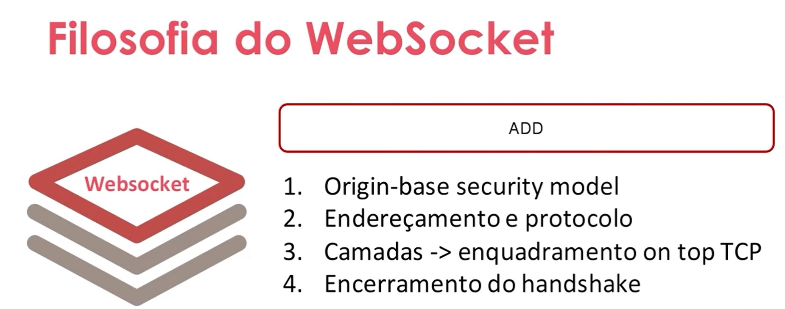

# Websocket introdução

## O que é Web Socket?

Web Socket é uma tecnologia de comunicação bidirecional, que permite a troca de informações em tempo real entre o cliente (navegador) e o servidor, de forma assíncrona. É uma alternativa ao protocolo HTTP, que é usado para transferência de dados de forma unidirecional, do servidor para o cliente. 

### Quando foi criado?
O protocolo Web Socket foi padronizado em 2011, pela IETF (Internet Engineering Task Force), como uma extensão do protocolo HTTP.

### Como funciona?
O funcionamento do Web Socket é baseado em uma conexão TCP/IP persistente, que permite que os dados sejam transmitidos em tempo real, sem a necessidade de uma nova solicitação a cada troca de informação. O fluxo de dados é bidirecional, ou seja, tanto o cliente quanto o servidor podem enviar informações a qualquer momento.

O processo de conexão do Web Socket é iniciado com uma solicitação de abertura de conexão, que é feita pelo cliente. Essa solicitação contém informações sobre o protocolo utilizado e um cabeçalho de segurança, que inclui uma chave de conexão gerada pelo cliente.

O servidor, por sua vez, responde com um cabeçalho de aceitação, que contém uma chave de conexão gerada pelo servidor. A partir desse momento, a conexão é estabelecida e tanto o cliente quanto o servidor podem enviar informações a qualquer momento, sem a necessidade de uma nova solicitação.

O Web Socket é suportado pelos principais navegadores modernos, como o Google Chrome, Mozilla Firefox, Microsoft Edge e Safari, e pode ser utilizado em diversas aplicações que requerem comunicação em tempo real, como jogos online, chat em tempo real, sistemas de monitoramento, entre outros.

### Vantagens do Web Socket

Algumas das principais vantagens do uso do Web Socket são:

- Comunicação bidirecional em tempo real: permite que os clientes e servidores troquem informações em tempo real, sem a necessidade de uma nova solicitação a cada troca de informação.
- Baixa latência: a comunicação em tempo real do Web Socket proporciona uma baixa latência, o que é importante em aplicações que requerem uma rápida resposta, como jogos online.
- Eficiência de recursos: a comunicação persistente do Web Socket reduz o número de solicitações e respostas HTTP, o que pode reduzir o consumo de recursos do servidor e melhorar a escalabilidade da aplicação.

### Limitações do Web Socket

Algumas limitações do Web Socket incluem:

- Suporte limitado em versões mais antigas dos navegadores: o Web Socket é uma tecnologia relativamente nova e não é suportado por versões mais antigas dos navegadores. Isso pode limitar a utilização em alguns contextos, como em empresas com políticas de atualização de navegador mais restritas.
- Necessidade de implementação do lado do servidor: para que o Web Socket funcione corretamente, é necessário que o servidor tenha suporte para esse protocolo. Isso pode exigir modificações na aplicação ou na infraestrutura do servidor.
- Questões de segurança: o Web Socket pode apresentar algumas questões de segurança, como a possibilidade de ataques de cross-site scripting (XSS) ou a necessidade de configurações adequadas de firewall.

#### Exemplos aplicação prática:

Algumas das aplicações mais comuns do Web Socket são:

- Jogos online: o Web Socket permite a comunicação em tempo real entre os jogadores e o servidor, o que é essencial em jogos multiplayer.
- Chat em tempo real: o Web Socket pode ser utilizado para a implementação de chat em tempo real, permitindo que os usuários troquem mensagens sem a necessidade de atualizações de página.
- Monitoramento em tempo real: o Web Socket pode ser utilizado para enviar informações em tempo real sobre sistemas, como dados de sensores ou métricas de desempenho.

 

## Diferenças entre HTTP vs WebSocket 

### Comunicação

- HTTP: O protocolo HTTP é unidirecional, ou seja, o cliente faz uma solicitação ao servidor e o servidor responde com uma resposta. A comunicação é feita por meio de mensagens HTTP, que podem conter informações sobre a solicitação (como a URL e os parâmetros da solicitação) e a resposta (como o código de status HTTP e o corpo da resposta).
- WebSocket: O protocolo WebSocket é bidirecional, ou seja, tanto o cliente quanto o servidor podem enviar informações a qualquer momento, sem a necessidade de uma nova solicitação. A comunicação é estabelecida por meio de uma conexão persistente entre o cliente e o servidor, que permite a troca de informações em tempo real.

### Latência

- HTTP: O protocolo HTTP pode apresentar uma latência relativamente alta, já que a comunicação é feita por meio de solicitações e respostas HTTP, que podem demorar alguns segundos para serem concluídas. Isso pode ser um problema em aplicações que requerem uma resposta rápida do servidor, como jogos online.
- WebSocket: O protocolo WebSocket apresenta uma latência mais baixa, já que a comunicação é feita em tempo real, sem a necessidade de uma nova solicitação a cada troca de informação. Isso é importante em aplicações que requerem uma resposta rápida, como jogos online.

### Uso

- HTTP: O protocolo HTTP é utilizado para transferência de dados unidirecional, do servidor para o cliente. É comumente utilizado para a transferência de arquivos, páginas web, imagens e outros recursos.
- WebSocket: O protocolo WebSocket é utilizado para comunicação bidirecional em tempo real entre o cliente e o servidor. É comumente utilizado em aplicações que requerem comunicação em tempo real, como jogos online, chat em tempo real e sistemas de monitoramento.

### Segurança

- HTTP: O protocolo HTTP não oferece recursos avançados de segurança, como criptografia de ponta a ponta.
- WebSocket: O protocolo WebSocket suporta criptografia de ponta a ponta, o que significa que as informações transmitidas entre o cliente e o servidor são criptografadas e só podem ser lidas por essas duas entidades. Isso é importante em aplicações que lidam com informações sensíveis, como dados de pagamento ou informações pessoais.

 

 

[Voltar a Principais protocolos de comunicação da internet](/Arquivos/Conteudo/6%20-%20Ganhando%20produtividade%20com%20spring%20framwork/6.1%20Principais%20protocolos%20de%20comunicacao%20na%20internet.md) 
[Voltar ao inicio](/README.md)