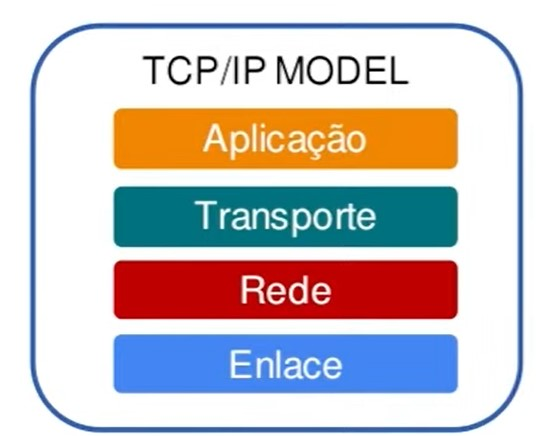

# Outros conceitos importantes

## Proxy

Um proxy é um servidor intermediário que atua como um intermediário entre os clientes e os servidores. Ele recebe as solicitações dos clientes e as encaminha para os servidores correspondentes, agindo como um representante do cliente junto ao servidor. O uso de um proxy pode trazer benefícios como aumento da segurança, melhoria na performance e controle de acesso a recursos da rede.

### Tipos de proxy

Existem diferentes tipos de proxy, cada um com suas características e funções específicas:

- Proxy HTTP: atua como intermediário para solicitações HTTP e HTTPS. Ele é capaz de interceptar as solicitações HTTP e encaminhá-las para o servidor correspondente.
- Proxy reverso: atua como intermediário para solicitações feitas ao servidor web. Ele recebe as solicitações dos clientes e as encaminha para o servidor web correspondente.
- Proxy de cache: armazena em cache as respostas dos servidores para solicitações repetidas. Isso pode melhorar significativamente a performance, reduzindo a latência e o tráfego de rede.

 

## DNS

DNS (Domain Name System) é um sistema de nomenclatura hierárquica utilizado para identificar recursos da rede, como servidores web e computadores. Ele permite que os usuários acessem esses recursos utilizando nomes amigáveis, como [www.exemplo.com](http://www.exemplo.com/), em vez de endereços IP numéricos.

### Funcionamento do DNS

O DNS funciona por meio de uma hierarquia de servidores DNS, que são responsáveis por armazenar informações sobre os nomes de domínio e seus correspondentes endereços IP. Quando um usuário acessa um nome de domínio, o sistema de resolução de nomes de domínio (DNS resolver) busca essa informação em uma série de servidores DNS até encontrar o endereço IP correspondente. Em seguida, o usuário pode acessar o recurso da rede desejado utilizando esse endereço IP.

 

## Socket

Socket é um mecanismo utilizado para a comunicação entre processos em um mesmo computador ou em diferentes computadores em uma rede. Ele permite que os processos enviem e recebam informações por meio de um canal de comunicação. O socket é definido por um endereço IP e um número de porta, que são utilizados para identificar o processo que está enviando ou recebendo informações.

### Tipos de Socket

Existem diferentes tipos de sockets, cada um com suas características e funções específicas:

- Socket TCP: utilizado para comunicação confiável e orientada a conexão. Ele garante que as informações sejam entregues na ordem correta e sem perda de dados.
- Socket UDP: utilizado para comunicação não confiável e não orientada a conexão. Ele não garante que as informações sejam entregues na ordem correta ou sem perda de dados.

 

## Load Balancer

O Load Balancer é um dispositivo ou software que distribui o tráfego de rede de forma equilibrada entre os servidores de um cluster. Ele é utilizado para aumentar a disponibilidade e escalabilidade de aplicações web, distribuindo as solicitações de clientes entre diferentes servidores. O uso de um Load Balancer pode ajudar a evitar sobrecarga em servidores individuais e garantir que a aplicação continue funcionando mesmo em caso de falhas em um ou mais servidores.

### Tipos de Load Balancer

- Load Balancer baseado em hardware: consiste em um dispositivo físico dedicado que é instalado na rede. Ele é capaz de lidar com grandes volumes de tráfego de rede e possui recursos avançados de gerenciamento de tráfego.
- Load Balancer baseado em software: consiste em um software que pode ser instalado em servidores existentes ou em máquinas virtuais. Ele é mais flexível e escalável que o Load Balancer baseado em hardware, pois pode ser implantado em diferentes plataformas de hardware.
- Load Balancer de DNS: utiliza o DNS para distribuir o tráfego entre diferentes servidores. Ele utiliza diferentes endereços IP para o mesmo nome de domínio, de modo que as solicitações são distribuídas entre diferentes servidores.
- Load Balancer de camada de aplicação: distribui o tráfego com base em informações de camada de aplicação, como o tipo de solicitação, o tamanho da solicitação e outras informações específicas da aplicação.

 

## Outros conceitos importantes no mundo Web

### Firewall:

É uma solução de segurança que protege a rede contra ameaças externas e internas. Ele atua como uma barreira entre a rede interna e a Internet, permitindo apenas o tráfego autorizado.

### CDN (Content Delivery Network):

É uma rede de servidores distribuídos em diferentes localidades geográficas que armazenam e entregam conteúdo aos usuários finais. Ele é utilizado para melhorar a velocidade e a disponibilidade de sites e aplicativos web, armazenando conteúdo em cache em servidores próximos aos usuários.

### API (Application Programming Interface)

É um conjunto de regras, protocolos e ferramentas para construir e integrar aplicativos. Ele permite que diferentes aplicativos se comuniquem entre si e compartilhem informações de forma padronizada.

### Microserviços:

É uma arquitetura de software que divide uma aplicação em serviços independentes e autônomos, cada um com sua própria lógica de negócios e banco de dados. Ele é utilizado para tornar a aplicação mais escalável, resiliente e fácil de manter.

### Contêineres

São unidades de software que encapsulam o código e suas dependências, permitindo que ele seja executado de forma isolada em diferentes ambientes. Eles são utilizados para facilitar a implantação e a portabilidade de aplicativos em diferentes plataformas e ambientes de execução.

 

# Camadas Tcp/Ip

- O TCP/IP (Transmission Control Protocol/Internet Protocol) é um modelo de referência que descreve como os protocolos de rede são organizados e como as camadas de rede se relacionam entre si.
- Ele é composto por quatro camadas principais: Camada de Aplicação, Camada de Transporte, Camada de Rede e Camada de Interface de Rede.
- Cada camada é responsável por uma parte específica do processo de comunicação de rede.
- O TCP/IP é amplamente utilizado na Internet e é considerado o modelo padrão de referência para redes de computadores.

 

## Camadas do modelo OSI

- O OSI (Open Systems Interconnection) é um modelo de referência que descreve como os protocolos de rede são organizados e como as camadas de rede se relacionam entre si.
- Ele é composto por sete camadas principais: Camada Física, Camada de Enlace de Dados, Camada de Rede, Camada de Transporte, Camada de Sessão, Camada de Apresentação e Camada de Aplicação.
- Cada camada é responsável por uma parte específica do processo de comunicação de rede.
- O OSI é menos utilizado na prática do que o TCP/IP, mas é considerado um modelo mais completo e abrangente, pois inclui mais camadas e separa as funções de cada camada de forma mais clara.

### Equivalendo as camadas OSI com TCP/IP
