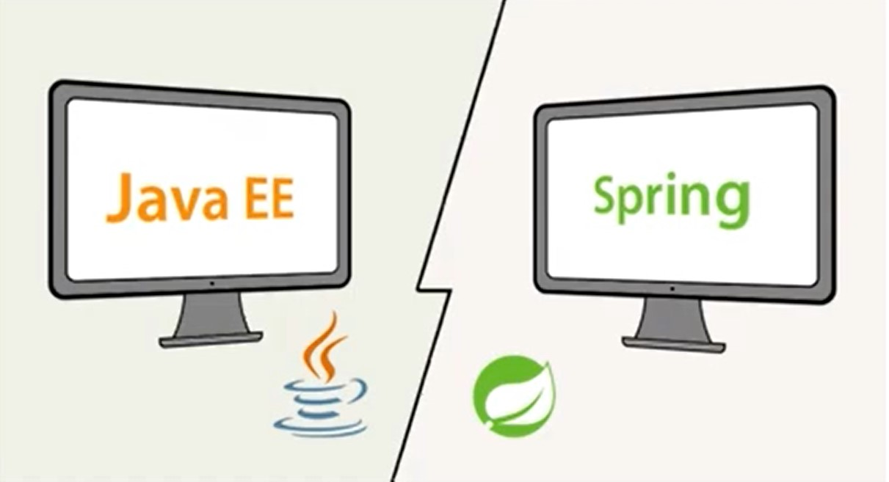

# Fundamentos do spring

## Spring Framework

O Spring Framework é um framework de desenvolvimento de software para a plataforma Java, que surgiu em 2003. Foi criado para facilitar o desenvolvimento de aplicações corporativas, com o objetivo de tornar o processo mais simples, ágil e produtivo.

### Principais vantagens

#### Inversão de controle (IoC)

O Spring Framework utiliza o padrão de inversão de controle (IoC), que permite que as dependências sejam gerenciadas pelo framework. Com isso, é possível reduzir o acoplamento entre os componentes da aplicação e aumentar a modularidade.

#### Injeção de dependência (DI)

O Spring Framework também utiliza o padrão de injeção de dependência (DI), que permite que as dependências sejam injetadas nos componentes da aplicação em tempo de execução. Com isso, é possível reduzir o acoplamento entre os componentes da aplicação e aumentar a flexibilidade.

#### AOP (Programação Orientada a Aspectos)

O Spring Framework também suporta a programação orientada a aspectos (AOP), que permite separar os aspectos transversais da aplicação, como a segurança e o registro de log, dos aspectos principais da aplicação.

#### Transações

O Spring Framework também oferece suporte à transações, permitindo que as transações sejam gerenciadas de forma programática ou declarativa. Com isso, é possível garantir a integridade dos dados da aplicação.

#### Facilidade de teste

O Spring Framework foi projetado para facilitar os testes unitários e de integração. Com isso, é possível garantir a qualidade do software e reduzir o tempo de desenvolvimento.

<br>

## Spring Modules
O Spring Framework é um conjunto de módulos que podem ser utilizados de forma independente ou combinados para atender às necessidades específicas de cada projeto. Abaixo, explicarei brevemente alguns dos principais módulos do Spring Framework:

#### Spring Core

O módulo Spring Core é o coração do Spring Framework. Ele fornece as funcionalidades básicas de IoC e DI, permitindo que as dependências sejam gerenciadas pelo framework. Além disso, ele também oferece suporte à internacionalização, ao gerenciamento de exceções e à validação de dados.

#### Spring MVC

O módulo Spring MVC é responsável por fornecer as funcionalidades de um framework web para o desenvolvimento de aplicações Java. Ele utiliza o padrão MVC (Model-View-Controller), permitindo que a aplicação seja dividida em camadas para melhorar a organização e a manutenibilidade do código. Além disso, ele também oferece suporte a diversos recursos, como a geração de arquivos PDF, a validação de formulários e o suporte a websockets.

#### Spring Data

O módulo Spring Data é responsável por fornecer uma camada de abstração para o acesso a dados em aplicações Java. Ele permite que o desenvolvedor escreva menos código para realizar as operações de persistência de dados, já que as consultas SQL são geradas automaticamente pelo framework. Além disso, ele também oferece suporte a diversas tecnologias de persistência de dados, como JPA, MongoDB, Cassandra e Redis.

#### Spring Security

O módulo Spring Security é responsável por fornecer recursos de segurança para aplicações Java. Ele oferece suporte à autenticação e autorização de usuários, permitindo que o desenvolvedor defina quais usuários têm acesso a quais recursos da aplicação. Além disso, ele também oferece suporte a diversos recursos de segurança, como a proteção contra ataques CSRF (Cross-Site Request Forgery), a criptografia de senhas e o suporte a SSO (Single Sign-On).

### Spring Boot

O módulo Spring Boot é responsável por fornecer uma experiência de desenvolvimento mais produtiva e rápida para aplicações Java. Ele utiliza o conceito de "convenção sobre configuração", permitindo que o desenvolvedor escreva menos código de configuração para a aplicação. Além disso, ele também oferece suporte a diversos recursos, como a execução da aplicação em um servidor embutido, a geração automática de documentação da API e o suporte a métricas e monitoramento.

<br>

## Representação runtime do Spring:


<br>

<br>

## Diferenças entre Spring e Java EE



O Spring Framework e o Java EE (Java Enterprise Edition) são dois frameworks bastante utilizados no desenvolvimento de aplicações corporativas em Java. Abaixo, listarei algumas das principais diferenças entre esses dois frameworks:

#### Arquitetura

- O Java EE é uma plataforma completa que oferece uma arquitetura para o desenvolvimento de aplicações empresariais, incluindo diversos componentes e APIs, como EJB (Enterprise JavaBeans), JPA (Java Persistence API), JMS (Java Message Service), Servlets, entre outros.
- O Spring, por outro lado, é um framework que oferece diversas funcionalidades para o desenvolvimento de aplicações, como IoC, DI, segurança, acesso a dados, entre outras, mas não possui uma arquitetura definida.

#### Escopo

- O Java EE é um framework mais amplo e voltado para o desenvolvimento de grandes aplicações corporativas, sendo mais complexo e pesado que o Spring.
- O Spring, por outro lado, é mais leve e modular, sendo mais indicado para aplicações menores ou de médio porte.

#### Configuração

- O Java EE utiliza arquivos de configuração XML para definir os componentes e configurações da aplicação.
- O Spring, por outro lado, oferece diversas formas de configuração, incluindo XML, anotações e programação Java, sendo que a configuração por meio de anotações é uma das mais populares.

#### Ciclo de vida

- O Java EE possui um ciclo de vida mais complexo e formal, com diversos eventos definidos e etapas de inicialização e encerramento bem definidas.
- O Spring, por outro lado, possui um ciclo de vida mais flexível e simplificado, permitindo uma maior facilidade no desenvolvimento e manutenção de aplicações.

#### Suporte à comunidade

- O Spring possui uma grande comunidade de desenvolvedores ativos, além de uma vasta documentação e diversos fóruns de discussão disponíveis.
- O Java EE, por sua vez, possui uma comunidade menor e menos ativa, com menos atualizações e documentação disponível.

<br>

## Inversão de Controle (IoC) no Spring Framework

A Inversão de Controle, também conhecida como IoC, é um dos principais conceitos do Spring Framework. A IoC é uma técnica de programação que consiste em delegar a responsabilidade de gerenciamento de objetos e suas dependências para um container. Em outras palavras, ao invés de uma classe criar e gerenciar as instâncias de suas dependências, ela recebe as instâncias já criadas pelo container.

### Funcionamento

No Spring Framework, o container responsável pelo gerenciamento de objetos é o ApplicationContext, que implementa a interface BeanFactory. O ApplicationContext utiliza o mecanismo de reflexão do Java para instanciar objetos, configurar suas dependências e injetá-las em tempo de execução.

Para que a IoC seja utilizada, é necessário que as classes sejam configuradas como beans no ApplicationContext. A configuração pode ser feita por meio de arquivos XML, anotações ou programação Java. No arquivo de configuração, é possível definir os beans, suas dependências e seus escopos.

#### Benefícios

O uso da IoC no Spring Framework traz diversos benefícios, tais como:

- Maior facilidade de manutenção e evolução da aplicação: com a IoC, as dependências são gerenciadas pelo container, permitindo que a lógica de negócio fique mais isolada e independente. Isso facilita a manutenção e evolução da aplicação, pois é possível substituir ou atualizar as dependências sem afetar outras partes da aplicação.
- Maior testabilidade: ao delegar o gerenciamento de objetos para o container, é possível criar testes unitários mais efetivos, pois é possível injetar dependências mockadas para testar a lógica da classe de forma isolada.
- Desacoplamento: a IoC promove um desacoplamento entre as classes, reduzindo o acoplamento entre os componentes da aplicação. Isso torna a aplicação mais flexível e escalável.


<br>

<br>

## Injeção de Dependências no Spring Framework

A Injeção de Dependências (ou Dependency Injection, em inglês) é um padrão de projeto de software que tem como objetivo reduzir o acoplamento entre as classes de uma aplicação. O Spring Framework utiliza a Injeção de Dependências como um dos principais recursos para gerenciar objetos e suas dependências.

### O que é Injeção de Dependências?**

A Injeção de Dependências é uma técnica que consiste em delegar a responsabilidade de criação e gerenciamento de objetos e suas dependências para um container. Em outras palavras, ao invés de uma classe criar e gerenciar as instâncias de suas dependências, ela recebe as instâncias já criadas pelo container.

A Injeção de Dependências pode ser feita de duas formas:

- Injeção de Dependências por Construtor: as dependências são passadas como parâmetros no construtor da classe.
- Injeção de Dependências por Setter: as dependências são passadas por meio de um método setter.

#### Como funciona a Injeção de Dependências no Spring Framework?**

O Spring Framework utiliza o mecanismo de reflexão do Java para instanciar objetos, configurar suas dependências e injetá-las em tempo de execução. Para que a Injeção de Dependências seja utilizada, é necessário que as classes sejam configuradas como beans no ApplicationContext.

Na configuração dos beans, é possível definir as dependências e seus escopos. O Spring Framework utiliza o padrão Singleton por padrão, mas é possível definir outros escopos, como Prototype, Request, Session, entre outros.

#### Benefícios da Injeção de Dependências no Spring Framework

A Injeção de Dependências traz diversos benefícios para o desenvolvimento de aplicações Java com o Spring Framework, tais como:

- Maior facilidade de manutenção e evolução da aplicação: com a Injeção de Dependências, as dependências são gerenciadas pelo container, permitindo que a lógica de negócio fique mais isolada e independente. Isso facilita a manutenção e evolução da aplicação, pois é possível substituir ou atualizar as dependências sem afetar outras partes da aplicação.
- Maior testabilidade: ao delegar o gerenciamento de objetos para o container, é possível criar testes unitários mais efetivos, pois é possível injetar dependências mockadas para testar a lógica da classe de forma isolada.
- Desacoplamento: a Injeção de Dependências promove um desacoplamento entre as classes, reduzindo o acoplamento entre os componentes da aplicação. Isso torna a aplicação mais flexível e escalável.


<br>

<br>

## Beans no Spring Framework

Em termos simples, um bean é um objeto gerenciado pelo container do Spring Framework. O Spring Framework utiliza o conceito de beans para gerenciar e configurar objetos em uma aplicação Java.

### O que são Beans?

Em uma aplicação Java com o Spring Framework, um bean é um objeto Java que é gerenciado pelo container do Spring. Os beans são criados a partir das classes Java e podem ser configurados com suas dependências e propriedades, além de serem destruídos pelo container quando não são mais necessários.

Um bean é configurado no arquivo de configuração XML do Spring Framework, onde são definidos seus atributos, propriedades e dependências.

#### Tipos de Beans

O Spring Framework oferece diversos tipos de beans para gerenciar objetos em uma aplicação. Alguns dos principais tipos de beans são:

- Singleton: é o tipo de bean padrão no Spring Framework. Ele garante que haja somente uma instância do bean em toda a aplicação.
- Prototype: cada vez que o bean é solicitado, uma nova instância é criada.
- Request: o bean é criado a cada requisição HTTP e é destruído ao final da requisição.
- Session: o bean é criado uma vez por sessão do usuário e é destruído ao final da sessão.

#### Benefícios dos Beans no Spring Framework

Os beans do Spring Framework trazem diversos benefícios para o desenvolvimento de aplicações Java, tais como:

- Gerenciamento de objetos: o Spring Framework utiliza o conceito de beans para gerenciar objetos em uma aplicação, permitindo que as dependências e configurações dos objetos sejam definidas em um único arquivo XML.
- Modularidade: o uso de beans no Spring Framework promove a modularidade da aplicação, permitindo que cada módulo seja configurado separadamente.
- Flexibilidade: o Spring Framework permite que os beans sejam configurados e reconfigurados de forma flexível, sem a necessidade de alterar o código-fonte da aplicação.

<br>

## Scopes no Spring Framework


O Spring Framework define diferentes scopes para os objetos gerenciados pelo container, permitindo que eles sejam utilizados em diferentes contextos de aplicação e preservando o estado desses objetos.

### O que são Scopes?

Scopes são definidos como o tempo de vida dos objetos gerenciados pelo container do Spring Framework. Um scope define a forma como o objeto é criado, utilizado e destruído pelo container.

O Spring Framework define os seguintes scopes para os objetos gerenciados pelo container:

- Singleton: o objeto é criado apenas uma vez e é compartilhado por todas as requisições.
- Prototype: um novo objeto é criado sempre que é solicitado.
- Request: o objeto é criado uma vez para cada requisição HTTP.
- Session: o objeto é criado uma vez por sessão do usuário.
- Global Session: o objeto é criado uma vez por aplicação, no escopo da sessão global.
- Application: o objeto é criado uma vez por aplicação.

#### Benefícios dos Scopes no Spring Framework

Os scopes no Spring Framework oferecem diversos benefícios para o desenvolvimento de aplicações Java, tais como:

- Flexibilidade: o uso de diferentes scopes permite que os objetos gerenciados pelo container sejam utilizados em diferentes contextos, preservando o estado desses objetos.
- Controle: o Spring Framework oferece controle sobre o tempo de vida dos objetos gerenciados pelo container, permitindo que a aplicação seja otimizada para atender às necessidades do negócio.
- Modularidade: o uso de diferentes scopes permite que a aplicação seja modular, facilitando a manutenção e evolução da aplicação.

<br>

## Singleton Scope no Spring Framework

O Singleton é o escopo padrão para objetos gerenciados pelo container do Spring Framework. Quando um objeto é configurado com o escopo Singleton, o container garante que apenas uma única instância desse objeto seja criada e compartilhada por toda a aplicação.

### O que é Singleton?

Em termos simples, um Singleton é um padrão de projeto de software que garante a criação de uma única instância de uma classe em toda a aplicação. Esse padrão de projeto é amplamente utilizado em aplicações Java e é implementado pelo Spring Framework por meio do escopo Singleton.

#### Benefícios do Singleton Scope no Spring Framework

O uso do Singleton Scope no Spring Framework oferece diversos benefícios para o desenvolvimento de aplicações Java, tais como:

- Desempenho: a utilização de uma única instância do objeto ajuda a evitar a sobrecarga de recursos do sistema, pois não é necessário criar novas instâncias toda vez que o objeto é necessário.
- Consistência: a utilização de uma única instância do objeto garante a consistência dos dados e comportamentos do objeto em toda a aplicação.
- Controle: o Spring Framework oferece controle sobre o ciclo de vida do objeto Singleton, permitindo que a aplicação seja otimizada para atender às necessidades do negócio.

<br>

## @Autowired no Spring Framework

@Autowired é uma das anotações mais utilizadas no Spring Framework para realizar injeção de dependência de objetos gerenciados pelo container em outras classes.

### *O que é Injeção de Dependência?

A Injeção de Dependência (DI) é um padrão de projeto de software que consiste em injetar as dependências de uma classe por meio de construtores, métodos ou atributos, em vez de instanciá-las diretamente na classe. Esse padrão de projeto ajuda a reduzir o acoplamento entre as classes e torna a aplicação mais modular e fácil de manter.

### O que é @Autowired?

@Autowired é uma anotação do Spring Framework que permite a injeção de dependência de objetos gerenciados pelo container em outras classes. Essa anotação é aplicada em um construtor, método ou atributo de uma classe e o Spring Framework se encarrega de injetar automaticamente as dependências correspondentes.

#### Benefícios do uso de @Autowired no Spring Framework

O uso de @Autowired no Spring Framework oferece diversos benefícios para o desenvolvimento de aplicações Java, tais como:

- Flexibilidade: a injeção de dependência permite que as dependências sejam facilmente substituídas ou configuradas para diferentes ambientes, sem alterar o código da classe que as utiliza.
- Desacoplamento: a injeção de dependência ajuda a reduzir o acoplamento entre as classes, tornando a aplicação mais modular e fácil de manter.
- Testabilidade: a injeção de dependência ajuda a facilitar a criação de testes unitários para as classes, pois as dependências podem ser facilmente substituídas por mock objects.

<br>

## Opções de Injeção de Dependência no Spring Framework

No Spring Framework, há diversas opções para realizar a injeção de dependência por meio da anotação @Autowired, cada uma com suas próprias características e formas de resolução de dependências.

### Injeção por Nome (byname)

Na injeção por nome, o Spring Framework procura por um bean com o mesmo nome do atributo a ser injetado na classe que está sendo configurada. Por exemplo:

<details>
<summary>Código exemplo:</summary>

```java
javaCopy code
@Component
public class MyClass {
  @Autowired
  private MyDependency myDependency;
}

```

- Nesse caso, o Spring Framework procura por um bean chamado "myDependency" para injetar na classe MyClass.

</details>

<br>

### Injeção por Tipo (bytype)

Na injeção por tipo, o Spring Framework procura por um bean com o tipo correspondente ao atributo a ser injetado na classe que está sendo configurada. 

<details>
<summary>Código exemplo:</summary>

```java
javaCopy code
@Component
public class MyClass {
  @Autowired
  private MyDependency myDependency;
}

```
- Nesse caso, o Spring Framework procura por um bean do tipo MyDependency para injetar na classe MyClass.

</details>

<br>

### Injeção por Construtor (constructor)

Na injeção por construtor, o Spring Framework procura pelo construtor correspondente ao atributo a ser injetado na classe que está sendo configurada. 

<details>
<summary>Código exemplo:</summary>

```java
javaCopy code
@Component
public class MyClass {
  private final MyDependency myDependency;

  @Autowired
  public MyClass(MyDependency myDependency) {
    this.myDependency = myDependency;
  }
}

```

- Nesse caso, o Spring Framework procura por um bean do tipo MyDependency para injetar no construtor de MyClass.

</details>

<br>

### Injeção por Anotação Qualificadora (qualifier)

Na injeção por anotação qualificadora, é possível definir uma anotação personalizada para qualificar os beans a serem injetados.

<details>
<summary>Código exemplo:</summary>

```java
javaCopy code
@Component
public class MyClass {
  @Autowired
  @Qualifier("myQualifier")
  private MyDependency myDependency;
}

```

- Nesse caso, o Spring Framework procura por um bean do tipo MyDependency qualificado com a anotação @myQualifier para injetar na classe MyClass.

</details>

<br>

<br>

### Injeção Opcional (optional)

Na injeção opcional, é possível marcar um atributo como opcional, permitindo que a injeção de dependência falhe sem lançar uma exceção.

<details>
<summary>Código exemplo:</summary>

```java
javaCopy code
@Component
public class MyClass {
  @Autowired(required = false)
  private MyDependency myDependency;
}

```

- Nesse caso, se não houver um bean correspondente para injetar em myDependency, o atributo será nulo e não será lançada uma exceção.

</details>

<br>

<br>

<br>

[Voltar para Imersão no spring framework com spring boot](/Arquivos/Conteudo/6%20-%20Ganhando%20produtividade%20com%20spring%20framwork/6.2%20Imersao%20do%20spring%20framework%20com%20spring%20boot.md)<br>
[Voltar ao inicio](/README.md)