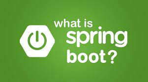

# O que é spring boot ?

Spring Boot é um framework de desenvolvimento de aplicações Java que facilita a criação de aplicativos autônomos, prontos para produção. Ele fornece um conjunto de bibliotecas e ferramentas para simplificar o desenvolvimento e o gerenciamento de aplicativos Java, permitindo que os desenvolvedores se concentrem na lógica de negócios.

## Principais recursos do Spring Boot:

### Configuração automática

Uma das principais vantagens do Spring Boot é sua capacidade de fornecer configuração automática para aplicativos. Ele usa um processo de descoberta de classpath para detectar as bibliotecas que estão sendo usadas e configurar automaticamente o aplicativo. Isso elimina a necessidade de configurações complicadas e reduz o tempo de configuração.

### Dependência de gerenciamento

O Spring Boot oferece uma ferramenta de gerenciamento de dependências integrada que ajuda a resolver problemas de compatibilidade e controle de versão. Isso significa que os desenvolvedores não precisam se preocupar com as versões de bibliotecas diferentes que podem estar em conflito umas com as outras.

### Servidor de aplicativos embutido

O Spring Boot vem com um servidor de aplicativos embutido que permite executar o aplicativo como um executável autônomo. Isso significa que os desenvolvedores podem implantar seus aplicativos sem precisar configurar e gerenciar um servidor de aplicativos separado.

### Suporte para múltiplas fontes de dados

O Spring Boot suporta múltiplas fontes de dados, incluindo bancos de dados relacionais, bancos de dados NoSQL e serviços de armazenamento em nuvem, como Amazon S3 e Microsoft Azure. Ele também oferece suporte para várias tecnologias de persistência, como JPA, Hibernate e JDBC.

### Teste fácil

O Spring Boot facilita a criação de testes para o aplicativo, permitindo que os desenvolvedores executem testes de unidade e integração de maneira simples e rápida. Ele fornece uma ampla variedade de ferramentas para testar o aplicativo, incluindo o framework de testes JUnit e a biblioteca de teste Mockito.

 

## O que são Starters 

Starters são módulos pré-configurados e prontos para uso que fornecem funcionalidades específicas para aplicações desenvolvidas com o Spring Boot. Eles são uma das principais características do Spring Boot e permitem que os desenvolvedores adicionem facilmente recursos adicionais às suas aplicações, sem precisar configurá-los manualmente.

- Os starters do Spring Boot são projetados para ajudar os desenvolvedores a começar rapidamente e simplificar o processo de desenvolvimento, permitindo que eles adicionem funcionalidades comuns a suas aplicações com apenas algumas linhas de código. Por exemplo, há starters para bancos de dados, autenticação, segurança, web services, email e muito mais.
- Cada starter do Spring Boot contém uma série de bibliotecas e configurações pré-definidas que são necessárias para implementar a funcionalidade específica que o starter fornece. Quando um starter é adicionado ao projeto, o Spring Boot configura automaticamente as dependências necessárias para que a funcionalidade seja ativada.
- Os starters são gerenciados pelo Spring Initializr, que é uma ferramenta de linha de comando ou uma interface web que permite aos desenvolvedores criar rapidamente projetos do Spring Boot com as dependências e configurações necessárias. O Spring Initializr inclui uma lista completa de todos os starters disponíveis e permite que os desenvolvedores adicionem ou removam facilmente dependências de acordo com as necessidades de suas aplicações.

 

## Starters mais utilizados no Spring boot

1. Spring Boot Starter Web: Este é o starter mais básico e é necessário para criar uma aplicação web. Ele inclui o Tomcat embutido, que permite executar a aplicação como um serviço web autônomo.
2. Spring Boot Starter Data JPA: Este starter fornece suporte ao Java Persistence API (JPA) para persistir dados em bancos de dados relacionais. Ele inclui bibliotecas para o Hibernate, que é uma das implementações mais populares do JPA.
3. Spring Boot Starter Security: Este starter fornece recursos de segurança, incluindo autenticação, autorização e criptografia, para aplicações web. Ele inclui o Spring Security, que é um framework de segurança amplamente utilizado para aplicações Java.
4. Spring Boot Starter Test: Este starter fornece ferramentas para testar o aplicativo, incluindo o framework de testes JUnit e a biblioteca de teste Mockito. Ele inclui também o Spring Test, que fornece suporte de teste integrado para aplicações Spring.
5. Spring Boot Starter Actuator: Este starter fornece recursos de monitoramento e gerenciamento para aplicações Spring Boot. Ele inclui endpoints que permitem que os desenvolvedores monitorem a saúde do aplicativo, verifiquem as métricas e obtenham informações sobre os logs e o ambiente de execução.
6. Spring Boot Starter Data MongoDB: Este starter fornece suporte para o MongoDB, um banco de dados NoSQL popular. Ele inclui o Spring Data MongoDB, que fornece uma API simples e elegante para trabalhar com o MongoDB.
7. Spring Cloud OpenFeign é um starter que fornece suporte para o cliente Feign, que é um framework de comunicação de serviços RESTful. O Feign é uma biblioteca que simplifica a integração entre serviços, permitindo que os desenvolvedores usem anotações Java para definir as interfaces de comunicação. O Spring Cloud OpenFeign permite que os desenvolvedores usem essas anotações Java em conjunto com a configuração do Spring Boot para criar clientes RESTful de maneira fácil e rápida.

 

 

 

[Voltar para Imersão no spring framework com spring boot](/Arquivos/Conteudo/6%20-%20Ganhando%20produtividade%20com%20spring%20framwork/6.2%20Imersao%20do%20spring%20framework%20com%20spring%20boot.md) 
[Voltar ao inicio](/README.md)