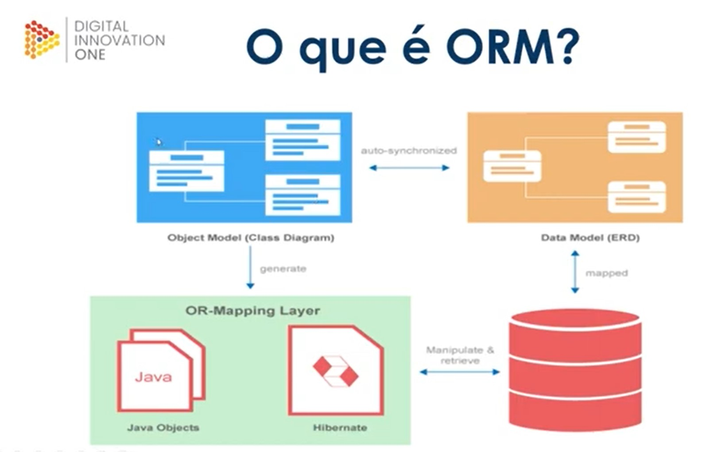
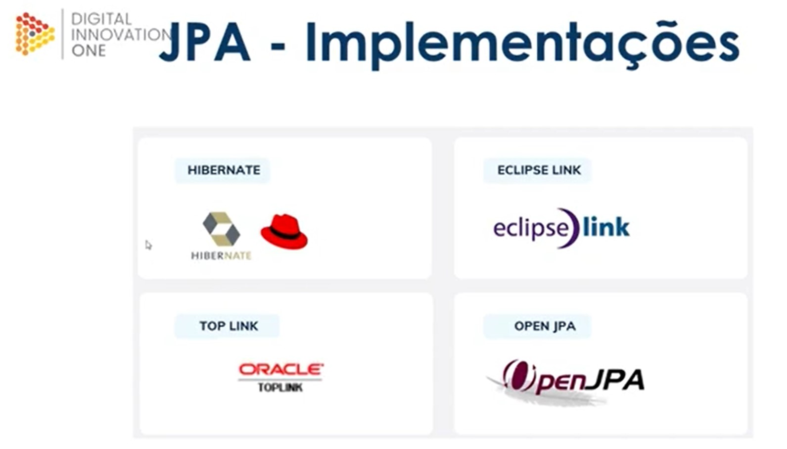
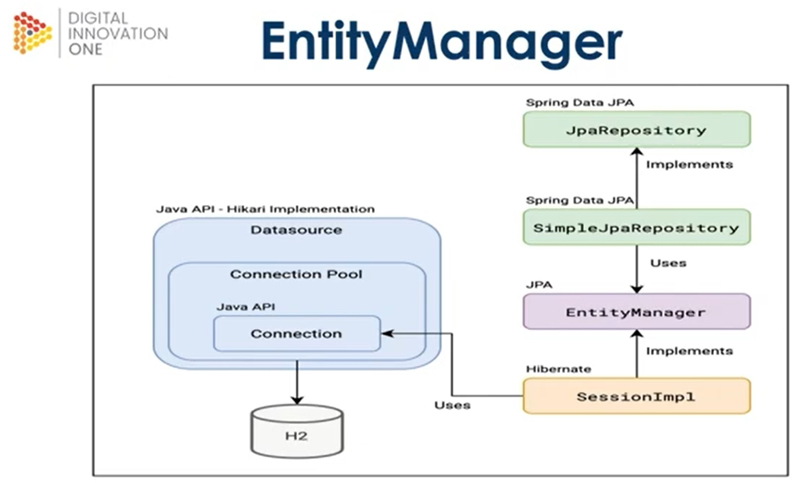

# Projeto prático 

### Referencia Spring initializr

[Spring boot - Spring inicializr](https://start.spring.io/) 
[Spring Data JPA - Reference Documentation](https://docs.spring.io/spring-data/jpa/docs/current/reference/html/)

 

## Partes do projeto:

#### 1° parte - Primeiros passos (spring-primeiros-passos)

- Criando um projeto com initializr
- Importando o projeto maven no Intellij
- Conhecendo a estrutura Spring boot
- Bean e ComandLineRunner

#### 2° parte - Quem são eles ? (spring-ioc-di-beans-autowired)

- Quando usar @Bean ?
- Quando usar @Component ?
- Implementar a IOC e DI

#### 3° parte - Quando irei precisar ? (spring-scopes-singleton-prototype)

- Conceito de Scope
- Configurando objeto Singleton
- Configurando objetos Prototype

#### 4° parte - Nem tudo é = (spring-properties-value)

- O poderoso application.properties
- @Value
- Default value

#### 5° parte - É sério isso ? (spring-configuration-properties)

- O poderoso application.properties
- @ConfigurationProperties (prefix)

#### 6° parte - ORM e JPA (dio-spring-data-jpa)
- O que é ORM ?
- Java persistence API (JPA)
- Mapeamentos
- EntityManager

##### Representações:

 

 

--- 

### Meu projeto 
[Arquivos](/Arquivos/Conteudo/6%20-%20Ganhando%20produtividade%20com%20spring%20framwork/Material/dio-springboot-main/)

