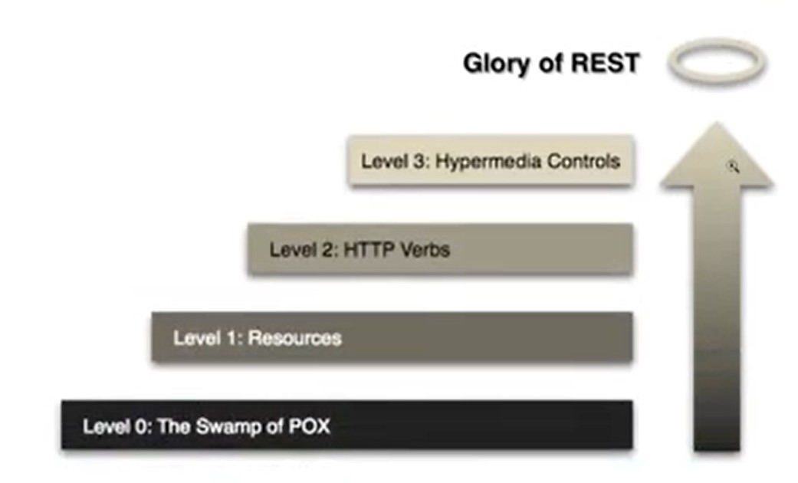

# Introdução ao REST e RESTFul

## O que REST ?

API REST (Representational State Transfer) é um padrão de arquitetura para desenvolvimento de APIs (Application Programming Interfaces) que utiliza o protocolo HTTP (Hypertext Transfer Protocol) para comunicação entre cliente e servidor.

- Uma API RESTful é composta por recursos, que são identificados por URLs únicas (endpoints), e podem ser acessados utilizando os métodos HTTP padrão, como GET, POST, PUT e DELETE, para realizar operações de leitura, criação, atualização e exclusão de dados.
- Além disso, a API REST geralmente utiliza formatos de representação de dados leves, como JSON (JavaScript Object Notation), para facilitar a interoperabilidade entre diferentes sistemas e plataformas.
- Uma API REST bem projetada segue os princípios da arquitetura REST, incluindo a separação entre cliente e servidor, a utilização de cache para melhorar a performance, a definição clara dos recursos e suas relações, entre outros

### REST vs RESTFUL

API REST e API RESTful são termos que muitas vezes são usados de forma intercambiável, mas tecnicamente existem algumas diferenças entre eles.

- API REST é uma API que segue os princípios da arquitetura REST, como a utilização de URLs únicas (endpoints) para identificar recursos, o uso de métodos HTTP padrão para operações em recursos, a utilização de representações de dados leves e a separação entre cliente e servidor.
- API RESTful, por outro lado, é uma API que segue completamente os princípios da arquitetura REST, incluindo a utilização de hypermedia (links) para permitir a descoberta de recursos relacionados e a transição entre estados da aplicação. Essa abordagem pode tornar as APIs mais flexíveis e escaláveis, mas também pode ser mais complexa de implementar.

Em resumo, API REST é uma API que segue os princípios da arquitetura REST, enquanto API RESTful é uma API que segue completamente esses princípios, incluindo a utilização de hypermedia.

#### Princípios para aplicação RESTFUL

1. Arquitetura Cliente-Servidor: A aplicação deve ser dividida em duas partes, cliente e servidor, com responsabilidades claramente separadas.
2. Protocolo HTTP: A comunicação entre cliente e servidor deve ser feita por meio do protocolo HTTP, utilizando seus verbos padrão (GET, POST, PUT, DELETE, etc.) para operações em recursos.
3. URL única para cada recurso: Cada recurso na aplicação deve ser identificado por uma URL única, que permite a manipulação do recurso por meio dos verbos HTTP.
4. Representação dos dados: Os dados da aplicação devem ser representados em um formato universal e leve, como JSON ou XML.
5. Operações sem estado(Stateless) : Cada operação em um recurso deve ser independente das outras operações e não deve depender do estado anterior da aplicação.
6. Utilização de Cache: A aplicação deve ser capaz de utilizar a cache do HTTP para melhorar a performance e diminuir a carga no servidor.
7. Interoperabilidade: A aplicação deve ser capaz de interagir com outras aplicações e sistemas, utilizando padrões universais de comunicação, como HTTP e JSON.
8. HATEOAS (Hypermedia as the Engine of Application State): O servidor deve enviar links e informações de navegação para o cliente, permitindo que ele descubra novos recursos e possa navegar entre eles.
9. O princípio das camadas (layers) em uma arquitetura RESTful significa que o sistema é dividido em camadas independentes e que cada camada só pode se comunicar com a camada imediatamente acima ou abaixo dela. Essa abordagem garante que cada camada tenha responsabilidades claramente definidas e que a complexidade do sistema seja gerenciável.

<br>

## Representação nivel de maturidade de uma aplicação rest:



<br>

<br>

### Nível 0 → Ausência de regras

Esse é considerado o nível mais básico e uma API que implementa apenas esse nível não pode ser considerada REST pois não segue qualquer padrão.

| Verbo HTTP | URL | Operação |
| --- | --- | --- |
| Post | /getUsuario | Pesquisar usuário |
| Post | /salvarUsuario | Salvar |
| Post | /AlterarUsuario | Alterar |
| Post | /excluirUsuario | Deletar |

<br>

### Nível 1 → Aplicação de recursos

Observe que o nome dos recursos foram equalizados e para não gerar ambiguidade é necessário definir um verbo apropriadamente.

| Verbo HTTP | URL | Operação |
| --- | --- | --- |
| Get | /usuarios/1 | Pesquisar usuário |
| Post | /usuarios | Salvar |
| Put | /usuarios/1 | Alterar |
| Delete | /usuarios/1 | Deletar |

<br>

### Nível 2 → Implementação de verbos HTTP

Como a definição dos verbos já foi requisitada no Nível 1, o Nível 2 se encarrega de validar a aplicabilidade dos verbos para finalidades específicas como observado na figura acima.

>💡 Existe uma discussão quando precisamos retornar dados através de parâmetros via body recebidos pelo método POST.

| Verbo HTTP | Função |
| --- | --- |
| Get | Retorna dados |
| Post | Grava dados |
| Put | Altera dados |
| Delete | Remove dados |

<br>

### Nível 3 → Hateoas

Hateoas (hypermedia as the engine of application state). Uma API que implementa esse nível fornece aos seus clientes links que indicarão como poderá ser feita a navegação entre seus recursos. Ou seja, quem for consumir a API precisará saber a toda principal e a resposta dessa requisição terá todas as demais rotas possíveis.

>💡 O nível 3 é sem dúvidas o menos explorado. Muitas APIs existentes no mercado não implementam esse nível.

<details>
<summary>Código exemplo:</summary>

```json
{
  "name": "John Doe",
  "email": "john.doe@example.com",
  "phone": "+1 555-555-5555",
  "_links": {
    "self": {
      "href": "/users/1234"
    },
    "orders": {
      "href": "/users/1234/orders"
    },
    "cart": {
      "href": "/users/1234/cart"
    },
    "address": {
      "href": "/users/1234/address"
    },
    "alterar": {
      "href": "/users/1234",
      "method": "PUT"
    },
    "excluir": {
      "href": "/users/1234",
      "method": "DELETE"
    }
  }
}
```

</details>

<br>

<br>

<br>

[Voltar a Criando API REST documentada com Spring web e Swagger](/Arquivos/Conteudo/6%20-%20Ganhando%20produtividade%20com%20spring%20framwork/6.3%20Criando%20api%20rest%20documentada%20com%20spring%20web%20e%20swagger.md)<br>
[Voltar ao inicio](/README.md)