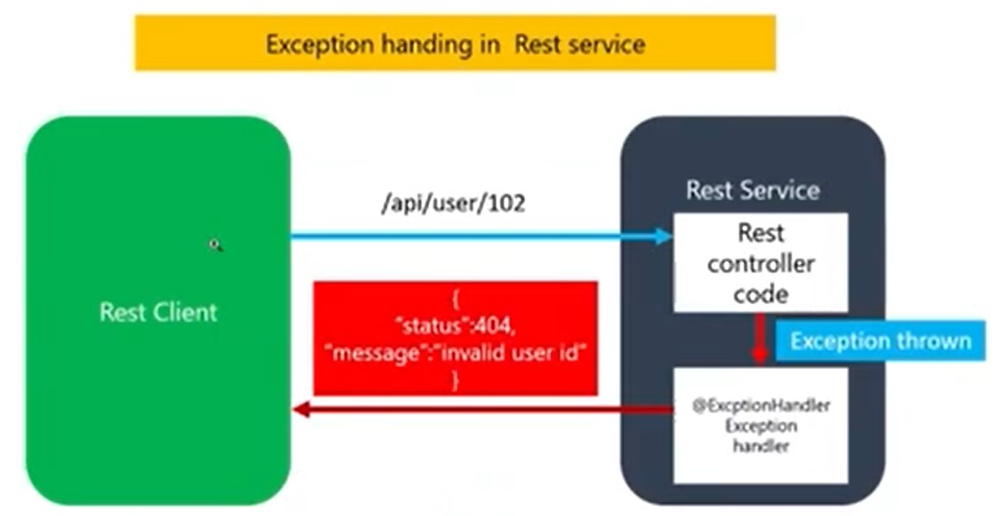

# Exception handlers

Em uma aplicação, erros podem acontecer por diversos motivos, como por exemplo, falha de comunicação com bancos de dados, problemas de conexão com serviços externos, entrada de dados inválidos pelo usuário, entre outros.

Quando um erro ocorre em uma aplicação, é importante que o usuário receba uma mensagem de erro amigável e que o problema seja tratado de forma adequada pelo sistema. Uma maneira de tratar esses erros é utilizando o conceito de **Exception Handlers**.

### **O que são Exception Handlers**

*Exception handlers* são blocos de código que tratam exceções lançadas por uma aplicação. Esses blocos de código são responsáveis por capturar a exceção lançada, analisar o erro e retornar uma resposta apropriada para o usuário.

 

## Como funcionam os Exception Handlers

Os **Exception Handlers** funcionam como interceptadores de exceções, capturando as exceções lançadas pela aplicação e retornando uma resposta apropriada para o usuário.

Quando uma exceção é lançada, o framework que está sendo utilizado pela aplicação (como o Spring, por exemplo), procura por um **Exception Handler** que seja capaz de lidar com a exceção em questão.

Se um **Exception Handler** adequado é encontrado, ele é executado e retorna uma resposta apropriada para o usuário. Caso contrário, a exceção é propagada para um **handler** global ou para o servidor de aplicação, que se encarrega de exibir uma mensagem padrão de erro.

### Como criar um Exception Handler

Para criar um **Exception Handler**, é necessário definir um método em uma classe anotada com `@ControllerAdvice`.

Essa classe será responsável por tratar as exceções lançadas pela aplicação, e o método deve ser anotado com `@ExceptionHandler` e receber como parâmetro a exceção a ser tratada.

Dentro desse método, é possível implementar a lógica necessária para lidar com o erro, como por exemplo, retornar uma mensagem de erro personalizada para o usuário ou logar o erro para fins de monitoramento.

#### Vantagens dos Exception Handlers

- Facilitam o tratamento de exceções em uma aplicação, permitindo que os desenvolvedores capturem e tratem as exceções lançadas de forma centralizada.
- Permitem que os usuários recebam mensagens de erro mais amigáveis e personalizadas.
- Ajudam a evitar a exposição de informações sensíveis ou detalhes da implementação para o usuário final.
- Facilitam o monitoramento de erros e a depuração de problemas na aplicação.

